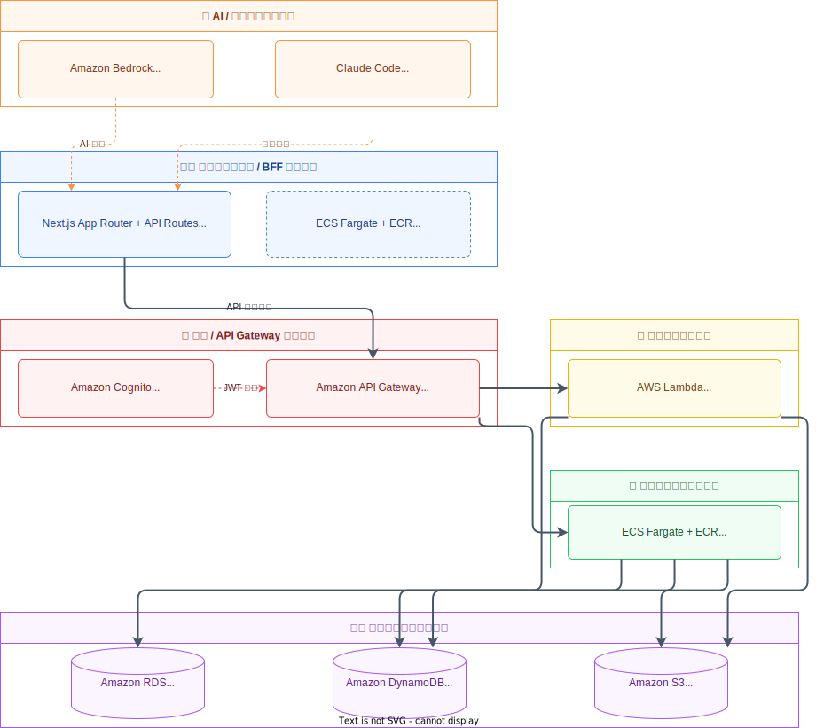
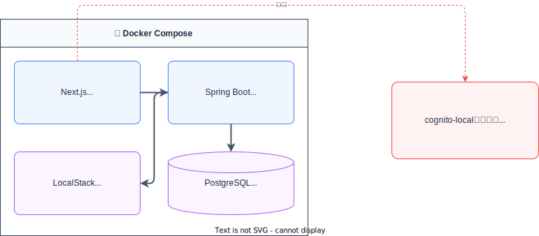

# AWS 標準アーキテクチャ（受注案件デフォルト構成）

> 戦略2：フルスクラッチを廃止するAWS標準アーキテクチャ  
> 社内 AI 駆動開発チュートリアル向け基盤ドキュメント

> **スコープ外**: VPC・サブネット・セキュリティグループ・IAM・Secrets Manager 等の AWS インフラ詳細はこのドキュメントでは扱わない。

---

## システム構成図

> **CI/CD・監視レイヤー**: GitHub Actions → ECR → ECS のローリングデプロイで上記コンテナ群を配信し、Amazon CloudWatch が全レイヤーのログ・メトリクス・アラームを収集する（横断的関心事のため図では省略）。

---

## 各レイヤーの設計指針とローカル開発の実現性

### AI / 開発支援レイヤー

| コンポーネント     | 役割                                                          |
| ------------------ | ------------------------------------------------------------- |
| **Amazon Bedrock** | 開発時に AI エージェントを呼び出すための LLM API（Claude 等） |
| **Claude Code**    | ターミナル / IDE で動作するコーディングエージェント           |

### フロントエンド / BFF レイヤー（Next.js on ECS）

Next.js を ECS Fargate 上で動かし、フロントエンドと BFF を統合する構成。

- **BFF の役割**: バックエンド API 呼び出しの集約・レスポンス変換・認証トークン管理
- **Server Actions / API Routes** でトークンをサーバーサイドに保持し、クライアントへの認証情報露出を防ぐ
- **ローカル実現性**: ✅ `npm run dev` でそのまま起動可能。AWS 依存なし

| コンポーネント      | ローカル実現性 | ローカル代替手段             |
| ------------------- | -------------- | ---------------------------- |
| Next.js（BFF 含む） | ✅ 完全対応    | `npm run dev`                |
| ECS Fargate         | ✅ 不要        | ローカルで直接実行 or Docker |
| ECR                 | ✅ 不要        | ローカル Docker イメージ     |

### 認証 / API Gateway レイヤー

| コンポーネント         | ローカル実現性 | ローカル代替手段                                                                                                       |
| ---------------------- | -------------- | ---------------------------------------------------------------------------------------------------------------------- |
| **Amazon Cognito**     | △ 部分対応     | **cognito-local**（npm パッケージ）でユーザープールの基本的な認証フローをエミュレート。または JWT モックサーバーで代替 |
| **Amazon API Gateway** | ✅ 対応        | **LocalStack**（`localhost:4566`）でエミュレート。または Next.js BFF が直接バックエンドを呼ぶ構成でスキップ可能        |

### バックエンドレイヤー（Spring Boot on ECS）

| コンポーネント  | ローカル実現性 | ローカル代替手段                       |
| --------------- | -------------- | -------------------------------------- |
| **Spring Boot** | ✅ 完全対応    | `./mvnw spring-boot:run` または Docker |
| **ECS Fargate** | ✅ 不要        | ローカルで直接実行                     |
| **ECR**         | ✅ 不要        | ローカル Docker イメージ               |

### サーバーレス処理（Lambda）

| コンポーネント | ローカル実現性 | ローカル代替手段                                 |
| -------------- | -------------- | ------------------------------------------------ |
| **AWS Lambda** | ✅ 完全対応    | **LocalStack**（`localhost:4566`）でエミュレート |

### データベースレイヤー

| コンポーネント              | ローカル実現性 | ローカル代替手段                                 |
| --------------------------- | -------------- | ------------------------------------------------ |
| **Amazon RDS (PostgreSQL)** | ✅ 完全対応    | **Docker**（`docker run postgres`）で完全互換    |
| **Amazon DynamoDB**         | ✅ 完全対応    | **LocalStack**（`localhost:4566`）でエミュレート |
| **Amazon S3**               | ✅ 完全対応    | **LocalStack**（`localhost:4566`）でエミュレート |

---

## ローカル開発環境の構成概要

> LocalStack Community（無料）で Lambda、API Gateway、S3、DynamoDB をすべてカバー。  
> Cognito のみ cognito-local で補完する。

---

## 技術スタック一覧

| 区分                 | 技術 / サービス                          |
| -------------------- | ---------------------------------------- |
| フロントエンド + BFF | React, Next.js (App Router + API Routes) |
| バックエンド         | Java 25, Spring Boot 4.0, Flyway         |
| コンテナ             | Docker, Amazon ECS Fargate, Amazon ECR   |
| API 管理             | Amazon API Gateway (HTTP API)            |
| 認証                 | Amazon Cognito                           |
| AI/LLM               | Amazon Bedrock (Claude), Claude Code     |
| DB (RDB)             | Amazon RDS for PostgreSQL                |
| DB (NoSQL)           | Amazon DynamoDB                          |
| ストレージ           | Amazon S3                                |
| サーバーレス         | AWS Lambda (非同期・バッチ用途に限定)    |
| CI/CD                | GitHub Actions, Amazon ECR               |
| 監視                 | Amazon CloudWatch                        |
| IaC                  | Terraform                                |

---

## 応用・拡張オプション（プロジェクト判断）

プロジェクト要件に応じて以下を追加する。

- AWS WAF（Webアプリケーションファイアウォール）
- AWS X-Ray（分散トレーシング）
- Amazon ElastiCache / Redis（キャッシュ層）
- Amazon SES（メール送信）
- Amazon SNS / SQS（非同期メッセージング）

---

_このドキュメントはプロジェクト開始時の標準ベースラインとして使用する。_
