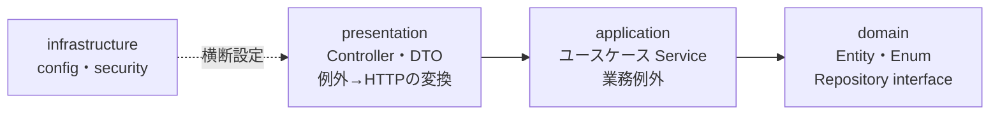

# コーディング規約

> 対象読者：学習者（主に新人）  
> 参照：[ADR 一覧](../decision/README.md) / [ai-tools-guide.md](./ai-tools-guide.md)

BookFlow で開発するときの約束事をまとめたガイドです。技術選定の**理由**は各 [ADR](../decision/README.md) に、API・画面の**仕様**は [Docs/spec/](../spec/index.md) に書かれています。本書は「実装時に迷わないためのルールと実例」に絞っています。

!!! tip "最大の規約は「既存コードに合わせる」"
    本書に書かれていないことで迷ったら、**同じ種類の既存ファイルを開いてパターンを真似る**のが正解です。
    ベース実装は ADR と本規約に沿って書かれているため、既存コードがそのまま生きた手本になります。

---

## 共通方針 { #common }

| 項目 | ルール |
|------|--------|
| ブランチ命名 | `feature/<issue番号>-<short-desc>`（例：`feature/42-resource-detail`） |
| コミット | Conventional Commits 形式（詳細は[§コミット・PR 規約](#commit-pr)） |
| 言語 | コメント・コミットメッセージ・ドキュメントは日本語で書いてよい（識別子は英語） |
| 仕様の扱い | `Docs/spec/` が真実の源。仕様と実装が食い違ったら仕様を確認し、必要なら仕様の更新を先に行う |

**コミット前に必ず通すこと**：フォーマッタとリンタを実行し、テストが green であることを確認してからコミットします。

| | フロントエンド（`cd frontend`） | バックエンド（`cd backend`） |
|---|---|---|
| フォーマット | `pnpm format` | `./gradlew spotlessApply` |
| Lint | `pnpm lint` | `./gradlew checkstyleMain` |
| テスト | `pnpm test` | `./gradlew test` |

---

## フロントエンド規約

参照 ADR：[001 pnpm](../decision/ADR-001-frontend-package-manager.md) / [002 Tailwind](../decision/ADR-002-frontend-styling.md) / [003 shadcn/ui](../decision/ADR-003-frontend-ui-components.md) / [004 データ取得](../decision/ADR-004-frontend-data-fetching.md) / [005 フォーム](../decision/ADR-005-frontend-form-library.md) / [006 Zod](../decision/ADR-006-frontend-validation.md) / [007 Zustand](../decision/ADR-007-frontend-client-state.md) / [008 Better Auth](../decision/ADR-008-frontend-auth-client.md) / [009 テスト](../decision/ADR-009-frontend-test-strategy.md) / [010 oxlint/oxfmt](../decision/ADR-010-frontend-lint-format.md)

### ディレクトリ責務

| ディレクトリ | 責務 |
|-------------|------|
| `src/app/` | ページ・レイアウト（App Router）。認証必須ページは `(authenticated)/` ルートグループ配下 |
| `src/components/` | UI コンポーネント。`ui/` は shadcn/ui 由来、`layout/` はヘッダー等の共通レイアウト |
| `src/server/actions/` | Server Actions（BFF 層）。バックエンド API 呼び出しはここに集約 |
| `src/lib/schemas/` | Zod スキーマ定義（フォームバリデーション用） |
| `src/lib/` | API クライアント・セッション・型定義・ユーティリティ |

### 設計原則

- **Server Components 優先**：`'use client'` はインタラクションが必要な末端コンポーネントだけに付ける（ADR-004）
- **データ取得は Server Actions 経由**：クライアントからバックエンド API を直接呼ばない。トークンはサーバーサイドに保持する
- **クライアント状態は最小限**：サーバー由来のデータをストアに複製しない。Zustand は UI 状態（モーダル開閉等）に限定する（ADR-007）
- **型は Zod スキーマから導出**：手書きの型とスキーマの二重管理をしない（`z.infer<typeof XxxSchema>`）

### Server Actions のパターン

`src/server/actions/resources.ts` が手本です。

```typescript
'use server'

import { createApiClient } from '@/lib/api-client'
import { ResourceResponseSchema, type ResourceResponse } from '@/lib/types/api'
import { getAccessToken } from '@/lib/session'
import type { CreateResourceInput } from '@/lib/schemas/resource'

/**
 * リソースを登録する（ADMIN のみ）。
 */
export async function createResourceAction(input: CreateResourceInput): Promise<ResourceResponse> {
  const client = createApiClient(getAccessToken)
  return client.post('/resources', input, ResourceResponseSchema)
}
```

- ファイル冒頭に `'use server'`、関数名は `xxxAction` で統一
- 各 Action に JSDoc で「何をするか・必要なロール」を書く
- レスポンスは Zod スキーマ（`@/lib/types/api`）で検証してから返す

!!! warning "Zod スキーマは `'use server'` ファイルに置けない"
    Next.js の制約により、`'use server'` ファイルからは非同期関数以外（Zod スキーマオブジェクト等）を
    export できません。入力スキーマは `src/lib/schemas/`（例：`src/lib/schemas/resource.ts`）に分離し、
    Action 側では `z.infer` で導出した**型のみ**をインポート・再エクスポートします。

### 命名規則

| 対象 | 規則 | 例 |
|------|------|----|
| コンポーネントファイル | PascalCase | `Header.tsx`・`ResourceManagementClient.tsx` |
| それ以外のモジュール | kebab-case | `api-client.ts`・`dev-auth.ts` |
| 関数・変数 | camelCase（Server Action は `xxxAction`） | `listResourcesAction` |
| Zod スキーマ | `XxxSchema` + 型は `XxxInput` / `XxxResponse` | `CreateResourceSchema` → `CreateResourceInput` |
| ルーティング | App Router 規約に従う | `app/(authenticated)/resources/page.tsx` |

### Lint / Format（oxlint + oxfmt）

設定は `frontend/oxlint.json`。react / nextjs / typescript プラグインを有効化し、`no-unused-vars` はエラー、`no-console` は警告です。デバッグ用の `console.log` は残さないでください。インポートパスはエイリアス `@/`（= `src/`）を使います（tsconfig は strict モード）。

---

## バックエンド規約

参照 ADR：[011 Gradle](../decision/ADR-011-backend-build-tool.md) / [012 Spring Data JPA](../decision/ADR-012-backend-orm.md) / [013 Flyway](../decision/ADR-013-backend-db-migration.md) / [014 バリデーション](../decision/ADR-014-backend-validation.md) / [015 OpenAPI](../decision/ADR-015-backend-api-docs.md) / [016 認証](../decision/ADR-016-backend-auth.md) / [017 ロギング](../decision/ADR-017-backend-logging.md) / [018 テスト](../decision/ADR-018-backend-test-strategy.md) / [019 コード品質](../decision/ADR-019-backend-code-quality.md)

### 4 層アーキテクチャ（厳守）

`com.example.bookflow` 配下は 4 つのレイヤーに分かれ、依存は一方向です。



| レイヤー | 置くもの | 置かないもの |
|---------|---------|-------------|
| `domain/` | Entity・Enum・Repository **インターフェース** | HTTP・DTO への依存 |
| `application/` | ユースケース Service・業務例外（`exception/`） | Controller・HttpServletRequest 等 |
| `presentation/` | Controller・DTO（`dto/`）・`GlobalExceptionHandler` | 業務ロジック |
| `infrastructure/` | Spring 設定（`config/`）・セキュリティ（`security/`） | 業務ロジック |

**下のレイヤーから上のレイヤーを参照してはいけません**（domain が presentation の DTO を import したら違反）。

### クラス命名・配置

| 種類 | 命名 | 例（実ファイル） |
|------|------|----------------|
| Entity | 名詞そのまま | `domain/Resource.java` |
| Repository | `XxxRepository`（interface） | `domain/ResourceRepository.java` |
| Service | `XxxService` | `application/ResourceService.java` |
| 業務例外 | `XxxException` | `application/exception/ResourceNotFoundException.java` |
| Controller | `XxxController` | `presentation/ResourceController.java` |
| DTO | `XxxRequest` / `XxxResponse`（record） | `presentation/dto/CreateResourceRequest.java` |

### DTO は record + `from()` ファクトリ

レスポンス DTO は record で定義し、Entity からの変換は static ファクトリ `from()` に集約します（`presentation/dto/ResourceResponse.java`）。

```java
public record ResourceResponse(
    UUID id, String name, String category, /* ... */ LocalDateTime createdAt) {

  public static ResourceResponse from(Resource resource) {
    return new ResourceResponse(
        resource.getId(), resource.getName(), resource.getCategory().name(), /* ... */);
  }
}
```

リクエスト DTO には Jakarta Bean Validation アノテーション（`@NotBlank`・`@Size` 等）を付け、Controller で `@Valid` を指定します（ADR-014）。エラーメッセージは日本語で書きます。

### 例外処理

- 業務エラーは `application/exception/` のカスタム例外（`BusinessException`・`ResourceNotFoundException` 等）を throw する
- HTTP ステータスへの変換は `presentation/exception/GlobalExceptionHandler`（`@RestControllerAdvice`）に**一元化**する。Controller / Service で try-catch して独自レスポンスを作らない
- エラーコードは `application/exception/ErrorCode.java` の定数を使う。ステータス・エラーコードの対応は [api-spec.md](../spec/api-spec.md) §共通が正

### データアクセス・マイグレーション

- クエリは Spring Data JPA の**派生クエリまたは JPQL（`@Query`）**で書く。生 SQL（ネイティブクエリ）は原則禁止（ADR-012）
- 関連のフェッチは `FetchType.LAZY` をデフォルトとし、N+1 が出る場合は `JOIN FETCH` で対処する
- スキーマ変更は Flyway マイグレーションで行う。ファイル名は `V<3桁連番>__<snake_case>.sql`（例：`V002__add_resource_image.sql`）。**コミット済みのマイグレーションファイルは変更禁止**（ADR-013）

### ログ

SLF4J の Logger を使います（`private static final Logger LOG = LoggerFactory.getLogger(Xxx.class);`）。`System.out.println` は禁止。出力形式はプロファイルで切り替わるため（ADR-017）、コード側は形式を意識しなくて構いません。

### Format / Lint（Spotless + Checkstyle）

| ツール | 役割 | 主なルール |
|--------|------|-----------|
| Spotless（`spotlessApply`） | 自動フォーマット | google-java-format 1.28.0・未使用 import 削除 |
| Checkstyle（`checkstyleMain`） | 規約チェック | スター import 禁止・命名（クラス PascalCase / メソッド camelCase / 定数 UPPER_SNAKE_CASE）・メソッド 150 行以内・引数 7 個以内 |

設定ファイルは `backend/build.gradle.kts` と `backend/config/checkstyle/checkstyle.xml` です。

---

## コミット・PR 規約 { #commit-pr }

<!-- 開発フロー全体（Issue 選択〜マージ）は dev-workflow.md（タスク 3.1）、PR テンプレートは .github/PULL_REQUEST_TEMPLATE.md（タスク 3.4）で整備済み -->

### Conventional Commits

コミットメッセージは `<type>: <変更内容の要約>` 形式で書きます。

| type | 用途 |
|------|------|
| `feat` | 機能追加 |
| `fix` | バグ修正 |
| `docs` | ドキュメントのみの変更 |
| `refactor` | 動作を変えないコード整理 |
| `test` | テストの追加・修正 |
| `chore` | ビルド設定・依存更新等 |

=== "Good な例"

    ```text
    feat: リソース詳細画面を追加
    fix: 予約重複チェックで終了時刻ちょうどの予約を許可
    test: ReservationService の境界値テストを追加
    ```

    → type が変更の性質と一致し、何が変わるかが要約から分かる。

=== "Bad な例"

    ```text
    update
    fix: いろいろ修正
    feat: 画面追加とバグ修正とリファクタ
    ```

    → 内容が分からない・複数の関心事が 1 コミットに混在している。

### コミットの粒度

**1 コミット 1 関心事**が原則です。「機能追加」と「無関係なリファクタ」が混ざっていたら分割してください。レビュアー（メンター）がコミット単位で差分を追える状態が目標です。

### PR 提出前のセルフレビュー

- [ ] [§共通方針](#common)のフォーマット・Lint・テストをすべて通した
- [ ] 仕様（`Docs/spec/`）と実装が一致している（仕様にない挙動を勝手に追加していない）
- [ ] AI が生成したコードを自分で読み、説明できる状態になっている（→ [ai-tools-guide.md §AI 利用ポリシー](./ai-tools-guide.md#prohibited)）
- [ ] 動作確認の手順と結果を PR に書ける状態になっている

---

## テスト規約

参照 ADR：[009 FE テスト戦略](../decision/ADR-009-frontend-test-strategy.md) / [018 BE テスト戦略](../decision/ADR-018-backend-test-strategy.md)

| | フロントエンド | バックエンド |
|---|---|---|
| ユニットテスト | Vitest（`tests/unit/`） | JUnit 5 + Mockito（`src/test/java/`） |
| API モック | MSW（`tests/unit/msw/handlers.ts` に一元管理） | Mockito の `@Mock` |
| 統合 / E2E | Playwright（`tests/e2e/`） | H2 in-memory（PostgreSQL 互換モード・Flyway 無効） |
| ファイル命名 | `<対象>.test.ts`（テスト対象とディレクトリ構造を合わせる） | `<対象クラス>Test.java`（同一パッケージ） |
| テスト名 | `describe` = 関数名、`it` = 日本語で「条件: 期待結果」 | `methodName_condition_expectedBehavior` |
| 実行 | `pnpm test` / `pnpm test:e2e` | `./gradlew test` |

### フロントエンドの実例

`tests/unit/server/actions/resources.test.ts` が手本です。MSW のデフォルトハンドラは `tests/unit/msw/handlers.ts` に定義し、異常系はテスト内で `server.use()` で上書きします。

```typescript
describe('listResourcesAction', () => {
  it('正常時: リソース一覧をページネーション形式で返す', async () => {
    const result = await listResourcesAction()
    expect(result.totalElements).toBe(1)
  })

  it('401 時: ApiClientError をスローする', async () => {
    server.use(
      http.get('/api/backend/resources', () => HttpResponse.json(null, { status: 401 })),
    )
    // ...
  })
})
```

### バックエンドの実例

Service の単体テストは `application/ResourceServiceTest.java` が手本です（Mockito で Repository をモック）。

```java
@ExtendWith(MockitoExtension.class)
class ResourceServiceTest {

  @Mock private ResourceRepository resourceRepository;
  @InjectMocks private ResourceService resourceService;

  @Test
  void list_withAvailabilityFilter_returnsNonOccupiedResources() {
    // ...
  }
}
```

Controller テストで認証ユーザーが必要な場合は、`src/test/java/.../support/` のカスタムアノテーション `@WithMockMember` / `@WithMockAdmin` を使います（ADR-016 の DEVIATION 参照）。

### カバレッジの考え方

カバレッジの数値基準は設けていません。その代わり、**新規・変更したコードには必ず対応するテストを付ける**こと、既存テストを green に保つことを必須とします。

!!! tip "テスト作成は AI の得意分野"
    既存テストファイルを参照させたうえで Claude Code に生成させると、命名規約・モックパターンに沿った
    テストの叩き台が得られます（→ [ai-tools-guide.md](./ai-tools-guide.md)）。生成後は必ず実行して検証してください。
