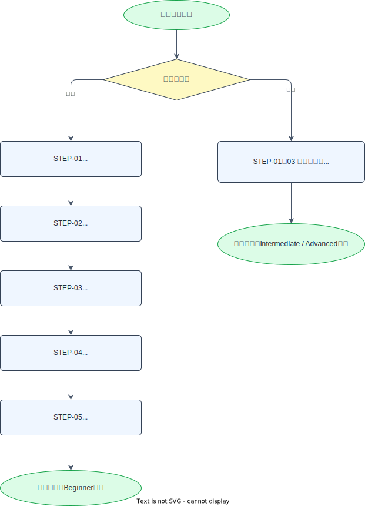

# 学習カリキュラム

このページは、BookFlow で学習を進める際の**学習パス**と、最初に取り組む**必須ステップ課題（STEP-01〜05）**を定義します。  
必須ステップを終えたあとは、難易度別の選択課題へ進みます。どの課題に取り組むか迷ったら、まず下の[学習パスマップ](#path-map)を確認してください。

---

## 学習パスマップ { #path-map }

学習者のレベルに応じて、2 つのパスを用意しています。新人は必須ステップを順番に進め、中堅は必須ステップを任意確認したうえで選択課題から始めます。

| パス | 進め方 |
| ---- | ------ |
| 新人向け | STEP-01 → 02 → 03 → 04 → 05 を**順番に必須**で実施 → Beginner レベルの選択課題へ |
| 中堅向け | STEP-01〜03 を**任意確認**（環境構築・運用フロー・AI ツールに慣れていればスキップ可）→ Intermediate / Advanced の選択課題へ |

難易度別の選択課題カタログ（Beginner / Intermediate / Advanced）は **[選択課題カタログ](./enhancement-catalog.md)** を参照してください。

- **新人**は STEP-05 完了後に [Beginner の課題](./enhancement-catalog.md#beginner) から始めることを推奨します。
- **中堅**は [Intermediate / Advanced の課題](./enhancement-catalog.md#intermediate) から選んでください。

---

## 必須ステップ課題 { #required-steps }

新人が最初に取り組む 5 つの課題です。**順序性があり**、前の STEP の完了を前提に次へ進みます。各 STEP は GitHub Issue として起票して取り組みます（`.github/ISSUE_TEMPLATE/` の「必須課題（STEP）」テンプレートを使用）。

各 STEP の「完了条件」は、その課題の**提出物**でもあります。完了条件を満たしたら PR を作成し、メンターのレビュー（第 2 ゲート）を受けてください。PR の進め方は [dev-workflow.md §標準開発フロー](./dev-workflow.md#flow) を参照してください。

---

## STEP-01：環境構築 { #step-01 }

| 項目 | 内容 |
| ---- | ---- |
| ゴール | DevContainer を起動し、ブラウザで BookFlow のダッシュボードにアクセスできる状態を作る |
| 推奨レベル | Beginner |
| 推定工数 | 半日 |
| AI 活用例 | 起動エラーが出たら、Claude Code にエラーメッセージを貼り付けて原因と対処法を尋ねる |
| 完了条件 | [getting-started.md §動作確認](./getting-started.md) の手順で、`curl http://localhost:8080/actuator/health` が `{"status":"UP"}` を返し、`http://localhost:3000` でサインイン画面またはダッシュボードが表示される |

手順の詳細は [getting-started.md](./getting-started.md)（STEP-01 の手順書）を参照してください。トラブル時は [troubleshooting.md](./troubleshooting.md) も確認してください。

---

## STEP-02：リポジトリ運用・開発フローの理解 { #step-02 }

| 項目 | 内容 |
| ---- | ---- |
| ゴール | このリポジトリでの開発の進め方（ブランチの切り方・学習パスの選び方・AI-DLC に基づく標準フロー）を理解し、実装を始められる状態を作る |
| 推奨レベル | Beginner |
| 推定工数 | 半日 |
| AI 活用例 | Claude Code に [dev-workflow.md](./dev-workflow.md) を読み込ませ、標準フローを自分の言葉で要約させて理解を確認する |
| 完了条件 | 下記の確認項目をすべて満たし、メンターに口頭またはコメントで説明できる |

実装に着手する前に、リポジトリの運用ルールを把握します。次の 4 点を確認してください。

- **標準開発フロー**：[dev-workflow.md §標準開発フロー](./dev-workflow.md#flow) を読み、「ビジネス要求シート（Issue）選択 → ブランチ作成 → plan mode で計画提示 → メンター承認（第 1 ゲート）→ Spec-first で仕様更新 → 縦切り実装 → セルフレビュー → PR → メンターレビュー（第 2 ゲート）→ マージ」の流れと、**2 つの承認ゲート**の意味を説明できる。
- **AI-DLC の考え方**：[dev-workflow.md §AI-DLC と BookFlow フローの対応](./dev-workflow.md#aidlc-mapping) を読み、plan-first の承認ゲート（plan mode で計画を合意してから実装する）の狙いを理解する。
- **ブランチの切り方**：[coding-conventions.md §コミット・PR 規約](./coding-conventions.md#commit-pr) に従い、`feature/<issue番号>-<short-desc>` 形式でブランチを作成できる。
- **学習パスの選び方**：この[学習パスマップ](#path-map)から、自分のレベルに合った次の課題を選べる。

!!! tip "実際に手を動かす"
    読むだけでなく、`feature/<issue番号>-<short-desc>` 形式のブランチを実際に 1 本作成してみると、以降の STEP でそのまま使えます。

---

## STEP-03：AI ツール導入・活用 { #step-03 }

| 項目 | 内容 |
| ---- | ---- |
| ゴール | 本リポジトリの標準 AI ツールである Claude Code の特性を理解し、状況に応じて意図的に活用できるようになる |
| 推奨レベル | Beginner |
| 推定工数 | 半日 |
| AI 活用例 | [ai-tools-guide.md](./ai-tools-guide.md) を参照し、コードベース理解・仕様確認・影響範囲調査・テスト生成・エラー調査・plan mode の各場面で Claude Code を試す |
| 完了条件 | [ai-tools-guide.md §活用チェックリスト（STEP-03 回答フォーム）](./ai-tools-guide.md#checklist) の 6 項目に回答を記入して PR を提出する |

セットアップ・使い方・効果的なプロンプトの書き方・AI 利用ポリシーは [ai-tools-guide.md](./ai-tools-guide.md) を参照してください。

---

## STEP-04：コードベース把握 { #step-04 }

| 項目 | 内容 |
| ---- | ---- |
| ゴール | BookFlow のコードを読んで、フロントエンド → BFF → バックエンド → DB の処理の流れを説明できる |
| 推奨レベル | Beginner |
| 推定工数 | 1日 |
| AI 活用例 | Claude Code に「リソース一覧の処理フローを説明して」と尋ね、回答を手がかりに実コードを読み解く |
| 完了条件 | リソース一覧表示のリクエストが、Next.js（画面）→ Server Actions（BFF）→ Spring Boot（API）→ PostgreSQL（DB）を辿る流れを、図またはコメントで説明して PR を提出する |

STEP-05 と合わせて、コードを「全体像 → 個別機能」の順に読み解く読解ステップです。アーキテクチャ全体像は [ARCHITECTURE.md](../ARCHITECTURE.md)、各レイヤーの責務は [coding-conventions.md](./coding-conventions.md) を参照してください。

---

## STEP-05：既存機能読解 { #step-05 }

| 項目 | 内容 |
| ---- | ---- |
| ゴール | 予約申請機能のユニットテストを読み、テストの意図と網羅範囲を説明できる |
| 推奨レベル | Beginner |
| 推定工数 | 半日 |
| AI 活用例 | Claude Code に「このテストが検証していない境界値は？」と尋ね、テストの網羅範囲を確認する |
| 完了条件 | 予約申請のサービス層テストに「テスト意図」のコメントを日本語で追記して PR を提出する |

STEP-04 で把握した全体像をもとに、特定機能（予約申請）をテストの観点から深掘りします。テスト規約は [coding-conventions.md](./coding-conventions.md) を参照してください。
