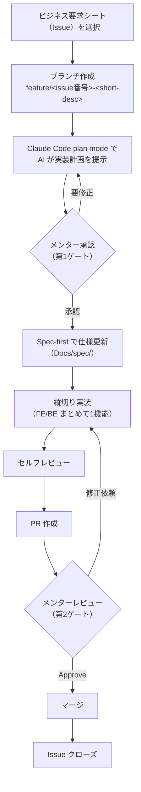

# 開発ワークフローガイド

> 対象読者：学習者（主に新人）  
> 参照：[ai-tools-guide.md](./ai-tools-guide.md) / [coding-conventions.md](./coding-conventions.md) / [仕様更新ルール（Spec-first）](../spec/index.md#spec-first)

このガイドは、学習課題（Issue）に着手してからマージするまでの**標準フロー**を示します。  
フローは AWS Labs の **AI-DLC**（AI Development Life Cycle）を思考モデルに、チュートリアル向けに簡素化したものです。実装の進め方に迷ったら、まずこのページのフローに沿って進めてください。

---

## AI-DLC と BookFlow フローの対応 { #aidlc-mapping }

AI-DLC は Inception（WHAT/WHY）・Construction（HOW）・Operations の 3 フェーズと、**plan-first の承認ゲート**を柱とする開発方法論です。BookFlow では `aidlc-docs/` のような専用の成果物ツリーは作らず、既存の `Docs/spec/`・`Docs/guide/`・`CLAUDE.md`・Claude Code の plan mode にすべて写像します。

| AI-DLC のフェーズ | 目的 | BookFlow での実体 |
| ------------------ | ---- | ------------------ |
| Inception（WHAT/WHY） | 要件・受入条件を明確にする | ビジネス要求シート（Issue が参照する要件ドキュメント） |
| Construction（HOW） | 設計してコードにする | Spec-first での仕様更新 → 縦切り実装 |
| Operations | 品質を継続的に保証する | CI 品質ゲート（lint・テスト・セキュリティスキャン） |
| plan-first の承認ゲート | 実装前に計画を合意する | Claude Code **plan mode** での計画提示 → メンター承認 |

`AGENTS.md` は導入せず、AI ツールとの連携点は `CLAUDE.md` に一元化しています。

---

## 標準開発フロー { #flow }

2 つの承認ゲートが、計画段階・実装完了段階それぞれでメンターのフィードバックを受けるタイミングです。

---

## 各ステップの解説

### 1. ビジネス要求シート（Issue）を選択する

取り組む課題を Issue から選びます。Issue にはビジネス要求シート（背景・要件・受入条件・影響範囲・AI 活用ポイント）への参照が含まれます。受入条件はシート側が真実の源です。

新規に課題を起票する場合は、`.github/ISSUE_TEMPLATE/` の「必須課題（STEP）」または「選択課題（エンハンス）」のテンプレートから作成してください（自由記述の Issue は無効化されています）。選択課題のビジネス要求シートの様式・一覧は [spec/enhancements/index.md](../spec/enhancements/index.md) を参照してください。

### 2. ブランチを作成する

[coding-conventions.md §コミット・PR 規約](./coding-conventions.md#commit-pr) の規約に従い、`feature/<issue番号>-<short-desc>` の形式でブランチを作成します。

### 3. Claude Code の plan mode で実装計画を提示する（第 1 ゲート）

shift+tab でプランモードに切り替え、ビジネス要求シートの内容を伝えて実装計画を提示させます。詳しい使い方は [ai-tools-guide.md §活用チェックリスト](./ai-tools-guide.md#checklist) を参照してください。

提示された計画をメンターに確認してもらい、承認を得てから実装に進みます（**第 1 ゲート**）。計画に問題があれば、この段階で修正します。

### 4. Spec-first で仕様を更新する

実装より先に `Docs/spec/` を更新します。詳細とルールは [仕様更新ルール（Spec-first）](../spec/index.md#spec-first) を参照してください。`/update-spec` スキルを使うと、更新対象の特定から表記規約のチェックまで案内されます。

仕様更新は **PR の先頭コミット**として記録し、実装と同一 PR で提出します。

### 5. 縦切りで実装する

フロントエンド・バックエンドなど複数レイヤーにまたがる変更は、機能単位（縦切り）でまとめて実装します。実装中の規約は [coding-conventions.md](./coding-conventions.md) に従ってください。

### 6. セルフレビューする

PR を作成する前に、[coding-conventions.md §PR 提出前のセルフレビュー](./coding-conventions.md#commit-pr) のチェックリストで確認します。AI が生成したコードは、自分で読んで説明できる状態になっているか確認してください（[ai-tools-guide.md §禁止事項](./ai-tools-guide.md#prohibited)）。

### 7. PR を作成する

[`.github/PULL_REQUEST_TEMPLATE.md`](../../.github/PULL_REQUEST_TEMPLATE.md) の様式に沿って、対応する Issue・ビジネス要求シートへのリンク、実装概要、AI ツールを使った箇所、Spec-first チェック、動作確認結果を記入して PR を作成します。

`/draft-pr` スキルを使うと、現在のブランチの差分からテンプレートに沿った PR タイトル・本文の下書きを生成できます。コミット・push・PR 作成自体は行わないため、最終的な提出はユーザー自身が行います。

### 8. メンターレビュー（第 2 ゲート）

メンターが PR をレビューします。修正依頼があれば対応し、再度レビューを受けます。Approve されたらマージします。

### 9. マージ・Issue クローズ

PR をマージし、対応する Issue をクローズします。
