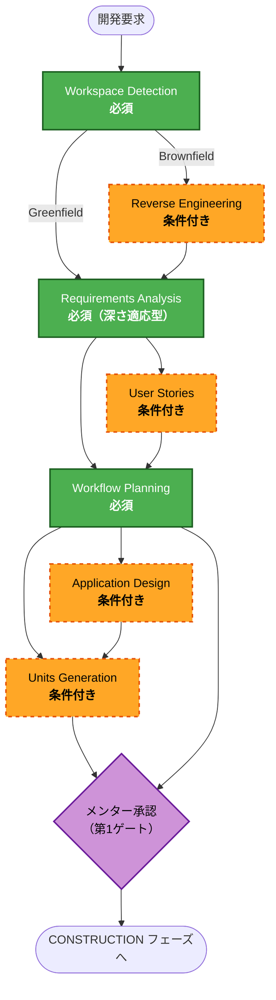
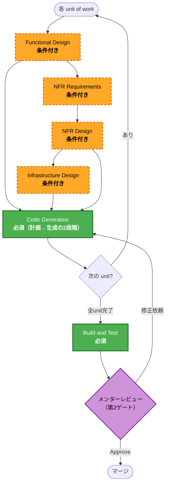
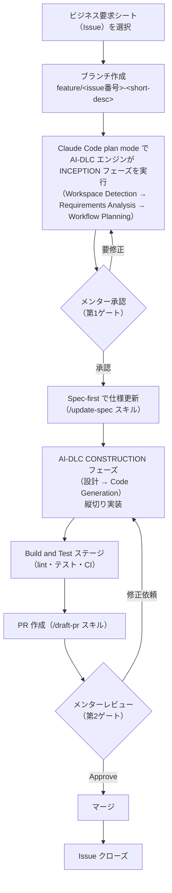

# 開発ワークフローガイド

このガイドは、学習課題（Issue）に着手してから完了するまでの **BookFlow 標準フロー** を示します。  
フローは AWS Labs の **AI-DLC**（AI Development Life Cycle、[`awslabs/aidlc-workflows`](https://github.com/awslabs/aidlc-workflows)）の 3 フェーズ・全ステージ・承認ゲートを **BookFlow の標準ワークフローとして採用**したものです。`aidlc-docs/` 並行成果物ツリーは作らず、状態管理は `Docs/spec/` に統合しています。

---

## AI-DLC エンジンと BookFlow フロー { #aidlc-mapping }

AI-DLC は Inception（WHAT/WHY）・Construction（HOW）・Operations の 3 フェーズと、**各ステージでの承認ゲート**を柱とする開発方法論です。BookFlow では AI-DLC エンジン（`.claude/rules/aidlc-core.md`）を **標準ワークフローとして教えています**。

### BookFlow 統合の要点

| AI-DLC の要素 | BookFlow での実体 |
|---|---|
| Inception（WHAT/WHY） | plan mode でエンジンが Workspace Detection → Requirements Analysis → Workflow Planning を実行 |
| ビジネス要求シート / Requirements | エンジンの Requirements Analysis 成果 → `Docs/spec/requirements.md` に統合 / `Docs/spec/enhancements/` のシート |
| units of work（並行可能な作業単位） | 縦切り課題 Issue ＝ `feature/<issue番号>-<short-desc>` 単位 |
| plan-first の承認ゲート | Claude Code **plan mode** でエンジンが Workflow Planning を提示 → メンター承認（第 1 ゲート） |
| Construction（HOW） | エンジンの per-unit ループ（設計 → Code Generation）→ Spec-first 仕様更新 → 縦切り実装 |
| Build and Test | エンジンの Build and Test ステージ ＋ CI 品質ゲート（lint・テスト・セキュリティスキャン） |
| Operations | CI 品質ゲート（`security-scan` / `ci-frontend` / `ci-backend`）にスコープを維持 |
| `aidlc-state.md`（進捗トラッカー） | `Docs/spec/aidlc-state.md` に写像 |
| `audit.md`（監査ログ） | `Docs/spec/aidlc-audit.md` に写像（追記専用） |
| `aidlc-docs/` 成果物ツリー | `Docs/spec/aidlc-docs/`（作業用）+ 既存 `Docs/spec/` ファイル（永続成果物） |

`AGENTS.md` は導入せず、AI ツールとの連携点は `CLAUDE.md` に一元化しています。

---

## AI-DLC 3フェーズの詳細 { #phases }

### INCEPTION フェーズ（WHAT/WHY）



| ステージ | 実行 | 役割 |
|---|---|---|
| Workspace Detection | 必須 | ワークスペース分析・Brownfield/Greenfield 判定・`aidlc-state.md` 初期化 |
| Reverse Engineering | Brownfield のみ | 既存コード解析・設計文書生成（STEP-05「既存機能読解」に対応） |
| Requirements Analysis | 必須 | 要件分析（Minimal/Standard/Comprehensive の深さ適応型） |
| User Stories | 条件付き | ユーザーストーリー・受入条件の策定（ユーザー影響がある変更に実行） |
| Workflow Planning | 必須 | 実行計画・後続ステージの EXECUTE/SKIP 判断 |
| Application Design | 条件付き | コンポーネント・メソッド・サービス設計（新コンポーネントが必要な場合） |
| Units Generation | 条件付き | units of work 分解（複数ユニット・複雑な分割が必要な場合） |

### CONSTRUCTION フェーズ（HOW）



| ステージ | 実行 | 役割 |
|---|---|---|
| Functional Design | 条件付き | 技術非依存のビジネスロジック設計（新データモデル・複雑なロジックに実行） |
| NFR Requirements | 条件付き | 非機能要件・技術スタック選定（パフォーマンス・セキュリティ・スケーラビリティ） |
| NFR Design | 条件付き | NFR パターン・論理コンポーネント設計（NFR Requirements 実行時に続けて実行） |
| Infrastructure Design | 条件付き | インフラ・デプロイアーキテクチャ設計（インフラ変更が必要な場合） |
| Code Generation | 必須 | コード生成の 2 段階：Part 1（計画・承認）→ Part 2（実行） |
| Build and Test | 必須 | ビルド・テスト手順の生成と検証 |

### OPERATIONS フェーズ

AI-DLC Operations の実体は CI 品質ゲート（`security-scan` / `ci-frontend` / `ci-backend`）です。将来のデプロイ自動化・監視は別タスクで扱います。

---

## 標準開発フロー { #flow }



2 つの承認ゲートが、計画段階・実装完了段階それぞれでメンターのフィードバックを受けるタイミングです。

---

## 各ステップの解説

### 1. ビジネス要求シート（Issue）を選択する

取り組む課題を Issue から選びます。Issue にはビジネス要求シート（背景・要件・受入条件・影響範囲・AI 活用ポイント）への参照が含まれます。受入条件はシート側が真実の源です。

新規に課題を起票する場合は、`.github/ISSUE_TEMPLATE/` の「必須課題（STEP）」または「選択課題（エンハンス）」のテンプレートから作成してください。選択課題のビジネス要求シートの様式・一覧は [spec/enhancements/index.md](../spec/enhancements/index.md) を参照してください。

### 2. ブランチを作成する

[coding-conventions.md §コミット・PR 規約](./coding-conventions.md#commit-pr) の規約に従い、`feature/<issue番号>-<short-desc>` の形式でブランチを作成します。

### 3. Claude Code の plan mode で AI-DLC エンジンが INCEPTION フェーズを実行する（第 1 ゲート）

shift+tab でプランモードに切り替え、ビジネス要求シートの内容を伝えます。AI-DLC エンジン（`.claude/rules/aidlc-core.md`）が以下を自動実行します：

1. **Workspace Detection**: ワークスペース分析・`Docs/spec/aidlc-state.md` を初期化
2. **Requirements Analysis**: 要件を整理（深さはエンジンが適応的に判断）
3. **Workflow Planning**: 実行すべき CONSTRUCTION ステージを判断し、実行計画を提示

計画をメンターに確認してもらい、承認を得てから実装に進みます（**第 1 ゲート**）。計画に問題があればこの段階で修正します。詳しい使い方は [ai-tools-guide.md §活用チェックリスト](./ai-tools-guide.md#checklist) を参照してください。

### 4. Spec-first で仕様を更新する

実装より先に `Docs/spec/` を更新します。エンジンの Requirements Analysis・Application Design の成果を既存の `Docs/spec/requirements.md`・`Docs/spec/screen-spec.md`・`Docs/spec/api-spec.md`・`Docs/spec/er-diagram.md` に統合します。`/update-spec` スキルを使うと更新対象の特定から表記規約のチェックまで案内されます。

仕様更新は **PR の先頭コミット**として記録し、実装と同一 PR で提出します。

### 5. AI-DLC CONSTRUCTION フェーズで設計・実装する

エンジンの Workflow Planning で決定した CONSTRUCTION ステージ（Functional Design / NFR Requirements / NFR Design / Infrastructure Design / Code Generation）を実行します。各ステージで成果物を提示し、**2択（Request Changes / Continue）**でメンター確認後に次へ進みます。

フロントエンド・バックエンドなど複数レイヤーにまたがる変更は、機能単位（縦切り）でまとめて実装します。実装中の規約は [coding-conventions.md](./coding-conventions.md) に従ってください。

### 6. Build and Test ステージと CI を通す

エンジンの Build and Test ステージでビルド・テスト手順を生成し、以下のコマンドで検証します：

```bash
# フロントエンド
cd frontend && pnpm test && pnpm lint

# バックエンド
cd backend && ./gradlew test && ./gradlew checkstyleMain
```

CI（`CI Frontend` / `CI Backend` / `Security Scan`）は機械的な品質ゲートです。

### 7. PR を作成する

[`.github/PULL_REQUEST_TEMPLATE.md`](../../.github/PULL_REQUEST_TEMPLATE.md) の様式に沿って PR を作成します。`/draft-pr` スキルを使うと、現在のブランチの差分からテンプレートに沿った PR タイトル・本文の下書きを生成できます。

### 8. メンターレビュー（第 2 ゲート）

メンターが PR をレビューします。Approve されたらマージします。レビュー観点と評価基準は [review-criteria.md §レビュー観点表](./review-criteria.md#review-rubric) を参照してください。

!!! note "メンター・リポジトリ管理者向け"
    GitHub の Settings → Branches でブランチ保護ルールを設定する場合、必須 status check には `CI Frontend / ci`・`CI Backend / ci`・`Security Scan / trivy` を、Approve は 1 名以上を指定してください。本リポジトリでは CODEOWNERS は使用しません。

### 9. マージ・Issue クローズ

PR をマージし、対応する Issue をクローズします。

---

## AI-DLC エンジンの活用参照

- **エンジンルール**: `.claude/rules/aidlc-core.md`（翻案版）、`vendor/aidlc-rules/aws-aidlc-rules/core-workflow.md`（上流原本）
- **ステージ詳細**: `.aidlc-rule-details/<phase>/<stage>.md`（BookFlow 翻案済み）
- **進捗トラッカー**: `Docs/spec/aidlc-state.md`
- **監査ログ**: `Docs/spec/aidlc-audit.md`
- **採用台帳**: `Docs/spec/aidlc-adoption.md`
