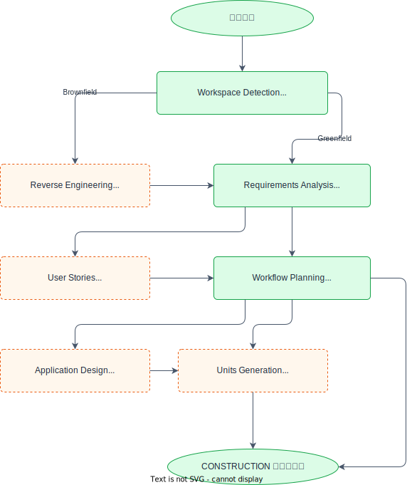
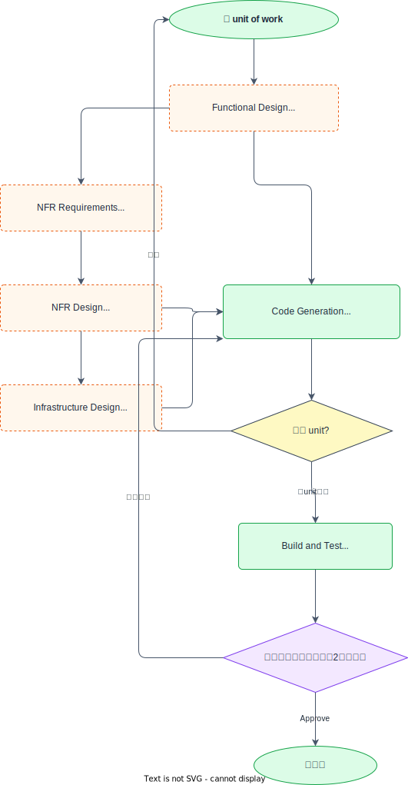
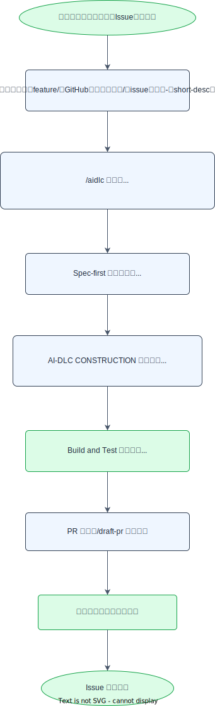

# 開発ワークフローガイド

このガイドは、学習課題（Issue）に着手してから完了するまでの **BookFlow 標準フロー** を示します。  
フローは AWS Labs の **AI-DLC**（AI Development Life Cycle、[`awslabs/aidlc-workflows`](https://github.com/awslabs/aidlc-workflows)）の 3 フェーズ・全ステージ・承認ゲートを **BookFlow の標準ワークフローとして採用**したものです。  
独立した `aidlc-docs/` 並行ツリーは作らず、作業用成果物は `Docs/spec/aidlc-docs/` に集約し、状態管理は `Docs/spec/` に統合しています。

---

## AI-DLC エンジンと BookFlow フロー { #aidlc-mapping }

AI-DLC は Inception（WHAT/WHY）/ Construction（HOW）/ Operations の 3 フェーズと、**各ステージでの承認ゲート**を柱とする開発方法論です。  
BookFlow では AI-DLC エンジン（`.claude/skills/aidlc/SKILL.md`）を **標準ワークフローとして教えています**。エンジンは `/aidlc` の明示起動、または「AI-DLC で進めて」等の意図指定があったときにのみ発動します。

### BookFlow 統合の要点

| AI-DLC の要素 | BookFlow での実体 |
|---|---|
| Inception（WHAT/WHY） | `/aidlc` 起動後、通常（agent）モードでエンジンが Workspace Detection → Requirements Analysis → Workflow Planning を実行 |
| ビジネス要求シート / Requirements | エンジンの Requirements Analysis 成果 → `Docs/spec/requirements.md` に統合 / `Docs/spec/enhancements/` のシート |
| units of work（並行可能な作業単位） | 縦切り課題 Issue ＝ `feature/<GitHubユーザー名>/<issue番号>-<short-desc>` 単位 |
| plan-first のセルフ承認 | `/aidlc` 起動時、エンジンが Workflow Planning を提示 → 学習者自身がチャットで計画に納得したことを示してから実装に進む |
| Construction（HOW） | エンジンの per-unit ループ（設計 → Code Generation）→ Spec-first 仕様更新 → 縦切り実装 |
| Build and Test | エンジンの Build and Test ステージ ＋ CI 品質ゲート（lint・テスト） |
| Operations | CI 品質ゲート（`CI Frontend` / `CI Backend`）にスコープを維持 |
| `aidlc-state.md`（進捗トラッカー） | `Docs/spec/aidlc-state.md` に写像 |
| `audit.md`（監査ログ） | `Docs/spec/aidlc-audit.md` に写像（追記専用） |
| `aidlc-docs/` 成果物ツリー | `Docs/spec/aidlc-docs/`（作業用）+ 既存 `Docs/spec/` ファイル（永続成果物） |

`AGENTS.md` は導入せず、AI ツールとの連携点は `CLAUDE.md` に一元化しています。

---

## AI-DLC 3フェーズの詳細 { #phases }

### INCEPTION フェーズ（WHAT/WHY）



| ステージ | 実行 | 役割 |
|---|---|---|
| Workspace Detection | 必須 | ワークスペース分析・Brownfield/Greenfield 判定・`aidlc-state.md` 初期化 |
| Reverse Engineering | Brownfield のみ | 既存コード解析・設計文書生成（[コードベース理解ガイド](./curriculum.md#codebase-understanding) に対応） |
| Requirements Analysis | 必須 | 要件分析（Minimal/Standard/Comprehensive の深さ適応型） |
| User Stories | 条件付き | ユーザーストーリー・受入条件の策定（ユーザー影響がある変更に実行） |
| Workflow Planning | 必須 | 実行計画・後続ステージの EXECUTE/SKIP 判断 |
| Application Design | 条件付き | コンポーネント・メソッド・サービス設計（新コンポーネントが必要な場合） |
| Units Generation | 条件付き | units of work 分解（複数ユニット・複雑な分割が必要な場合） |

### CONSTRUCTION フェーズ（HOW）



| ステージ | 実行 | 役割 |
|---|---|---|
| Functional Design | 条件付き | 技術非依存のビジネスロジック設計（新データモデル・複雑なロジックに実行） |
| NFR Requirements | 条件付き | 非機能要件・技術スタック選定（パフォーマンス・セキュリティ・スケーラビリティ） |
| NFR Design | 条件付き | NFR パターン・論理コンポーネント設計（NFR Requirements 実行時に続けて実行） |
| Infrastructure Design | 条件付き | インフラ・デプロイアーキテクチャ設計（インフラ変更が必要な場合） |
| Code Generation | 必須 | コード生成の 2 段階：Part 1（計画・承認）→ Part 2（実行） |
| Build and Test | 必須 | ビルド・テスト手順の生成と検証 |

### OPERATIONS フェーズ

AI-DLC Operations の実体は CI 品質ゲート（`CI Frontend` / `CI Backend`）です。将来のデプロイ自動化、監視は別タスクで扱います。

---

## 標準開発フロー { #flow }



計画段階（Workflow Planning）・実装完了段階（PR）のそれぞれで、学習者自身がセルフチェックしてから次に進みます。メンターは必須の承認者ではなく、Issue・PR への任意のコメントで支援します。

---

## 各ステップの解説

### 1. ビジネス要求シート（Issue）を選択する

取り組む課題を Issue から選びます。Issue にはビジネス要求シート（背景、依存関係、要件、受入条件、影響範囲、AI 活用ポイント）への参照が含まれます。  
受入条件はシート側が真実の源です。

### 2. ブランチを作成する

[coding-conventions.md §共通方針](./coding-conventions.md#common) の規約に従い、`feature/<GitHubユーザー名>/<issue番号>-<short-desc>` の形式でブランチを作成します。

!!! note "作り忘れた場合"
    ブランチを作成し忘れたまま `/aidlc` を起動しても、エンジン起動前の Pre-flight 処理が `main`/`master` 上にいることを検知します。取り組む対象のビジネス要求シート（`Docs/spec/enhancements/`）を特定できれば、short-desc とファイル名・GitHub Issue 検索から Issue 番号を推測してブランチ名を提案するので、内容を確認して承認するだけで済みます（推測できない場合は Issue 番号と短い説明を直接確認します）。ブランチはこの提案の承認後に自動作成され、ワークフローが始まります（詳細は [`.claude/skills/aidlc/SKILL.md`](../../.claude/skills/aidlc/SKILL.md) の Pre-flight 節を参照）。

!!! tip "コードベースを読み解くタイミング"
    実装に入る前に対象機能のコードを読み解いておくと、次の Workflow Planning での計画が立てやすくなります。読み方の目安は [curriculum.md §コードベース理解ガイド](./curriculum.md#codebase-understanding) を参照してください。

### 3. `/aidlc` を起動して AI-DLC エンジンに INCEPTION フェーズを実行させる

通常（agent）モードのまま、ビジネス要求シートの内容を伝えたうえで、`/aidlc` を起動する（または「AI-DLC で進めて」と明示的に伝える）と、AI-DLC エンジン（`.claude/skills/aidlc/SKILL.md`）が発動します。AI-DLC の指定がない小修正・質問では発動しません。plan mode への切り替えは不要です。  
発動すると、エンジンは以下を自動実行します：

1. **Workspace Detection**: ワークスペース分析・`Docs/spec/aidlc-state.md` を初期化
2. **Requirements Analysis**: 要件を整理（深さはエンジンが適応的に判断）
3. **Workflow Planning**: 実行すべき CONSTRUCTION ステージを判断し、実行計画を提示

計画の内容を自分で確認し、納得したらチャットでその旨を伝えて承認し、実装に進みます。メンターの承認は不要です。計画に問題があればこの段階で修正します。  
Claude Code の基本操作は [ai-tools-guide.md](./ai-tools-guide.md) を参照してください。

### 4. Spec-first で仕様を更新する

実装より先に `Docs/spec/` を更新します。  
エンジンの Requirements Analysis、Application Design の成果を既存の `Docs/spec/requirements.md`、`Docs/spec/screen-spec.md`、`Docs/spec/api-spec.md`、`Docs/spec/er-diagram.md` に統合します。  
`/update-spec` スキルを使うと更新対象の特定から表記規約のチェックまで案内されます。

仕様更新は実装と同一 PR で提出します。実装コミットに同梱してもよいし、独立した `docs(spec): ...` コミットに分けてもよい（分ける場合は PR の先頭コミットにします）。

### 5. AI-DLC CONSTRUCTION フェーズで設計・実装する

エンジンの Workflow Planning で決定した CONSTRUCTION ステージ（Functional Design / NFR Requirements / NFR Design / Infrastructure Design / Code Generation）を実行します。  
各ステージで成果物を提示し、**2択（Request Changes / Continue）**で学習者自身が確認したうえで次へ進みます。

フロントエンド、バックエンドなど複数レイヤーにまたがる変更は、機能単位（縦切り）でまとめて実装します。  
実装中の規約は [coding-conventions.md](./coding-conventions.md) に従ってください。

### 6. Build and Test ステージと CI を通す

エンジンの Build and Test ステージでビルド・テスト手順を生成し、以下のコマンドで検証します：

```bash
# フロントエンド
cd frontend && pnpm test && pnpm lint

# バックエンド
cd backend && ./gradlew test && ./gradlew checkstyleMain
```

CI（`CI Frontend` / `CI Backend`）は機械的な品質ゲートです。

### 7. PR を作成する

[`.github/PULL_REQUEST_TEMPLATE.md`](../../.github/PULL_REQUEST_TEMPLATE.md) の様式に沿って PR を作成します。  
`/create-pr` スキルを使うと、head/base ブランチと下書きのみか実際に作成するかを確認したうえで、テンプレートに沿った PR タイトル・本文を組み立て、`gh pr create` で作成できます。実際に作成する場合、head ブランチの push は事前に済ませておく必要があります（`/commit-push` スキル参照）。

### 8. セルフレビュー・マージ

[review-criteria.md §評価基準](./review-criteria.md#completion-criteria) のチェックリストで自分の PR をセルフレビューし、満たしていることを確認したら自分でマージします。メンターレビューは必須ではありません。メンターは任意のタイミングで Issue・PR にコメントすることがあります。

PR に `@claude review` とコメントすると、AI 一次レビューが得られます（[review-criteria.md §AI 一次レビューとの対応](./review-criteria.md#ai-review)、[ADR-024](../decision/ADR-024-ai-first-review-adoption.md)）。これは任意の参考コメントであり、マージをブロックしません。

!!! note "メンター・リポジトリ管理者向け"
    GitHub の Settings → Branches でブランチ保護ルールを設定する場合、必須 status check には `CI Frontend / ci`、`CI Backend / ci` を指定してください。承認レビューは必須にしません（「Require approvals」はオフ）。  
    本リポジトリでは CODEOWNERS は使用しません。

### 9. マージ・Issue クローズ

PR をマージし、対応する Issue をクローズします。

---

## AI-DLC エンジンの活用参照

- **エンジン本体**: `.claude/skills/aidlc/SKILL.md`（`/aidlc` スキル）、`vendor/aidlc-rules/aws-aidlc-rules/core-workflow.md`（上流原本）
- **起動判断のポインタ**: `.claude/rules/aidlc-core.md`（常時読込。`/aidlc` を起動すべきかどうかの判断のみを担う薄いファイル）
- **ステージ詳細**: `.aidlc-rule-details/<phase>/<stage>.md`（BookFlow 翻案済み）
- **進捗トラッカー**: `Docs/spec/aidlc-state.md`
- **監査ログ**: `Docs/spec/aidlc-audit.md`
- **採用台帳**: `Docs/spec/aidlc-adoption.md`
