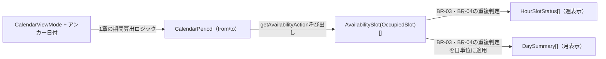

# Domain Entities — カレンダービュー（Unit: calendar-view）

本課題はバックエンドのデータモデルを変更しない。既存の`OccupiedSlot`（`reservationId`・`startAt`・`endAt`、`frontend/src/lib/types/api.ts`の`AvailabilitySlotSchema`）を唯一の入力とし、以下はすべてフロントエンド側の表示用に導出する型（永続化しない）である。

## 既存エンティティ（再利用、変更なし）

- **`AvailabilitySlot`**（`OccupiedSlot`のフロントエンド表現）：`reservationId: string`・`startAt: string`・`endAt: string`

## 新規導出型（フロントエンドのみ、`calendar-logic.ts`に定義）

- **`CalendarViewMode`**：`"week" | "month"`。カレンダーの表示モード。
- **`CalendarPeriod`**：`{ from: Date; to: Date }`。表示モードとアンカー日付から算出される、空き状況取得の対象期間（半開区間）。
- **`HourSlotStatus`**：`{ date: Date; hour: number; occupied: boolean; reservationId: string | null }`。週表示の1セル分の状態。`hour`は0〜23。
- **`DaySummary`**：`{ date: Date; reservationCount: number; isCurrentMonth: boolean }`。月表示の1セル（1日）分の状態。

## 関係

`CalendarViewMode`とアンカー日付はReactコンポーネントの`useState`で保持するクライアント状態であり、永続化・URL同期は行わない（`requirements.md`のTechnical Context「状態管理」節のとおり）。
