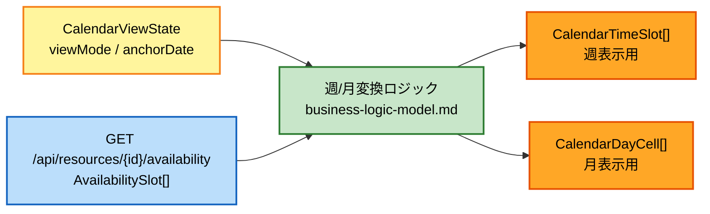

# Domain Entities — calendar-view

本ユニットはフロントエンドの表示状態のみを扱い、永続化対象の新規ドメインエンティティは持たない。以下はコンポーネント内部で扱うフロントエンド側の表示用モデル（TypeScript 型）である。

## 既存エンティティ（再利用）

### AvailabilitySlot（`frontend/src/lib/types/api.ts`、既存）

| フィールド | 型 | 説明 |
|---|---|---|
| `reservationId` | `string`（UUID） | 占有している予約の ID |
| `startAt` | `string`（ISO日時） | 占有区間の開始日時 |
| `endAt` | `string`（ISO日時） | 占有区間の終了日時 |

課題シート上は `OccupiedSlot` と呼称されるが、フロントエンドの実装上の型名は `AvailabilitySlot` であり、本ユニットでもこれをそのまま再利用する（新しい型を重複定義しない）。

## 新規の表示用モデル（永続化しない）

### CalendarViewState

| フィールド | 型 | 説明 |
|---|---|---|
| `viewMode` | `'week' \| 'month'` | 現在の表示モード |
| `anchorDate` | `Date` | 表示期間を算出する基準日 |

### CalendarTimeSlot（週表示の30分枠、`AvailabilitySlot[]` から導出）

| フィールド | 型 | 説明 |
|---|---|---|
| `date` | `Date` | 対象日 |
| `startTime` | `Date` | 枠の開始日時 |
| `endTime` | `Date` | 枠の終了日時（`startTime` + 30分） |
| `status` | `'available' \| 'occupied'` | BR-01/BR-02 により判定 |

### CalendarDayCell（月表示の日セル、`AvailabilitySlot[]` から導出）

| フィールド | 型 | 説明 |
|---|---|---|
| `date` | `Date` | 対象日 |
| `hasReservation` | `boolean` | BR-04 により判定（その日に重なる `AvailabilitySlot` が1件以上あるか） |
| `isCurrentPeriod` | `boolean` | 月表示グリッドにおいて、表示対象の月に属する日か（前後月の日付は `false`） |

## 関連図

```mermaid
flowchart LR
    API["GET /api/resources/{id}/availability<br/>AvailabilitySlot[]"]
    State["CalendarViewState<br/>viewMode / anchorDate"]
    Transform["週/月変換ロジック<br/>business-logic-model.md"]
    Week["CalendarTimeSlot[]<br/>週表示用"]
    Month["CalendarDayCell[]<br/>月表示用"]

    State --> Transform
    API --> Transform
    Transform --> Week
    Transform --> Month

    style API fill:#BBDEFB,stroke:#1565C0,stroke-width:2px,color:#000
    style State fill:#FFF59D,stroke:#F57F17,stroke-width:2px,color:#000
    style Transform fill:#C8E6C9,stroke:#2E7D32,stroke-width:2px,color:#000
    style Week fill:#FFA726,stroke:#E65100,stroke-width:2px,color:#000
    style Month fill:#FFA726,stroke:#E65100,stroke-width:2px,color:#000
```
