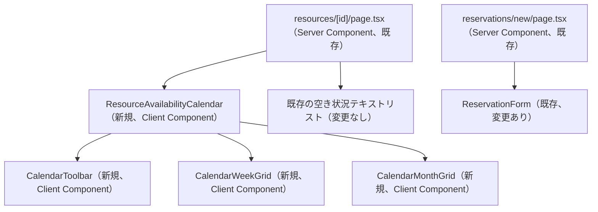

# Frontend Components — カレンダービュー（Unit: calendar-view）

## コンポーネント階層

配置先ディレクトリ：`frontend/src/app/(authenticated)/resources/[id]/`（純粋関数は`calendar-logic.ts`として同ディレクトリに配置し、コンポーネントから分離する。純粋関数はサーバー・クライアントどちらからも参照しうるため`"use client"`指定は付けない）。

## `resources/[id]/page.tsx`（既存、変更）

- 既存の`slots`取得ロジック（当日〜7日後固定）はテキストリスト表示専用として維持する（BR-13）。
- 新規に`<ResourceAvailabilityCalendar resourceId={resource.id} />`をテキストリストより前に配置する。カレンダー自身の初期データ取得はクライアント側で行うため、Server Componentからは`resourceId`のみを渡す。

## `ResourceAvailabilityCalendar`（新規）

**Props**：`{ resourceId: string }`

**State**：
- `viewMode: CalendarViewMode`（初期値`"week"`）
- `anchorDate: Date`（初期値：本日）
- `slots: AvailabilitySlot[]`（初期値`[]`）
- `isPending: boolean`（`useTransition`、データ再取得中の表示制御）

**振る舞い**：
- マウント時、および`viewMode`・`anchorDate`が変化するたびに、`calendar-logic.ts`の期間算出ロジックで`{ from, to }`を求め、`getAvailabilityAction(resourceId, from, to)`を呼び直す（`useEffect`＋`useTransition`。エラー時は既存の`resources/[id]/page.tsx`と同様に握りつぶし、`slots`を空のまま扱う）。
- `viewMode`を変更するハンドラ、前後移動（`shiftPeriod("prev" | "next")`）ハンドラ、月表示の日セルクリック時にアンカー日付を更新し`viewMode`を`"week"`に戻すハンドラを持つ。
- `CalendarToolbar`・`CalendarWeekGrid`・`CalendarMonthGrid`へ、算出済みの表示用データとハンドラをpropsで渡す（ロジック自体はコンポーネント内に持たず、`calendar-logic.ts`の関数呼び出しに委譲する）。

## `CalendarToolbar`（新規）

**Props**：`{ viewMode: CalendarViewMode; periodLabel: string; onViewModeChange: (mode: CalendarViewMode) => void; onPrev: () => void; onNext: () => void }`

- 週表示/月表示の切り替えボタン（shadcn/uiの`Button`、選択中を`variant`で区別）。
- 「前週/前月」「次週/次月」ボタン（`viewMode`に応じてラベルを出し分ける）。
- `periodLabel`（例：「2026年8月17日 〜 2026年8月23日」「2026年8月」）は`ResourceAvailabilityCalendar`側で算出して渡す。

## `CalendarWeekGrid`（新規）

**Props**：`{ weekStart: Date; slots: HourSlotStatus[]; resourceId: string }`

- 7列（曜日）× 24行（時間）のグリッドを描画する。
- 各セルは`slots`から対応する`HourSlotStatus`を参照し、`calendar-logic.ts`の`getWeekCellHref(cell, resourceId)`の戻り値で分岐する。`null`が返ればグレーアウト＋テキスト「予約済」の`
`（クリック不可、BR-12：色のみに依存しない）、`null`以外なら空きスタイルの`<Link href={...}>`として描画する。コンポーネント自身は`occupied`を見て条件分岐しない（クリック可否の判断は`getWeekCellHref`に一元化し、ユニットテストで直接検証する）。
- 週168セルの再レンダリングを抑えるため、セル単位のサブコンポーネントを`React.memo`化し、`slots`配列ではなく該当セルの`HourSlotStatus`のみをpropsに渡す。

## `CalendarMonthGrid`（新規）

**Props**：`{ days: DaySummary[]; onDayClick: (date: Date) => void }`

- 月曜始まりの週を複数行、7列で描画する（前月・翌月の日付を含む、BR-08）。
- 各日セルは`reservationCount`に応じて「空き」または「予約 N件」を表示し、`isCurrentMonth === false`のセルは薄いスタイルにする。
- 日セルの`onClick`は`onDayClick(date)`を呼ぶのみで、URL遷移は行わない（BR-07）。

## `reservations/new/page.tsx`（既存、変更）

- `searchParams`から`startAt`を読み取り、`defaultResourceId`と同様に`ReservationForm`へ`defaultStartAt`propとして渡す。

## `ReservationForm`（既存、変更）

**Props（変更後）**：`{ resources: ResourceResponse[]; defaultResourceId?: string; defaultStartAt?: string }`

- `useForm`の`defaultValues.startAt`を`defaultStartAt ?? ""`に変更する（既存の`defaultResourceId ?? ""`と同一パターン、フォームのバリデーションルール・送信ロジックは変更しない）。

## API連携ポイント

| コンポーネント | 呼び出すServer Action | 変更 |
|---|---|---|
| `ResourceAvailabilityCalendar` | `getAvailabilityAction(id, from, to)`（`server/actions/resources.ts`） | 呼び出し元が増えるのみ。関数シグネチャ変更なし |
| `resources/[id]/page.tsx` | `getResourceAction`・`getAvailabilityAction`（既存呼び出し） | 変更なし |
| `reservations/new/page.tsx` | なし（`searchParams`読み取りのみ） | `startAt`読み取りを追加 |

## テスト方針

- `calendar-logic.ts`内の純粋関数（期間算出・グリッド写像・日次要約・URL生成・アンカー日付シフト）はVitestのユニットテストで網羅する（コンポーネントを介さずに直接テストする）。
- コンポーネントのレンダリング・クリック挙動のテストは、`ResourceFilterForm`等の既存テストパターン（Testing Library）に合わせて主要な振る舞い（週/月切り替え、予約済みセルのクリック無効化）のみを対象とし、全168セルの網羅的なレンダリングテストは行わない（ロジック自体は純粋関数側で網羅済みのため）。
