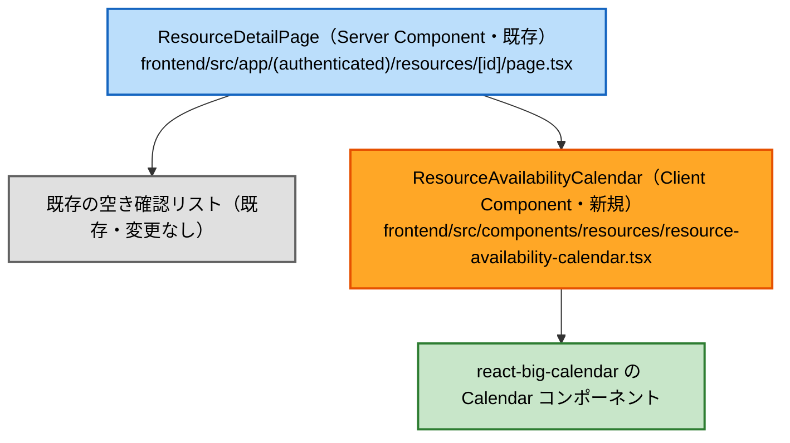

# Frontend Components — calendar-view

## 採用ライブラリ（明確化質問の回答）

- **`react-big-calendar`**（MIT ライセンス）をカレンダー描画に採用する
- `react-big-calendar` は日付計算に外部の日付ライブラリ（localizer）を要求するが、本リポジトリには date-fns 等の日付ライブラリが未導入のため、**`date-fns`（MIT ライセンス）を合わせて新規導入**する
- Code Generation 時、`pnpm add` 前に両ライブラリのライセンス表記を改めて確認する（`CLAUDE.md` のローカル環境セットアップ Gotcha に準拠）。また React 19 / Next.js 15 との互換性（peer dependency 警告の有無）も導入時に確認する

## コンポーネント構成

```mermaid
flowchart TD
    Page["ResourceDetailPage（Server Component・既存）<br/>frontend/src/app/(authenticated)/resources/[id]/page.tsx"]
    List["既存の空き確認リスト（既存・変更なし）"]
    Calendar["ResourceAvailabilityCalendar（Client Component・新規）<br/>frontend/src/components/resources/resource-availability-calendar.tsx"]
    RBC["react-big-calendar の Calendar コンポーネント"]

    Page --> List
    Page --> Calendar
    Calendar --> RBC

    style Page fill:#BBDEFB,stroke:#1565C0,stroke-width:2px,color:#000
    style List fill:#E0E0E0,stroke:#616161,stroke-width:2px,color:#000
    style Calendar fill:#FFA726,stroke:#E65100,stroke-width:2px,color:#000
    style RBC fill:#C8E6C9,stroke:#2E7D32,stroke-width:2px,color:#000
```

### `ResourceDetailPage`（既存・変更内容のみ記載）

- Server Component のまま維持する。既存の「空き状況」セクション（当日〜7日後のリスト）はそのまま残す（BR-09）
- 新規に `<ResourceAvailabilityCalendar resourceId={resource.id} />` を、既存の空き確認リストセクションの前または後ろに追加する（具体的な配置順は Code Generation 時に画面バランスを見て決定する）
- 初期データの fetch 方法は変更しない（カレンダー用のデータ取得は `ResourceAvailabilityCalendar` 内で独立して行う）

### `ResourceAvailabilityCalendar`（新規・Client Component）

**Props**:

| Prop | 型 | 説明 |
|---|---|---|
| `resourceId` | `string` | 対象リソースの ID |

**State**（`useState` で管理。BookFlow のフロントエンド規約に従いクライアント状態は最小限に留め、この画面のみで閉じる一時的な表示状態のため `Zustand` グローバルストアは導入しない）:

| State | 型 | 初期値 | 説明 |
|---|---|---|---|
| `viewMode` | `'week' \| 'month'` | `'week'` | 表示モード |
| `anchorDate` | `Date` | 今日 | 表示期間の基準日 |
| `slots` | `AvailabilitySlot[]` | `[]` | 現在の表示期間の占有スロット |
| `isLoading` | `boolean` | `false` | 取得中フラグ |
| `hasError` | `boolean` | `false` | 取得失敗フラグ（BR-08） |

**副作用**:
- `viewMode` または `anchorDate` が変化するたびに、`business-logic-model.md` の期間算出ロジックで `from`/`to` を計算し、`getAvailabilityAction(resourceId, from, to)`（既存の Server Action、`frontend/src/server/actions/resources.ts`）を呼び出して `slots` を更新する
- 取得失敗時は `hasError = true` とし、BR-08 に従って簡潔なエラー表示に留める

**react-big-calendar の設定方針**:
- `localizer`：`date-fns` ベースの `dateFnsLocalizer`（日本語ロケール・月曜始まり週）
- `view` / `onView`：`viewMode` と同期する（`month` ビューと `week` ビューのみ使用し、`day`/`agenda` は無効化する）
- `date` / `onNavigate`：`anchorDate` と同期する（ツールバーの「前へ・次へ・今日」操作に対応。RSV-04）
- `step` / `timeslots`：週表示のグリッド粒度を30分単位にする（BR-07）
- `events`：週表示では `slots` をそのまま `{ start: startAt, end: endAt, resource: reservationId }` 形式のイベントに変換して渡し、`eventPropGetter` でグレーアウト表示する（BR-01）。月表示では `events` は空配列とし、個々の予約を表示しない（明確化質問の回答：2値表示のみ）
- `dayPropGetter`（月表示）：対象日が `CalendarDayCell.hasReservation` なら背景色を付けるクラスを返す（BR-04）
- `selectable`：週表示・月表示とも `true` にする
- `onSelectSlot`：
  - 週表示：選択範囲が `slots` のいずれかと重なる場合は何もしない（BR-01 によりグレーアウトされているため通常は選択不可だが、念のためガードする）。重ならない場合は `router.push(`/reservations/new?resourceId=${resourceId}&startAt=${選択開始日時のISO文字列}`)` で遷移する（BR-03）
  - 月表示：`viewMode` を `'week'` に、`anchorDate` をクリックした日付に更新する（画面遷移はしない。BR-05）

### 子コンポーネントへの分割方針

`react-big-calendar` のラッパーとして `ResourceAvailabilityCalendar` 単体に責務を閉じ、過度な分割はしない（画面規模が小さいため）。ただし以下は分離してテスト容易性を高める：

- `frontend/src/lib/calendar/availability-to-events.ts`：`AvailabilitySlot[]` → 週表示イベント配列・月表示の `hasReservation` 判定への変換関数（純粋関数。`business-logic-model.md` のロジックを実装し、Vitest で単体テストする）
- `frontend/src/lib/calendar/period.ts`：`viewMode`/`anchorDate` から `from`/`to`、前後移動後の `anchorDate` を算出する純粋関数（Vitest で単体テストする）

### `/reservations/new` 側の変更（既存・小規模な拡張）

RSV-03（空き枠クリックで開始日時を引き渡す）を成立させるには、遷移先の予約申請フォームが `startAt` クエリパラメータを読み取れる必要がある。現状は `resourceId` のみ対応しているため、以下を拡張する（新規コンポーネントの追加ではなく、既存2ファイルへの追記）：

- `frontend/src/app/(authenticated)/reservations/new/page.tsx`：`searchParams.startAt` を読み取り、`ReservationForm` に `defaultStartAt` として渡す
- `frontend/src/app/(authenticated)/reservations/new/ReservationForm.tsx`：`defaultStartAt` を受け取り、`startAt` の `defaultValues` に設定する。`startAt` の入力欄は `type="datetime-local"` のため、値は `YYYY-MM-DDTHH:mm` 形式（秒・タイムゾーンなし）に整形して渡す必要がある（`ResourceAvailabilityCalendar` 側でこの形式に変換してからクエリパラメータに含める）

## API 連携箇所

| コンポーネント / 関数 | 呼び出し | 備考 |
|---|---|---|
| `ResourceAvailabilityCalendar` | `getAvailabilityAction(resourceId, from, to)`（既存 Server Action） | 表示期間変更のたびに呼び出す。バックエンド・API 契約の変更なし |

## フォームバリデーション

本ユニットは新規フォームを持たない。`/reservations/new` への遷移時にクエリパラメータ（`resourceId`・`startAt`）で初期値を渡すのみで、予約申請フォーム自体のバリデーションルール（終了 > 開始、必須項目等）は既存のまま変更しない。
