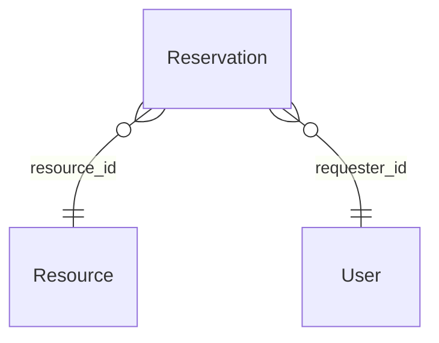

# Domain Entities — CSV 帳票出力（Unit: csv-export）

## 新規エンティティ・DTO: なし

本ユニットは既存の `Reservation` エンティティを読み取り専用で参照するのみで、新規のドメインエンティティ・JPA エンティティ・リクエスト/レスポンス DTO は追加しない（Requirements Analysis・Application Design で確定済みの方針）。

- CSV 生成はコントローラ引数（`List<ReservationStatus>`・`LocalDateTime` × 2）から直接行うため、新規リクエスト DTO は不要。
- レスポンスは `byte[]`（`ResponseEntity<byte[]>`）であり、新規レスポンス DTO は不要。

## 参照する既存エンティティ・値

| エンティティ/型 | 参照するフィールド | 用途 |
|---|---|---|
| `Reservation` | `id`・`startAt`・`endAt`・`purpose`・`status` | CSV データ行の直接の値 |
| `Reservation.resource`（`Resource`、LAZY） | `name` | CSV「リソース名」列（`JOIN FETCH` で N+1 を回避、既存 `ReservationRepository` の他メソッドと同じ方針） |
| `Reservation.requester`（`User`、LAZY） | `name` | CSV「申請者名」列（同上） |
| `ReservationStatus`（enum） | 全5値 | `business-rules.md` のステータス表示マッピングのキー |

## エンティティ関連図（既存関係を変更しない）

新規のリレーション・カラム追加はない。`docs-next/docs/spec/er-diagram.md` の更新は不要。
