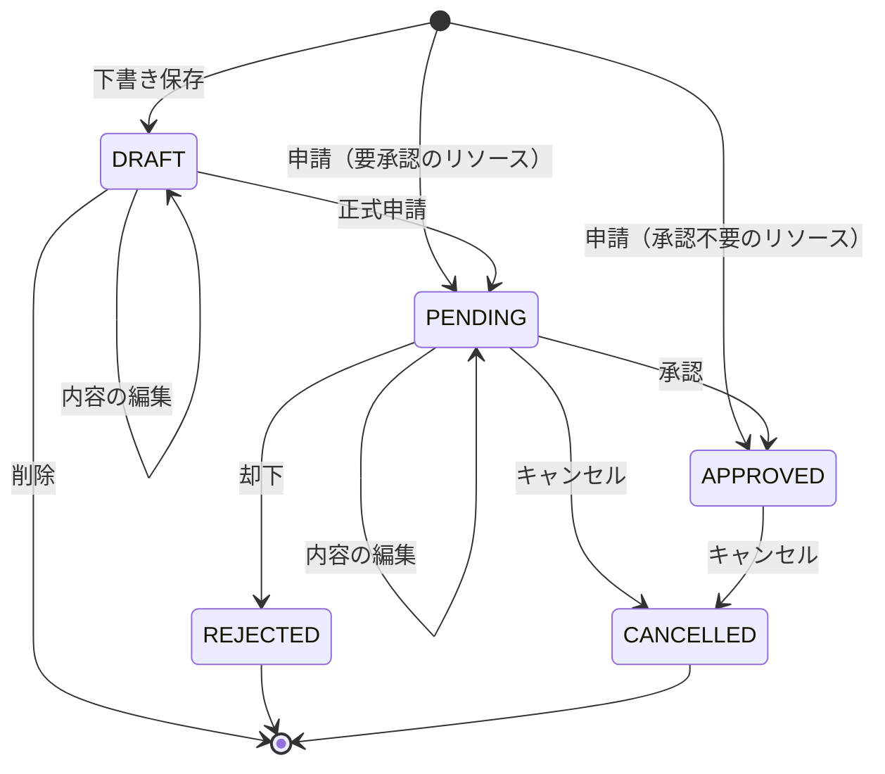

# Domain Entities — `reservation-draft`

**ユニット**: `reservation-draft`
**作成日時**: 2026-10-02T11:02:40+00:00

本ユニットは新しいエンティティを導入しない。
既存の `Reservation` に状態遷移メソッドを1つ足すだけで、フィールド構成とテーブル定義は変わらない。

---

## 1. `Reservation`

### 変更しないもの

フィールド構成、テーブルマッピング、`create` / `update` / `cancel` / `markApproved` / `markRejected` の既存メソッドは変更しない。
`ddl-auto: validate` の制約により、カラム名・型・制約は `V001__create_initial_schema.sql` と一致していなければならないが、
本ユニットはスキーマを変更しないため、この制約への影響もない。

### 追加するメソッド

```java
/**
 * 予約を承認待ちにする。
 *
 * 下書きの正式申請で、リソースが承認を要する場合に呼ばれる。
 * 呼び出し前に Service 層で遷移可否と重複予約を確認すること。
 */
public void markPending() {
  this.status = ReservationStatus.PENDING;
  this.updatedAt = LocalDateTime.now();
}
```

既存の `cancel()` / `markApproved()` / `markRejected()` と同じ形にする。
いずれも引数を取らず、固定のステータスを書き込み、`updatedAt` を更新するだけで、遷移の可否は判定しない。
遷移先が `APPROVED` の場合は既存の `markApproved()` をそのまま使うため、追加するメソッドはこれ1つで足りる。

### 遷移の可否をエンティティに持たせない理由

既存のステータスガード（更新は `PENDING` のみ、キャンセルは `PENDING` と `APPROVED` のみ）はすべて `ReservationService` に置かれている。
エンティティに判定を移すと、同じ種類のルールが2つの層に分かれ、どちらを読めばよいかが曖昧になる。
本ユニットだけ配置を変える理由がないため、既存の構成に合わせる（確認質問 Q6）。

---

## 2. `ReservationStatus`

変更しない。`DRAFT` は既に定義済みである。

```java
public enum ReservationStatus {
  DRAFT,
  PENDING,
  APPROVED,
  REJECTED,
  CANCELLED
}
```

---

## 3. ステータス遷移図



### テキストによる表現

```
初期状態への遷移
  なし        -> DRAFT      下書き保存（draft=true）
  なし        -> PENDING    申請（requires_approval=true）
  なし        -> APPROVED   申請（requires_approval=false）

本ユニットで追加する遷移
  DRAFT       -> DRAFT      内容の編集（PUT・status 省略）
  DRAFT       -> PENDING    正式申請（PUT・status=PENDING。requires_approval の値によらない）
  DRAFT       -> （削除）   DELETE。レコードごと削除するため遷移先のステータスはない

既存の遷移（変更しない）
  PENDING     -> PENDING    内容の編集
  PENDING     -> APPROVED   承認
  PENDING     -> REJECTED   却下
  PENDING     -> CANCELLED  キャンセル
  APPROVED    -> CANCELLED  キャンセル

禁止する遷移
  DRAFT       -> CANCELLED  下書きの破棄は削除で行う（キャンセルは 422）
  DRAFT       -> APPROVED   直接指定は 422。正式申請の遷移先も PENDING のみ
  DRAFT       -> REJECTED   承認フローを経ないため発生しない
  PENDING     -> DRAFT      申請の取り下げはスコープ外
  APPROVED    -> DRAFT      同上
  REJECTED    -> 任意        終端状態
  CANCELLED   -> 任意        終端状態
```

`DRAFT` から直接 `APPROVED` へ遷移することはない。
正式申請の遷移先は `requires_approval` の値によらず `PENDING` であり、
リクエストで `status` に `"APPROVED"` を指定することもできない（422）。
利用者が承認を迂回できないようにするため。

---

## 4. `approval_steps` との関係

`DRAFT` の予約は `approval_steps` を1件も持たない。
承認ステップが生成されるのは、次の2つの時点に限る。

1. 予約の新規作成時、`draft` が指定されず、かつリソースの `requires_approval` が `true` のとき（既存の振る舞い）
2. 下書きの正式申請時、リソースの `requires_approval` が `true` のとき（本ユニットで追加）

`requires_approval` が `false` のリソースを下書きから正式申請した場合は、`PENDING` になるが承認ステップは生成されない。
この予約は承認待ち一覧から到達できず進まなくなる（既知の制約。要件定義 §7 を参照）。

承認ステップの生成処理そのもの（`ApprovalService.createInitialStep`）は変更しない。
呼び出す条件だけが変わる。
