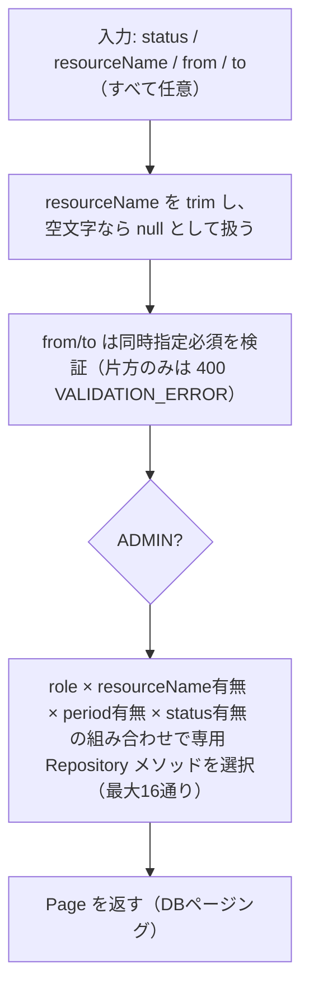

# Business Logic Model — reservation-list-filter

## 予約一覧取得のデータフロー（resourceName・from/to 追加後）

## 合成ルール

- `status`・`resourceName`・`from`/`to` はすべて独立したフィルタ条件であり、AND 合成される
- いずれの条件も「指定されていなければ絞り込まない」という既存方針（status の既存実装と同じ）を resourceName・period にも適用する
- 既存のロール別可視範囲（ADMIN は全予約、それ以外は自分の予約のみ）は、新規フィルタとは独立した前提条件として常に適用される（BR-05）

## 既存ロジックとの接続点

- **ページネーション方式は変更なし**: 既存の `ReservationService#list` は `Page<Reservation>` を `Pageable` ごと Repository に渡す DB ページング方式。resourceName・period フィルタは JPQL の `WHERE` 句として追加するだけで、Resource の空き確認のような Java 側手動ページネーションへの変更は不要（Reservation 自身の `startAt`/`endAt` を絞り込むだけで完結するため）
- **16メソッド構成**: 既存の4メソッド（role 2 × status 2）に resourceName 有無（2）× period 有無（2）を掛け合わせた最大16通りの `@Query` メソッドを追加する。共通条件は `ReservationRepository` のインターフェース定数（`RESOURCE_NAME_MATCH`・`PERIOD_MATCH`）として集約し、`ResourceRepository.KEYWORD_MATCH` と同じパターンを踏襲する

### 16メソッドの一覧（命名規則：Requester → ResourceName → Period → StatusIn の順で条件を連結）

| # | メソッド名 | role | resourceName | period | status |
|---|---|---|---|---|---|
| 1 | `findAllFetch`（既存） | ADMIN | – | – | – |
| 2 | `findByResourceNameFetch` | ADMIN | ✓ | – | – |
| 3 | `findByPeriodFetch` | ADMIN | – | ✓ | – |
| 4 | `findByResourceNameAndPeriodFetch` | ADMIN | ✓ | ✓ | – |
| 5 | `findByStatusInFetch`（既存） | ADMIN | – | – | ✓ |
| 6 | `findByResourceNameAndStatusInFetch` | ADMIN | ✓ | – | ✓ |
| 7 | `findByPeriodAndStatusInFetch` | ADMIN | – | ✓ | ✓ |
| 8 | `findByResourceNameAndPeriodAndStatusInFetch` | ADMIN | ✓ | ✓ | ✓ |
| 9 | `findByRequesterIdFetch`（既存） | 非ADMIN | – | – | – |
| 10 | `findByRequesterIdAndResourceNameFetch` | 非ADMIN | ✓ | – | – |
| 11 | `findByRequesterIdAndPeriodFetch` | 非ADMIN | – | ✓ | – |
| 12 | `findByRequesterIdAndResourceNameAndPeriodFetch` | 非ADMIN | ✓ | ✓ | – |
| 13 | `findByRequesterIdAndStatusInFetch`（既存） | 非ADMIN | – | – | ✓ |
| 14 | `findByRequesterIdAndResourceNameAndStatusInFetch` | 非ADMIN | ✓ | – | ✓ |
| 15 | `findByRequesterIdAndPeriodAndStatusInFetch` | 非ADMIN | – | ✓ | ✓ |
| 16 | `findByRequesterIdAndResourceNameAndPeriodAndStatusInFetch` | 非ADMIN | ✓ | ✓ | ✓ |

既存4メソッド（#1・#5・#9・#13）は変更しない。新規12メソッド（#2・#3・#4・#6・#7・#8・#10・#11・#12・#14・#15・#16）を追加する。
