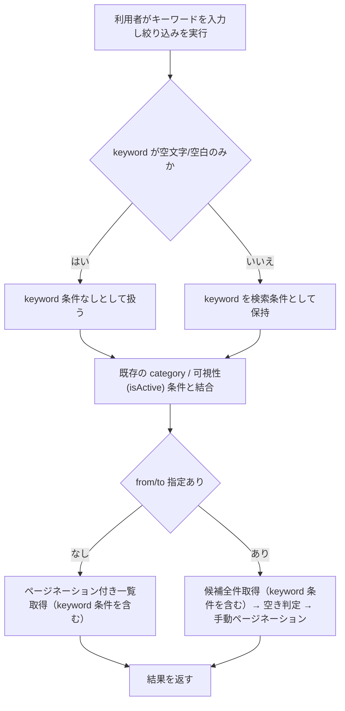

# Business Logic Model - resource-keyword-filter

## 対象プロセス

リソース一覧の絞り込み（既存プロセスの拡張）。利用者はカテゴリ・空き確認期間に加えて、リソース名または説明文に含まれるキーワードで一覧を絞り込める。

## 処理フロー

## 業務ロジックの要点

- キーワード条件は既存の絞り込み条件（カテゴリ・可視性・空き確認）と**独立して**評価され、最終的に AND で結合される。既存の空き確認フィルタ（`listWithAvailabilityFilter`）は候補取得後に Java 側で予約重複を除外する構造のため、キーワード条件は「候補取得」の時点（DB クエリ）で適用し、可視性・カテゴリと同列に扱う。
- キーワードの一致判定は「リソース名またはリソース説明文のいずれかに部分一致する」の OR 条件であり、この OR 条件全体が他の条件との AND の一項になる（RES-01・RES-04 の組み合わせ）。
- 大文字小文字の違いは一致判定に影響しない（RES-02）。
