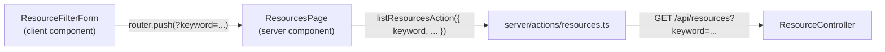

# Frontend Components - resource-keyword-filter

## コンポーネント構成（変更箇所のみ）

新規コンポーネントは追加しない。既存の `ResourceFilterForm`（クライアントコンポーネント）にキーワード入力欄を追加し、既存の `ResourcesPage`（サーバーコンポーネント）・`listResourcesAction`（Server Action）を通じて `keyword` パラメータを伝搬する。

## `ResourceFilterForm` の変更

- **Props**: `defaultKeyword?: string` を追加（既存の `defaultCategory`/`defaultFrom`/`defaultTo` と同列）
- **入力欄**: 既存のカテゴリ・開始日時・終了日時と並ぶグリッドに、`Label`（「キーワード」）+ `Input`（`type="text"`, `name="keyword"`, `id="keyword"`, `defaultValue={defaultKeyword}`, `placeholder` 例: 「リソース名・説明で検索」）を追加。既存の3カラムグリッド（`sm:grid-cols-3`）に収まりきらない場合はグリッド列数を調整する
- **送信処理（`handleSubmit`）**: `data.get("keyword")` を取得し、`.trim()` した結果が空文字でなければ `params.set("keyword", trimmed)` する（BR-03 に対応。空文字・空白のみの場合は `params` に含めない）
- **リセット処理**: 既存の `handleReset`（`/resources` へ遷移）は変更不要（URL からクエリパラメータごと消える）
- **バリデーション**: フロントエンドに Zod 等のバリデーション基盤は導入されていないため、本欄も同様にバリデーションなし（trim による空文字判定のみ）

## `ResourcesPage`（`resources/page.tsx`）の変更

- `SearchParams` インターフェースに `keyword?: string` を追加
- `listResourcesAction()` 呼び出しに `keyword: params.keyword` を追加
- `ResourceFilterForm` への props に `defaultKeyword={params.keyword}` を追加
- ページネーションリンク生成（`PaginationNav` の `query` prop）は `params` オブジェクトをそのまま渡しているため、`keyword` も自動的にページ送りで保持される（追加変更不要）

## `server/actions/resources.ts` の変更

- `ListResourcesParams` インターフェースに `keyword?: string` を追加
- `listResourcesAction()` 内で `if (params?.keyword) queryParams.keyword = params.keyword;` を追加

## ユーザー操作フロー

1. 利用者がキーワード欄に文字列を入力し「絞り込む」を押す
2. `handleSubmit` が `keyword`（trim 後、空でなければ）を URL パラメータに含めて `/resources?...` へ遷移
3. サーバーコンポーネントが新しい `searchParams` で再レンダリングされ、`keyword` を含めて一覧を再取得する
4. 「リセット」を押すと `/resources` に戻り、キーワードを含む全フィルタが解除される
