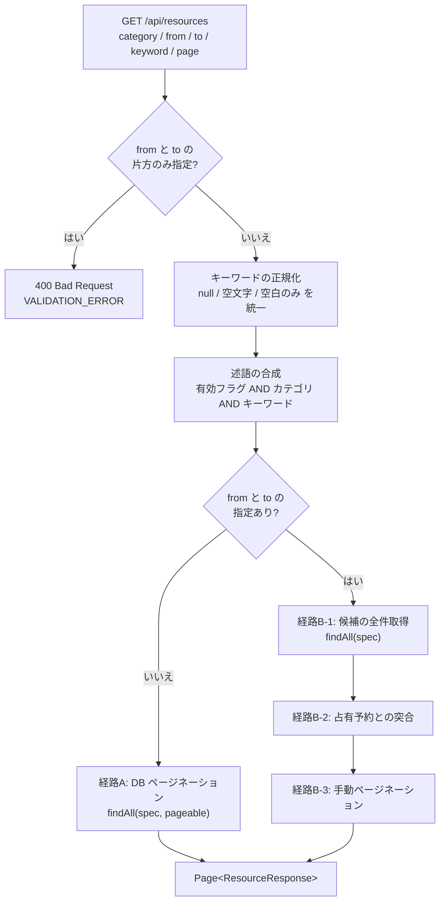

# Business Logic Model — `resource-keyword-search`

## 全体の流れ



### テキスト代替

```
1. リクエスト受領（category / from / to / keyword / page / size）
2. from と to の片方のみ指定なら 400 VALIDATION_ERROR（既存の検証・変更なし）
3. キーワードを正規化する
4. 述語を合成する（有効フラグ AND カテゴリ AND キーワード）
5. from と to の指定で分岐する
   5a. 指定なし → 経路A: findAll(spec, pageable) で DB 側ページネーション
   5b. 指定あり → 経路B: findAll(spec) で候補を全件取得
                 → 占有予約と突合して除外
                 → 手動ページネーション
6. Page<ResourceResponse> を返す
```

## 1. キーワードの正規化

述語を組み立てる前に、入力を1つの規則に揃える。

| 入力 | 正規化後 | 結果 |
|---|---|---|
| `null`（パラメータ未指定） | 指定なし | キーワード条件を課さない |
| `""`（空文字） | 指定なし | 同上 |
| `"   "`（空白のみ） | 指定なし | 同上 |
| `"  会議  "` | `"会議"` | 前後の空白を除去して照合 |
| `"会議 プロジェクター"` | `"会議 プロジェクター"` | 内部の空白は保持し、単一のリテラルとして照合 |

前後の空白の除去は、全角空白を含む空白文字全般を対象とする。判定と除去には Java の `String.isBlank()` と `String.strip()` を用いる。これらは Unicode の空白定義に従うため、全角空白も対象になる（`trim()` は制御文字までしか扱わないため使わない）。

正規化は**述語を組み立てる側の責務**とし、この規則を1箇所に閉じる。呼び出し側は `null` をそのまま渡してよい。

## 2. 述語の合成

3つの述語をすべて AND で結合する。いずれも「指定がなければ制約を課さない」形を取る。

| 述語 | 制約を課さない条件 | 課す制約 |
|---|---|---|
| 有効リソース限定 | 呼び出し元が ADMIN のとき | `isActive = true` |
| カテゴリ一致 | カテゴリが `null` のとき | `category = :category` |
| キーワード一致 | 正規化後が指定なしのとき | `LOWER(name) LIKE :pattern` **OR** `LOWER(description) LIKE :pattern` |

**制約を課さない述語の表現**：Spring Data JPA 4.0 の `Specification.and(other)` は引数の非 null を要求するため、`null` は渡せない。制約なしは `Specification.unrestricted()`（`toPredicate` が `null` を返す実装）で表現する。合成は `Specification.allOf(...)` または `and` の連結で行う。

> 本設計は Spring Data JPA 4.0.5 の `Specification` / `JpaSpecificationExecutor` のソースを確認したうえで書いている。利用可能なメソッドは `unrestricted()`・`where(spec)`・`and(spec)`・`allOf(...)`・`anyOf(...)`、および `findAll(Specification)`・`findAll(Specification, Pageable)` である。

## 3. 2経路それぞれでの適用点

`ResourceService.list` は `from` と `to` の有無で内部経路が分かれる。**合成した述語は分岐より前に1回だけ組み立て、両経路がそれを共有する。**

### 経路A：`from` / `to` 未指定（現 `listPaginated`）

```
findAll(spec, pageable)  →  Page<Resource>  →  map(ResourceResponse::from)
```

現在の「ADMIN か否か × カテゴリの有無」による4分岐は、述語の合成に吸収されて消える。

### 経路B：`from` / `to` 指定あり（現 `listWithAvailabilityFilter`）

```
findAll(spec)  →  List<Resource>（候補）
               →  候補 ID に対する占有予約を1クエリで取得
               →  重複する予約を持つリソースを除外
               →  手動ページネーション
```

現在の `fetchAllCandidates` による4分岐も同様に消える。

**この構造が FR-12 を満たす根拠**：述語は分岐前に1回組み立てられ、両経路が同じ `spec` を使う。片方の経路にキーワード条件を入れ忘れるという事態が構造的に起こらない。

## 4. 期間フィルタとの評価順序

**述語で絞ってから占有判定する**（経路B の順序どおり）。逆順にしない理由は2つある。

1. 占有判定は候補 ID の集合を入力とするため、候補が少ないほど突合するデータ量が減る。キーワードで先に絞るほうが処理量が小さい。
2. 現在の実装がすでにこの順序（候補取得 → 占有判定 → ページネーション）であり、順序を変える理由がない。

## 5. 入力検証

キーワードの最大長 100 文字は presentation 層で検証する。超過時は既存の検証失敗と同じ `400 Bad Request`（`code: VALIDATION_ERROR`）を返す。

検証の対象は**正規化前の生の入力**ではなく、前後の空白を除いた後の文字列とする。利用者から見て、貼り付けの際に付いた空白が長さ超過の原因になるのは理解しにくいためである。

`from` / `to` の同時指定検証（既存）は変更しない。

## 6. 呼び出し経路の変更点

| レイヤー | 現在 | 変更後 |
|---|---|---|
| presentation | `list(category, from, to, pageable, currentUser)` | `keyword` を `@RequestParam(required = false)` で追加し、長さ検証を行う |
| application | `list(category, from, to, isAdmin, pageable)` | `keyword` を引数に追加。述語を合成して2経路に渡す |
| domain | 6個の派生クエリメソッド | `JpaSpecificationExecutor<Resource>` の継承と、述語を組み立てるユーティリティ |

**既存の派生クエリメソッド6個は削除する。** 利用箇所を調査したところ、`ResourceService` と `ResourceServiceTest` 以外からの参照はない。述語合成に置き換えたあとは未使用となるため、残すと死んだコードになる。悲観ロック用の `findByIdForUpdate` は予約サービスが使うため残す。

## 7. フロントエンドのデータフロー

```
ResourceFilterForm（入力）
  → URLSearchParams に keyword を積む
  → router.push("/resources?...")
  → ResourcesPage が searchParams.keyword を読む
  → listResourcesAction({ ..., keyword }) に渡す
  → API クライアントがクエリパラメータに変換
  → GET /api/resources?keyword=...
```

復元は逆向きに `searchParams.keyword` → `ResourceFilterForm` の `defaultKeyword` prop → 入力欄の `defaultValue` と流れる。ページ送りは既存の `PaginationNav` が `query` をそのまま引き継ぐため、追加の対応を要しない。

詳細は [frontend-components.md](./frontend-components.md) を参照。
