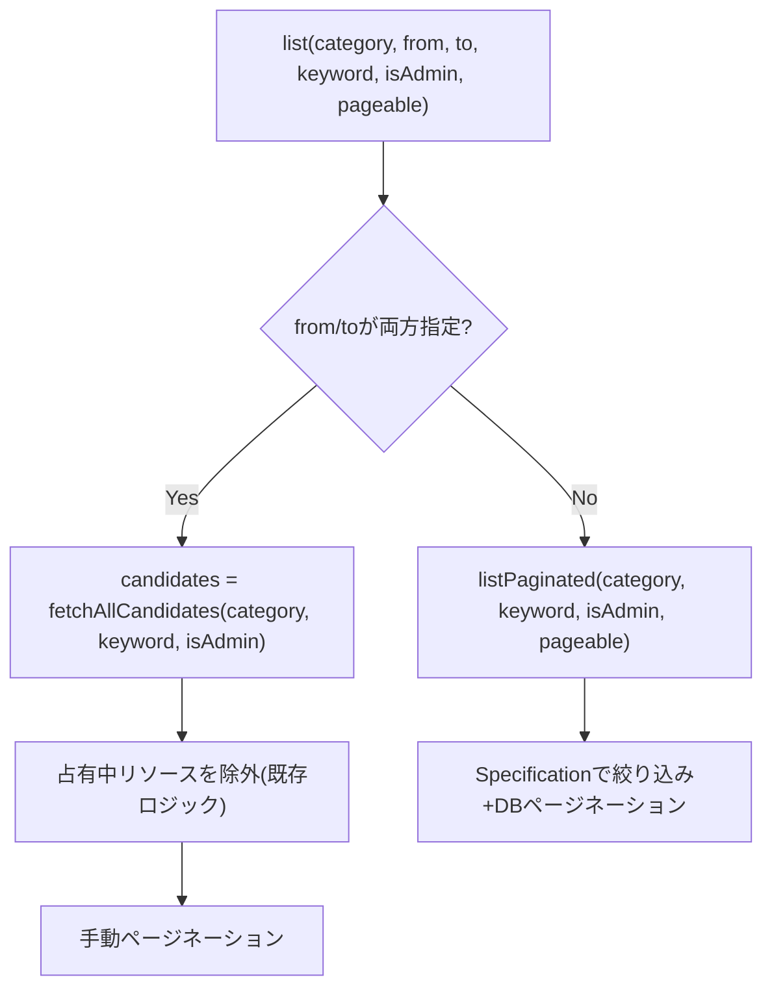

# Business Logic Model

## 絞り込みロジック全体

`ResourceService.list()` は既に `category`・`isAdmin`（`is_active`）・`from`/`to`（空き確認）の3系統の条件を合成している。今回 `keyword` を4つ目の条件として追加するが、合成方式そのもの（`from`/`to` は Java 側後処理、それ以外は DB クエリ）は変更しない。

## Repository層の設計（採用決定: Specification）

ユーザー承認により `JpaSpecificationExecutor<Resource>` を `ResourceRepository` に追加し、`category`・`isActive`・`keyword`（name/description への ILIKE 部分一致）を `Specification` の AND 合成で表現する。既存の派生クエリメソッド（`findByCategory` 等）は `fetchAllCandidates`／`listPaginated` の呼び出し側を Specification 呼び出しに置き換えることで置換し、削除する。

- **理由**: 派生クエリメソッドのままだと `keyword` 追加で組み合わせが倍増する（[code-structure.md](../../../inception/reverse-engineering/code-structure.md) 参照）。Specification は条件を独立した部品として合成でき、将来の条件追加（[resource-list-sort.md](../../../../enhancements/resource-list-sort.md) 等）にも影響範囲を限定しやすい。
- **keyword 条件の実装**: `cb.or(cb.like(cb.lower(root.get("name")), pattern), cb.like(cb.lower(root.get("description")), pattern))`（`pattern` は `%` + `keyword.toLowerCase()` + `%`）。PostgreSQL でも H2 でも動作する `LOWER()` + `LIKE` を採用し、DB依存の `ILIKE` 構文は使わない（テスト環境のH2と本番のPostgreSQLの両方で同一の挙動を保証するため）。
- **null許容**: `keyword` が null または空文字の場合、その条件は `Specification` に含めない（未指定時は既存動作と同一というRES要件を満たす）。
