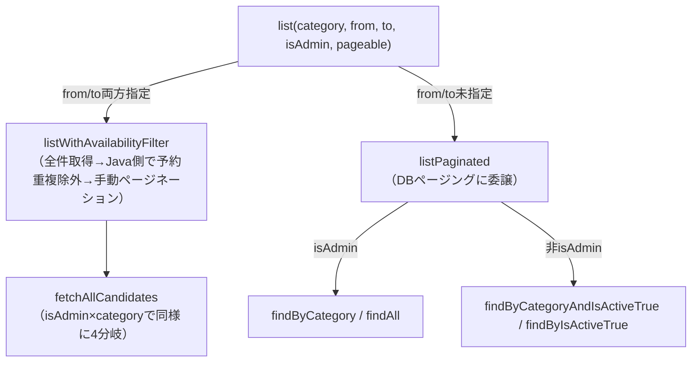
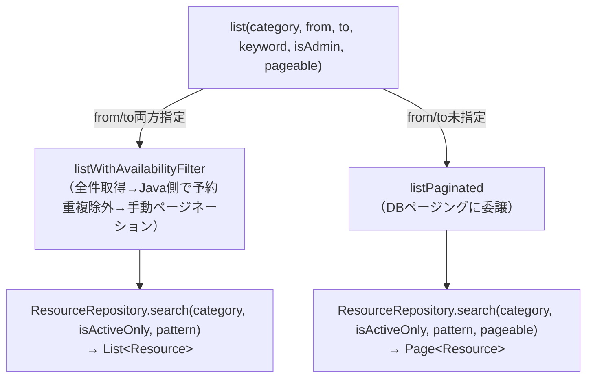
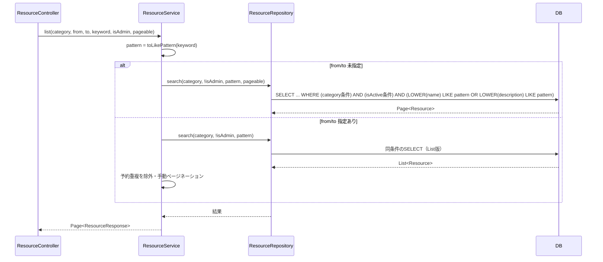

# Business Logic Model — resource-list-filter

## 対象ロジック

リソース一覧検索（`ResourceService` の一覧取得系メソッド群）に、キーワード（`name`・`description` への部分一致）によるフィルタ条件を追加する。

## 現状のロジック構造

```mermaid
flowchart TD
    list["list(category, from, to, isAdmin, pageable)"]
    list -->|from/to両方指定| availFilter["listWithAvailabilityFilter<br/>（全件取得→Java側で予約重複除外→手動ページネーション）"]
    list -->|from/to未指定| paginated["listPaginated<br/>（DBページングに委譲）"]
    paginated -->|isAdmin| repoAdmin["findByCategory / findAll"]
    paginated -->|非isAdmin| repoActive["findByCategoryAndIsActiveTrue / findByIsActiveTrue"]
    availFilter --> fetchAll["fetchAllCandidates<br/>（isAdmin×categoryで同様に4分岐）"]
```

**現状の課題**：`isActive`×`category` の2軸で既に4〜6種の派生クエリメソッドに分岐しており、ここに `keyword` という3軸目を素朴に加えると組み合わせが指数的に増える。

## 変更後のロジック構造

6種の派生クエリメソッドを、`category`・`isActiveOnly`・`keyword` の3条件をすべて JPQL の `WHERE` 句でAND結合する単一のクエリメソッド `search` に統合する。

```mermaid
flowchart TD
    list["list(category, from, to, keyword, isAdmin, pageable)"]
    list -->|from/to両方指定| availFilter["listWithAvailabilityFilter<br/>（全件取得→Java側で予約重複除外→手動ページネーション）"]
    list -->|from/to未指定| paginated["listPaginated<br/>（DBページングに委譲）"]
    paginated --> searchPage["ResourceRepository.search(category, isActiveOnly, pattern, pageable)<br/>→ Page&lt;Resource&gt;"]
    availFilter --> searchList["ResourceRepository.search(category, isActiveOnly, pattern)<br/>→ List&lt;Resource&gt;"]
```

- `isActiveOnly` は `!isAdmin`（ADMINのときのみinactiveを含める）とする。現状の「isAdmin×category」4分岐と等価な結果になることを、Code GenerationのJPQL `WHERE` 句（`(:isActiveOnly = false OR r.isActive = true)`）で担保する。
- `pattern` は `keyword` から導出するLIKEパターン文字列（`business-rules.md` 参照）。

## 既存メソッドの扱い

- `ResourceRepository` の派生クエリメソッド6種（`findByIsActiveTrue`系2種、`findByCategoryAndIsActiveTrue`系2種、`findByCategory`系2種）は `ResourceService` 内でのみ使用されており（コードベース内に外部参照なし）、新しい `search` 2メソッド（Page版・List版）に置き換えて削除する。
- `findByIdForUpdate`（悲観ロック）は本変更の対象外、変更しない。

## 処理フロー（シーケンス）

```mermaid
sequenceDiagram
    participant C as ResourceController
    participant S as ResourceService
    participant R as ResourceRepository
    participant D as DB

    C->>S: list(category, from, to, keyword, isAdmin, pageable)
    S->>S: pattern = toLikePattern(keyword)
    alt from/to 未指定
        S->>R: search(category, !isAdmin, pattern, pageable)
        R->>D: SELECT ... WHERE (category条件) AND (isActive条件) AND (LOWER(name) LIKE pattern OR LOWER(description) LIKE pattern)
        D-->>R: Page<Resource>
    else from/to 指定あり
        S->>R: search(category, !isAdmin, pattern)
        R->>D: 同条件のSELECT（List版）
        D-->>R: List<Resource>
        S->>S: 予約重複を除外・手動ページネーション
    end
    R-->>S: 結果
    S-->>C: Page<ResourceResponse>
```
