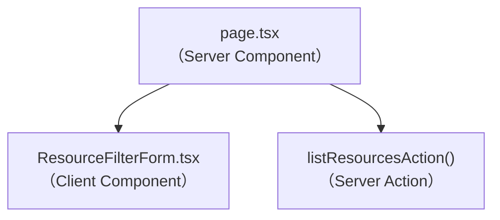

# Frontend Components — resource-list-filter

## コンポーネント構成（変更なし、既存3コンポーネントの拡張のみ）



新規コンポーネントの追加はない（Application Design・Units GenerationをSKIPした判断と整合）。

## `ResourceFilterForm.tsx` の変更

### Props

| Prop | 型 | 変更 |
|---|---|---|
| `defaultCategory` | `string \| undefined` | 変更なし |
| `defaultFrom` | `string \| undefined` | 変更なし |
| `defaultTo` | `string \| undefined` | 変更なし |
| `defaultKeyword` | `string \| undefined` | **新規追加**。URLの`keyword`パラメータの初期値 |

### UI要素の追加

- `<Input name="keyword" defaultValue={defaultKeyword}>` をグリッド内に追加する。既存グリッドは `sm:grid-cols-3`（カテゴリ・開始日時・終了日時）なので `sm:grid-cols-4` に変更する
- ラベルは「キーワード」、placeholder は「名称・説明で検索」程度の簡潔な案内文

### 状態管理・イベント処理の変更

- `handleSubmit` 内で `FormData` から `keyword` を取得し、空文字列でなければ `URLSearchParams` に `keyword` をセットする（business-rules.md BR-06）
- URL組み立てロジックは `pagination-nav.tsx` の `buildHref` と同様の方針で、DOM非依存の純関数として切り出す：

```typescript
export function buildResourceFilterParams(data: FormData): URLSearchParams
```

  - 入力: `FormData`（`category`・`from`・`to`・`keyword`の4キー）
  - 出力: `URLSearchParams`（空文字列・`category=ALL`は除外、`keyword`はトリムしてから空文字列なら除外）
  - 目的: `handleSubmit`（DOM依存）から分離し、ユニットテストで純粋に検証できるようにする

### バリデーション

- キーワード欄に入力バリデーションはない（business-rules.md BR-07）

## `page.tsx` の変更

- `SearchParams` インターフェースに `keyword?: string` を追加
- `listResourcesAction()` 呼び出しに `keyword: params.keyword` を渡す
- `ResourceFilterForm` に `defaultKeyword={params.keyword}` を渡す
- `PaginationNav` の `query` には既に `params` 全体を渡しているため、`keyword` は自動的にページ送り時も引き継がれる（追加対応不要）

## `resources.ts`（Server Action）の変更

- `ListResourcesParams` インターフェースに `keyword?: string` を追加
- `listResourcesAction` 内で `params?.keyword` が存在する場合のみ `queryParams.keyword` にセットする

## API統合ポイント

- `GET /api/resources`（`api-spec.md` 更新済み）の `keyword` クエリパラメータを利用する。レスポンス型（`ResourceResponseSchema`）に変更はない

## ユーザー操作フロー

1. 利用者がキーワード欄に文字列を入力し「絞り込む」を押す
2. `handleSubmit` が `buildResourceFilterParams` でURLパラメータを組み立て、`router.push` で画面遷移
3. `page.tsx`（Server Component）が新しい `searchParams` を受けて `listResourcesAction` を再実行
4. 結果がリソースカード一覧に反映される
5. 「リセット」を押すと `/resources` に遷移し、キーワードを含む全フィルタが解除される（既存の `handleReset` のロジックは変更不要）
