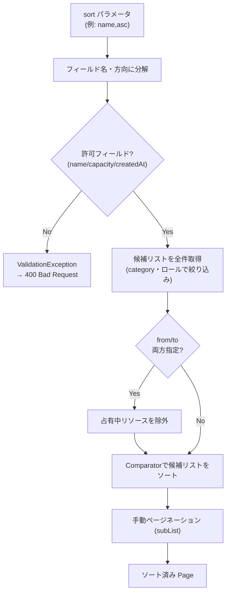

# Business Logic Model — リソース一覧ソート機能

> **2026-08-13 改訂**：Code Generation Planning 着手前の実測により、当初案の「`from`/`to` 未指定時は `Pageable` を Repository へそのまま委譲すれば追加実装不要」という前提が崩れたため、単一フローに統合した（詳細は `aidlc-audit.md` の「Code Generation Planning 準備」節）。

## 対象データフロー

## 実測で判明した前提の誤り

`from`/`to` 未指定時（旧経路A・`listPaginated`）は、当初 `Pageable`（`Sort` を含む）を `ResourceRepository` のページング付きクエリメソッドへそのまま渡し、DB の `ORDER BY` 句に展開させる設計だった。稼働中の PostgreSQL コンテナに対して直接 `ORDER BY capacity DESC` / `ORDER BY capacity ASC` / `ORDER BY name ASC`（ロケール `en_US.utf8`）を実行して確認したところ、次の点が Comparator 方式（後述）の前提と食い違うことが判明した。

- `capacity` の降順は PostgreSQL の既定で null が**先頭**に来る（`DESC` の既定は `NULLS FIRST`）。BR-03（null は昇順・降順いずれでも末尾固定）を満たさない。昇順側は既定で null が末尾に来るため問題ない。
- `name` の昇順は DB のロケール（`en_US.utf8`）に依存した辞書式順序になり、BR-05（大文字小文字非依存）との一致は保証されない。
- Spring Data JPA の `Sort.Order#nullsLast()` を明示しても、テスト環境（H2）では生成 SQL に反映されないことを確認した。本番 PostgreSQL での効果は未検証であり、これに依存する設計は採らない。

したがって `from`/`to` の指定有無にかかわらず、候補リストの全件取得後に `Comparator<Resource>` を適用する単一フローに統合する。DB の `ORDER BY` や JPA の `Sort` 委譲には頼らない。

## 統合後のフロー

1. `fetchAllCandidates`（既存メソッド）でカテゴリ・ロールに応じた候補リストを全件取得する。
2. `from`/`to` が両方指定されている場合のみ、占有中リソースを除外する（既存ロジックをそのまま流用）。
3. `pageable.getSort()` から導出した `Comparator<Resource>` で候補リストをソートする。
4. ソート後の候補リストに対して手動ページネーション（`subList`）を行う。

**ただし**、`sort` に許可外のフィールド名（例: `location`）が指定された場合は、Controller 層で `sort` の許可フィールドを事前検証し、`ValidationException`（400 Bad Request）に正規化してから本フローに渡す。

### Comparator 導出ロジック

`Pageable.getSort()` は複数の `Order`（フィールド+方向）を持ちうるが、issue #22 のUIは単一フィールドの選択のみを提供するため、**最初の `Order` 1件のみを見る**（複数指定時の合成ソートはスコープ外）。

- `name` → `Comparator.comparing(Resource::getName, String.CASE_INSENSITIVE_ORDER)`（BR-05：大文字小文字を区別しない）
- `capacity` → `Comparator.comparing(Resource::getCapacity, Comparator.nullsLast(Comparator.naturalOrder()))`（BR-03：null は昇順・降順いずれでも末尾。`desc` 適用後に `nullsLast` が `nullsFirst` に反転しないよう、比較器全体を組んでから `.reversed()` するのではなく、null判定を先に固定してから値部分だけ方向に応じて反転する）
- `createdAt` → `Comparator.comparing(Resource::getCreatedAt)`
- 上記以外のフィールド名 → Controller 層のバリデーションで事前に弾かれるため、ここには到達しない想定（到達した場合は防御的に `ValidationException` を送出する）

`direction = DESC` の場合、`name`・`createdAt` はそのまま `.reversed()` して問題ないが、`capacity` は前述のとおり null 固定のため、値部分の比較のみを `.reversed()` し、null判定ロジックは変えない実装にする（詳細は Code Generation で確定）。

## 対象外（スコープ外）とする業務ロジック

- キーワード検索との組み合わせ（前提課題未実装のため。`requirements.md` 参照）
- 複数フィールドの複合ソート（例: `name,asc&capacity,desc` の同時指定）
