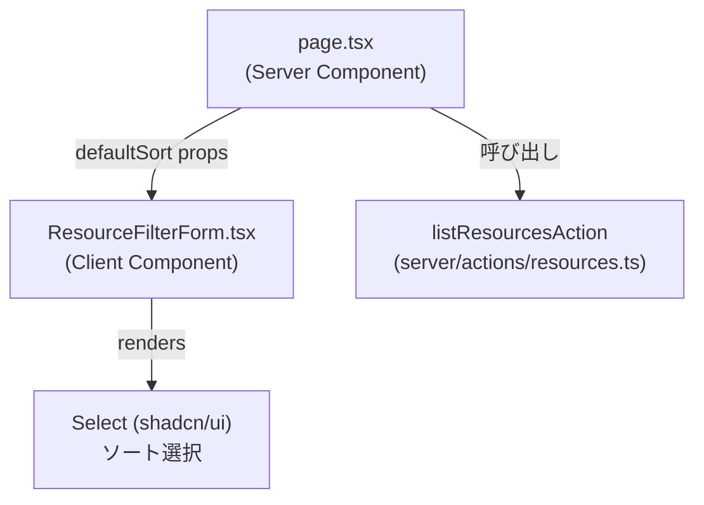

# Frontend Components — リソース一覧ソート機能

## コンポーネント階層（変更箇所のみ）



## Props / State 定義

### `ResourceFilterFormProps`（既存インターフェースへの追加）

```ts
interface ResourceFilterFormProps {
  defaultCategory?: string;
  defaultFrom?: string;
  defaultTo?: string;
  defaultSort?: string; // 追加。URLの sort パラメータをそのまま渡す（未指定時は DEFAULT_SORT）
}
```

### 内部定数

```ts
const DEFAULT_SORT = "createdAt,asc"; // BR-02 のデフォルト値と一致させる
```

## ユーザー操作フロー

1. 利用者が `/resources` を開く（`sort` 未指定）→ `ResourceFilterForm` の並び替えドロップダウンは「登録日時が古い順」を初期選択とする
2. 利用者が並び替えドロップダウンで選択肢を変更し「絞り込む」を押す→ `handleSubmit` が `FormData` から `sort` の値を取得し、`URLSearchParams` に `sort` を設定して `router.push`
3. 値が `DEFAULT_SORT` と一致する場合は `sort` パラメータをURLに付与しない（URLの簡潔さを保つ。既存の `category === "ALL"` を省略する実装パターンに合わせる）

## 選択肢定義（`frontend/src/lib/labels.ts` へ追加）

```ts
export const RESOURCE_SORT_OPTIONS: { value: string; label: string }[] = [
  { value: "createdAt,asc", label: "登録日時が古い順" },
  { value: "createdAt,desc", label: "登録日時が新しい順" },
  { value: "name,asc", label: "名称順（昇順）" },
  { value: "name,desc", label: "名称順（降順）" },
  { value: "capacity,asc", label: "定員が少ない順" },
  { value: "capacity,desc", label: "定員が多い順" },
];
```

**設計判断**: バックエンドは3フィールド×2方向の全6通りを受け付けるため（BR-01）、UIも6通り全てを選択肢として提示し、APIの能力とUIの選択肢を一致させる。受入条件が明示的に要求するのは名称順・定員順の昇順/降順のみだが、登録日時の降順を選択肢から外すと「APIは対応しているのにUIから選べない」という非対称が生じるため、全6通りを採用する。

## フォーム送信ロジックの変更点（`handleSubmit`）

```ts
const sort = data.get("sort") as string;
if (sort && sort !== DEFAULT_SORT) params.set("sort", sort);
```

## API 連携ポイント

- **使用エンドポイント**: `GET /api/resources`（`sort` クエリパラメータ、`ListResourcesParams.sort` として `server/actions/resources.ts` 経由で渡す）
- **BFF層の変更**: `ListResourcesParams` インターフェースに `sort?: string` を追加し、`listResourcesAction` の `queryParams` 組み立てに `if (params?.sort) queryParams.sort = params.sort;` を追加する
- **ページネーション連携**: `page.tsx` の `PaginationNav` へ渡す `query` オブジェクトに `sort` を含めることで、ページ送り時もソート順を維持する

## フォームバリデーション

クライアント側バリデーションは不要（`Select` コンポーネントの選択肢が `RESOURCE_SORT_OPTIONS` に限定されるため、不正な値がフォームから送信されることはない。バックエンド側のバリデーション（BR-04）が最終防衛線）。
