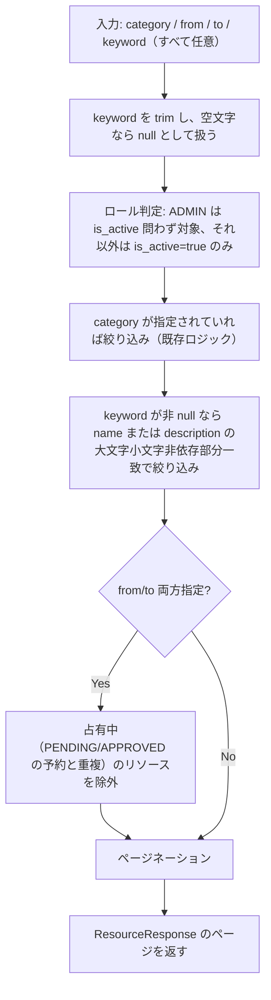

# Business Logic Model — resource-search

## リソース一覧取得のデータフロー（keyword 追加後）

## 合成ルール

すべてのフィルタ条件（category・is_active・keyword・空き確認）は **AND** で合成される。いずれの条件も「指定されていなければ絞り込まない」という既存方針を keyword にも適用する（RES-04・NFR-02）。

## 既存ロジックとの接続点

- **正規化**: keyword の trim・空文字→null 変換は、現状 category/from/to が「フロントエンドで未指定なら URL パラメータ自体を付与しない」形で実現しているパターン（`code-structure.md` 参照）を踏襲する。バックエンド側でも防御的に trim・null 判定を行う（フロントエンドを経由しない直接 API 呼び出しに対しても正しく動作させるため）
- **2つの取得経路**: `ResourceService#listPaginated`（from/to 未指定）と `ResourceService#listWithAvailabilityFilter`（from/to 指定、`fetchAllCandidates` で候補取得後に Java 側で空き判定）の**両方**に keyword フィルタを適用する。図の `KeywordFilter` は `TimeCheck` より前段に置き、どちらの経路に進んでも keyword 条件は反映済みの候補集合から開始する
