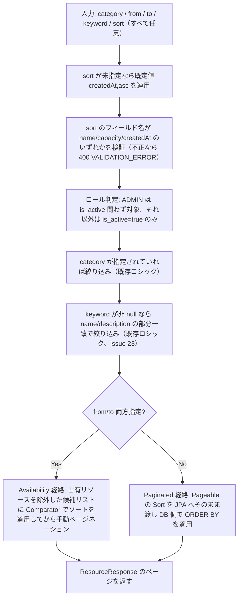

# Business Logic Model — resource-sort

## リソース一覧取得のデータフロー（sort 追加後）

## 合成ルール

- `sort` はほかのフィルタ条件（category・is_active・keyword・空き確認）とは独立した「表示順」の指定であり、絞り込み条件（AND 合成の対象）には加わらない。絞り込み後の候補集合に対してソートを適用する
- `sort` 未指定時は `createdAt,asc` を既定値として適用する（RES-02）。これは Controller 層で `@PageableDefault` に明示することで、Service 層のロジックを変更せずに実現する

## 既存ロジックとの接続点

- **2 つの取得経路でのソート適用方式の違い**:
  - **`listPaginated`（from/to 未指定）**: `Pageable` をそのまま JPA リポジトリメソッドに渡す既存実装のため、`Pageable.getSort()` を Spring Data JPA が自動的に `ORDER BY` へ変換する。**Controller 層でのホワイトリスト検証さえ追加すれば、Service/Repository 層の改修は不要**
  - **`listWithAvailabilityFilter`（from/to 指定）**: `fetchAllCandidates` で取得した `List<Resource>` を Java 側で占有判定フィルタしたあと、`candidates.subList(start, end)` で手動ページネーションしている既存実装。この経路は `Pageable` の `Sort` を一切参照していないため、**`Comparator<Resource>` を `Sort` から組み立てて、手動ページネーションの直前に `candidates.sort(comparator)` を適用する実装が必須**（これを怠ると受入条件「カテゴリ・期間フィルタとの組み合わせでもソートが適用される」が満たせない）
- **ホワイトリスト検証の位置**: `ResourceController#list` で、既存の `from`/`to` 同時指定チェックと同じパターン（`ValidationException` を直接 throw）で実施する。`pageable.getSort()` の各 `Sort.Order` の `getProperty()` を走査し、`name`/`capacity`/`createdAt` 以外が含まれていれば 400 とする
- **NULL capacity**: `listPaginated` 経路は `Sort.Order` の null 処理指定（Hibernate が H2/PostgreSQL 双方で `NULLS LAST` を移植可能な SQL に変換する）で実現する。`listWithAvailabilityFilter` 経路は `Comparator.comparing(Resource::getCapacity, Comparator.nullsLast(...))` で実現する
