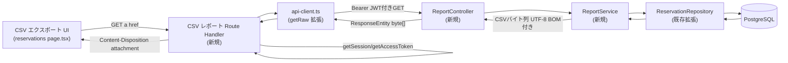

# Component Dependency — CSV 帳票出力（Issue #29）

## 依存関係マトリクス

| コンポーネント | 依存先 | 種別 |
|---|---|---|
| CSV エクスポート UI（`/reservations` page.tsx 拡張） | CSV レポート Route Handler | HTTP GET（ブラウザのリンク遷移） |
| CSV レポート Route Handler（新規） | `getSession()` / `getAccessToken()`（`session.ts`） | 関数呼び出し（セッション検証） |
| CSV レポート Route Handler（新規） | `api-client.ts`（`getRaw` 拡張） | 関数呼び出し |
| `api-client.ts` | ReportController（バックエンド） | HTTP GET（Bearer トークン付き） |
| ReportController（新規） | ReportService（新規） | 直接呼び出し（DI） |
| ReportService（新規） | ReservationRepository（既存・拡張） | 直接呼び出し（DI・Spring Data JPA） |
| ReservationRepository | PostgreSQL（`reservations`/`resources`/`users` テーブル） | JPQL クエリ |

## 通信パターン

- フロントエンド → バックエンドは常に BFF 層（Server Action または今回追加する Route Handler）を経由する。ブラウザから直接バックエンドを呼び出す経路は存在しない（既存アーキテクチャ。詳細は `application-design.md`「設計判断：認証方式の前提修正」参照）。
- `ReportController` → `ReportService` → `ReservationRepository` は既存 `ReservationController` → `ReservationService` → `ReservationRepository` と同型の 3 層呼び出し。`ReportService` は `ReservationService` を経由しない（services.md 参照）。

## データフロー（Mermaid）



### テキスト代替表現

```
CSV エクスポート UI (reservations page.tsx)
  --GET(a href, status/from/to引継)--> CSV レポート Route Handler (新規)
CSV レポート Route Handler
  --getSession/getAccessToken--> セッション検証
  --getRaw経由--> api-client.ts
api-client.ts
  --Bearer JWT付きGET--> ReportController (新規)
ReportController
  --直接呼び出し--> ReportService (新規)
ReportService
  --クエリ呼び出し--> ReservationRepository (既存拡張)
ReservationRepository
  --JPQL--> PostgreSQL
（戻り値は逆順で伝播し、最終的に CSV バイト列がブラウザのダウンロードとして届く）
```
