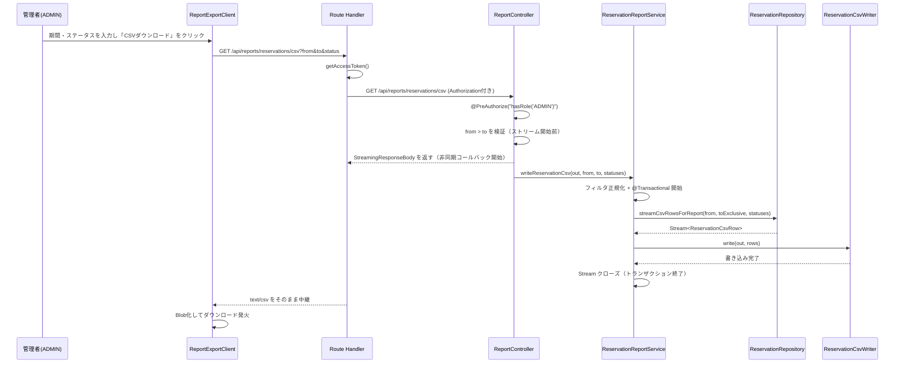

# Component Dependency: CSV 帳票出力

## 依存関係マトリクス（バックエンド）

| コンポーネント | 依存先 | 依存の種類 |
|---|---|---|
| `ReportController` | `ReservationReportService` | コンストラクタ注入 |
| `ReservationReportService` | `ReservationRepository`・`ReservationCsvWriter` | コンストラクタ注入 |
| `ReservationCsvWriter` | `ReservationCsvRow`（入力型） | データ依存のみ（Spring 非依存） |
| `ReservationRepository`（追加メソッド） | `ReservationCsvRow`（JPQL コンストラクタ式の FQCN 参照） | データ依存 |

## 依存関係マトリクス（フロントエンド）

| コンポーネント | 依存先 | 依存の種類 |
|---|---|---|
| `ReportExportClient` | `lib/reports.ts`（純関数）・`ApiClientError`（`lib/api-client.ts` から型のみ） | import |
| `page.tsx` | `ReportExportClient` | コンポーネント合成 |
| Route Handler | `lib/session.ts`（`getAccessToken`） | import |
| `nav-items.ts` | なし（純粋なデータ定義への追加） | — |

## データフロー

## 通信パターン

- バックエンド内部は同期呼び出し（コンストラクタ注入によるサービス層の一直線な委譲）。非同期性は Spring MVC の `StreamingResponseBody` の内部機構によるものであり、コンポーネント間の通信パターンとしては意識しない
- フロントエンド〜バックエンド間は HTTP（`fetch`）。Route Handler が中間層として1回の中継を行う（api-client.ts の rewrite 経由の呼び出しパターンとは別系統）
