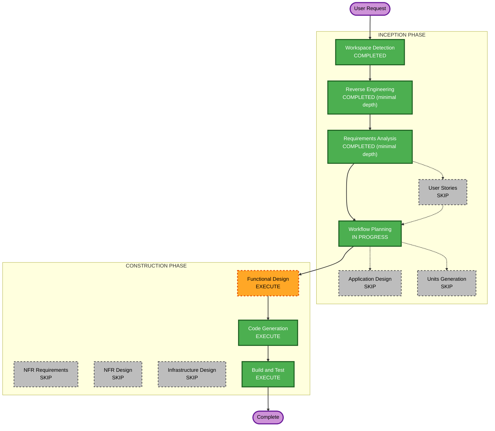

# Execution Plan

## Detailed Analysis Summary

### Transformation Scope

- **Transformation Type**: Single component change（既存の `GET /api/resources` とそのUIフォームへの条件追加。アーキテクチャ変更なし）
- **Primary Changes**: バックエンド3ファイル（Controller/Service/Repository）+ フロントエンド3ファイル（Form/Page/ServerAction）への keyword フィルタ追加
- **Related Components**: なし（[dependencies.md](../reverse-engineering/dependencies.md) 参照。他エンハンス課題との並行着手のみ要注意）

### Change Impact Assessment

- **User-facing changes**: Yes ― `ResourceFilterForm` にキーワード入力欄が増える
- **Structural changes**: No ― 4レイヤーアーキテクチャの層構造は変わらない
- **Data model changes**: No ― 新規カラム・新規エンティティなし
- **API changes**: Yes（後方互換） ― `GET /api/resources` に任意パラメータ `keyword` を追加するのみ
- **NFR impact**: No ― 既存のパフォーマンス・セキュリティ要件の範囲内（[requirements.md](../requirements/requirements.md) 非機能要件参照）

### Component Relationships

- **Primary Component**: `ResourceController` → `ResourceService` → `ResourceRepository`（backend）、`ResourceFilterForm` → `page.tsx` → `resources.ts`（frontend）
- **Dependent Components**: なし（他コントローラ・他画面からの呼び出しなし）
- **Supporting Components**: `ResourceServiceTest`・`ResourceControllerTest`（テスト追加対象）

### Risk Assessment

- **Risk Level**: Low（既存エンドポイントへの後方互換パラメータ追加。ロールバックは変更差分の取り消しのみで容易）
- **Rollback Complexity**: Easy
- **Testing Complexity**: Simple（既存テストパターンへの追記で完結）

## Workflow Visualization



### Text Alternative

```
INCEPTION
  Workspace Detection ....... COMPLETED
  Reverse Engineering ....... COMPLETED (minimal depth)
  Requirements Analysis ..... COMPLETED (minimal depth)
  User Stories .............. SKIP
  Workflow Planning .......... IN PROGRESS (this document)
  Application Design ........ SKIP
  Units Generation ........... SKIP (single unit: resource-list-filter)

CONSTRUCTION (unit: resource-list-filter)
  Functional Design ......... EXECUTE
  NFR Requirements ........... SKIP
  NFR Design ................. SKIP
  Infrastructure Design ...... SKIP
  Code Generation ............ EXECUTE (Plan -> Generate)
  Build and Test ............. EXECUTE

OPERATIONS
  CI ゲート（BookFlow翻案。CI Frontend / CI Backend）
```

## Phases to Execute

### INCEPTION PHASE

- [x] Workspace Detection (COMPLETED)
- [x] Reverse Engineering (COMPLETED — 最小深度)
- [x] Requirements Analysis (COMPLETED — 最小深度)
- [ ] User Stories — **SKIP**
  - **Rationale**: 新規ペルソナ・新規ユーザーワークフローの追加ではない。既存 UC-02（リソース一覧・空き確認）に検索条件を1つ追加するだけで、受入条件は業務要求シートに既に完備している（`requirements.md` 参照）。ユーザーストーリー化による追加価値が薄い。
- [ ] Execution Plan (IN PROGRESS — 本ドキュメント)
- [ ] Application Design — **SKIP**
  - **Rationale**: 新規コンポーネント・新規サービスは発生しない。既存の `ResourceController`/`ResourceService`/`ResourceRepository`/`ResourceFilterForm` の境界内での変更（[architecture.md](../reverse-engineering/architecture.md) の変更コンポーネント表を参照）。
- [ ] Units Generation — **SKIP**
  - **Rationale**: 分解の必要がない単一ユニット。フロントエンド・バックエンドにまたがる変更だが、CLAUDE.md の「縦切り実装」原則に沿って1機能＝1ユニット（`resource-list-filter`）として Construction フェーズをそのまま回す。

### CONSTRUCTION PHASE（ユニット: `resource-list-filter`）

- [ ] Functional Design — **EXECUTE**
  - **Rationale**: [code-structure.md](../reverse-engineering/code-structure.md) で検出した `ResourceRepository` の派生クエリメソッド組み合わせ爆発への対応方針（`Specification` 導入 vs カスタム `@Query`）を、実装着手前に確定させる必要がある。新規データモデルはないが、この設計判断は「業務ルールの詳細設計」に相当する。
- [ ] NFR Requirements — **SKIP**
  - **Rationale**: 新たなパフォーマンス・セキュリティ・スケーラビリティ要件はない（`requirements.md` 非機能要件は既存NFR設定の範囲内）。拡張機能（Security/Resiliency/PBT）はいずれも非適用で確定済み。
- [ ] NFR Design — **SKIP**
  - **Rationale**: NFR Requirements を実行しないため連動してSKIP。
- [ ] Infrastructure Design — **SKIP**
  - **Rationale**: インフラ・デプロイ構成への変更なし。
- [ ] Code Generation — **EXECUTE (ALWAYS)**
  - **Rationale**: 実装計画立案・コード生成が必要
- [ ] Build and Test — **EXECUTE (ALWAYS)**
  - **Rationale**: ビルド・既存テスト回帰・新規テストの実行検証が必要

### OPERATIONS PHASE

- [ ] Operations — PLACEHOLDER（BookFlow翻案：CI Frontend / CI Backend ゲートで代替。`dev-workflow.md` 参照）

## Estimated Timeline

- **Total Stages Executing**: 6（Workspace Detection, Reverse Engineering, Requirements Analysis, Functional Design, Code Generation, Build and Test）
- **Estimated Duration**: 2〜3時間（業務要求シートの見積りと同水準）

## Success Criteria

- **Primary Goal**: `GET /api/resources` にキーワード検索を追加し、`ResourceFilterForm` から利用可能にする
- **Key Deliverables**: バックエンド実装（Controller/Service/Repository + テスト）、フロントエンド実装（Form/Page/ServerAction）、`api-spec.md`・`screen-spec.md` の更新
- **Quality Gates**: 既存テスト（`ResourceServiceTest`/`ResourceControllerTest`）が引き続き pass すること、追加テストが業務要求シートの受入条件を満たすこと、`pnpm lint`/`oxfmt`・`./gradlew spotlessApply`/`checkstyleMain` が通ること
