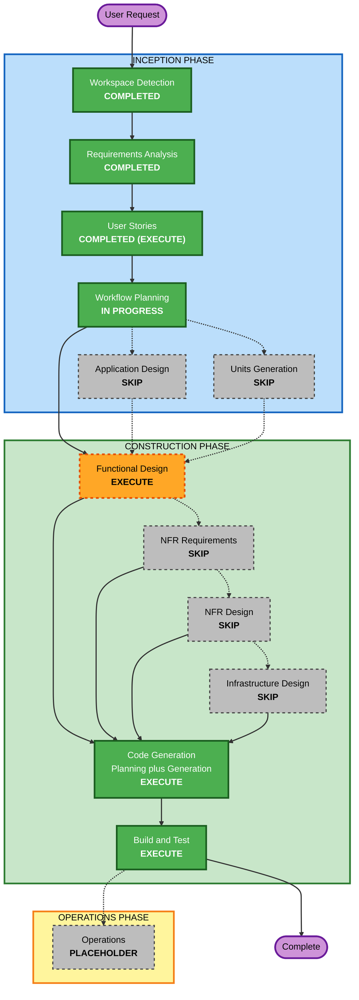

# Execution Plan — 予約の下書き保存（Issue #30）

## Detailed Analysis Summary

### Transformation Scope（Brownfield）

- **Transformation Type**: Single component change（既存の `ReservationService`/`ReservationController`/`Reservation` ドメインエンティティの拡張。新規サービス・新規テーブルは作らない）
- **Primary Changes**: 予約に `DRAFT` ライフサイクル（作成・再編集・正式申請・キャンセル）を追加し、`DRAFT` に限定したアクセス制御分岐を導入する
- **Related Components**: `ApprovalService`（`createInitialStep` の呼び出しタイミングが変わる。ロジック自体は無変更）、`ResourceService.overlaps`（重複チェックで再利用、無変更）

### Change Impact Assessment

- **User-facing changes**: Yes（予約申請フォーム・予約一覧・予約詳細・予約編集の4画面）
- **Structural changes**: Minor（`Reservation` に無条件セッター `markPending()` を追加。既存の `cancel()`/`markApproved()`/`markRejected()` と同じ形。新しい層・新しいクラスは作らない）
- **Data model changes**: No（新規テーブル・カラムはなし。V001 の CHECK 制約に既に定義済みの `DRAFT` をアプリ層で有効化するのみ）
- **API changes**: Yes（`POST /api/reservations` に `draft`、`PUT /api/reservations/{id}` に `submit` という任意フィールドを追加。新規エンドポイントの追加はなし）
- **NFR impact**: No（Extension 3種はすべて Disabled 判定済み）

### Component Relationships（Brownfield）

```markdown
## Component Relationships
- **Primary Component**: ReservationService / ReservationController / Reservation（domain）
- **Shared Components**: ResourceService.overlaps（重複チェックの静的メソッド、既存のまま再利用）、ApprovalService.createInitialStep（呼び出し元は変わるがロジックは無変更）
- **Dependent Components**: ReservationEditForm.tsx / ReservationForm.tsx / reservations 系ページ（frontend）
- **Supporting Components**: なし（監視・ログ・デプロイへの影響なし）
```

| コンポーネント | 変更種別 | 変更理由 | 優先度 |
|---|---|---|---|
| `ReservationService` | Major | `create()`/`update()`/`cancel()`/`checkReadAccess()` に分岐追加 | Critical |
| `Reservation`（domain） | Minor | `markPending()` 追加 | Critical |
| `ReservationController`/DTO | Minor | `draft`/`submit` フィールド追加 | Critical |
| frontend 予約4画面 | Minor〜Major | ボタン・タブ・導線追加 | Important |
| spec文書（`docs-next/docs/spec/`） | Minor | `DRAFT`「未使用」注記の更新 | Critical（Spec-first） |
| drawio資産（予約ステータス遷移図） | Minor | `DRAFT`の遷移を反映 | Important |

### Risk Assessment

- **Risk Level**: Medium（複数レイヤーにまたがるが、新規テーブル・新規サービス・インフラ変更はなく、既存の状態遷移パターン（`cancel()`/`markApproved()`/`markRejected()`）を踏襲するため未知要素は少ない）
- **Rollback Complexity**: Easy（単一 PR の revert で戻せる。DB マイグレーションを伴わないため）
- **Testing Complexity**: Moderate（状態遷移の組み合わせ（`DRAFT`×`submit`×`requires_approval`）とアクセス制御（ロール×ステータス）の掛け合わせをテストする必要がある）

## Workflow Visualization


```mermaid
flowchart TD
    Start(["User Request"])

    subgraph INCEPTION["INCEPTION PHASE"]
        WD["Workspace Detection<br/><b>COMPLETED</b>"]
        RA["Requirements Analysis<br/><b>COMPLETED</b>"]
        US["User Stories<br/><b>COMPLETED (EXECUTE)</b>"]
        WP["Workflow Planning<br/><b>IN PROGRESS</b>"]
        AD["Application Design<br/><b>SKIP</b>"]
        UG["Units Generation<br/><b>SKIP</b>"]
    end

    subgraph CONSTRUCTION["CONSTRUCTION PHASE"]
        FD["Functional Design<br/><b>EXECUTE</b>"]
        NFRA["NFR Requirements<br/><b>SKIP</b>"]
        NFRD["NFR Design<br/><b>SKIP</b>"]
        ID["Infrastructure Design<br/><b>SKIP</b>"]
        CG["Code Generation<br/>Planning plus Generation<br/><b>EXECUTE</b>"]
        BT["Build and Test<br/><b>EXECUTE</b>"]
    end

    subgraph OPERATIONS["OPERATIONS PHASE"]
        OPS["Operations<br/><b>PLACEHOLDER</b>"]
    end

    Start --> WD
    WD --> RA
    RA --> US
    US --> WP
    WP -.-> AD
    WP -.-> UG
    WP --> FD
    AD -.-> FD
    UG -.-> FD
    FD -.-> NFRA
    NFRA -.-> NFRD
    NFRD -.-> ID
    FD --> CG
    NFRA --> CG
    NFRD --> CG
    ID --> CG
    CG --> BT
    BT -.-> OPS
    BT --> End(["Complete"])

    style WD fill:#4CAF50,stroke:#1B5E20,stroke-width:3px,color:#fff
    style RA fill:#4CAF50,stroke:#1B5E20,stroke-width:3px,color:#fff
    style US fill:#4CAF50,stroke:#1B5E20,stroke-width:3px,color:#fff
    style WP fill:#4CAF50,stroke:#1B5E20,stroke-width:3px,color:#fff
    style FD fill:#FFA726,stroke:#E65100,stroke-width:3px,stroke-dasharray: 5 5,color:#000
    style CG fill:#4CAF50,stroke:#1B5E20,stroke-width:3px,color:#fff
    style BT fill:#4CAF50,stroke:#1B5E20,stroke-width:3px,color:#fff
    style AD fill:#BDBDBD,stroke:#424242,stroke-width:2px,stroke-dasharray: 5 5,color:#000
    style UG fill:#BDBDBD,stroke:#424242,stroke-width:2px,stroke-dasharray: 5 5,color:#000
    style NFRA fill:#BDBDBD,stroke:#424242,stroke-width:2px,stroke-dasharray: 5 5,color:#000
    style NFRD fill:#BDBDBD,stroke:#424242,stroke-width:2px,stroke-dasharray: 5 5,color:#000
    style ID fill:#BDBDBD,stroke:#424242,stroke-width:2px,stroke-dasharray: 5 5,color:#000
    style OPS fill:#BDBDBD,stroke:#424242,stroke-width:2px,stroke-dasharray: 5 5,color:#000
    style INCEPTION fill:#BBDEFB,stroke:#1565C0,stroke-width:3px,color:#000
    style CONSTRUCTION fill:#C8E6C9,stroke:#2E7D32,stroke-width:3px,color:#000
    style OPERATIONS fill:#FFF59D,stroke:#F57F17,stroke-width:3px,color:#000
    style Start fill:#CE93D8,stroke:#6A1B9A,stroke-width:3px,color:#000
    style End fill:#CE93D8,stroke:#6A1B9A,stroke-width:3px,color:#000

    linkStyle default stroke:#333,stroke-width:2px
```

### テキスト代替（Mermaid未対応環境向け）

```
INCEPTION
  Workspace Detection ......... COMPLETED
  Reverse Engineering ......... SKIPPED（既存成果物を非陳腐化と判定し再利用）
  Requirements Analysis ....... COMPLETED
  User Stories ................ COMPLETED（EXECUTE 判定）
  Workflow Planning ........... IN PROGRESS（本ドキュメント）
  Application Design .......... SKIP
  Units Generation ............ SKIP

CONSTRUCTION（単一unit: reservation-draft）
  Functional Design ........... EXECUTE
  NFR Requirements ............ SKIP
  NFR Design ................... SKIP
  Infrastructure Design ....... SKIP
  Code Generation .............. EXECUTE（Part1計画+Part2実装。Part2着手前に /update-spec と drawio更新を挟む）
  Build and Test ............... EXECUTE

OPERATIONS
  Operations ................... PLACEHOLDER（CI品質ゲートが相当）
```

## Phases to Execute

### 🔵 INCEPTION PHASE
- [x] Workspace Detection (COMPLETED)
- [x] Reverse Engineering (SKIPPED — 既存成果物を非陳腐化と判定し再利用)
- [x] Requirements Analysis (COMPLETED)
- [x] User Stories (COMPLETED — EXECUTE)
- [x] Execution Plan (IN PROGRESS — 本ドキュメント)
- [ ] Application Design — **SKIP**
  - **Rationale**: 新規コンポーネント・新規サービスを作らない。既存の `ReservationService`/`ReservationController`/`Reservation` の境界内での拡張にとどまる
- [ ] Units Generation — **SKIP**
  - **Rationale**: 新規データモデル・新規エンドポイントはなく（既存エンドポイントへの任意フィールド追加のみ）、複数パッケージへの分割が必要な規模でもない。単一unit「reservation-draft」として扱う

### 🟢 CONSTRUCTION PHASE（単一unit: `reservation-draft`）
- [ ] Functional Design — **EXECUTE**
  - **Rationale**: `DRAFT` の状態遷移（`submit` 分岐×`requires_approval`分岐）と、ステータス限定のアクセス制御分岐（`checkReadAccess` の `DRAFT` 例外）という複雑な業務ロジックの詳細設計が必要（D2/D6/D7 を実装可能な粒度まで具体化する）
- [ ] NFR Requirements — **SKIP**
  - **Rationale**: Requirements Analysis で Security/Resiliency/Property-Based Testing の3拡張すべてDisabledと判定済み。新規の性能・可用性要件もない
- [ ] NFR Design — **SKIP**
  - **Rationale**: NFR Requirements SKIP に連動
- [ ] Infrastructure Design — **SKIP**
  - **Rationale**: インフラ・デプロイ構成の変更なし
- [ ] Code Generation — EXECUTE (ALWAYS)
  - **Rationale**: 実装計画の作成とコード生成が必要。Part 2（実装）着手前に `/update-spec`（spec文書のDRAFT関連記述更新）と `drawio-skill`（予約ステータス遷移図の更新）を挟む
- [ ] Build and Test — EXECUTE (ALWAYS)
  - **Rationale**: バックエンド（`ReservationServiceTest`/`ReservationControllerTest`）・フロントエンド（Vitest）双方の既存テストへの追加と、lint/format/buildの検証が必要

### 🟡 OPERATIONS PHASE
- [ ] Operations — PLACEHOLDER
  - **Rationale**: BookFlowではPR作成後のCI品質ゲート（`CI Frontend`/`CI Backend`）が相当

## Package Change Sequence（Brownfield）

単一unitのため逐次調整は不要。ただし unit 内の実装順序は Code Generation Part 1（計画）で以下の順とする想定：

1. `/update-spec`（spec文書更新）＋ drawio遷移図更新
2. backend: domain（`Reservation.markPending()`）→ application（`ReservationService`）→ presentation（DTO/Controller）
3. frontend: `reservations/new`（下書き保存）→ `reservations`（一覧タブ）→ `reservations/[id]`（再編集・正式申請導線）→ `reservations/[id]/edit`（DRAFT対応）

## Estimated Timeline

- **Total Phases**: 5（Functional Design, Code Generation Part1, Code Generation Part2, Build and Test, Operations相当のCI）
- **Estimated Duration**: 半日〜1日（要求シートの「影響範囲」見積もりと一致）

## Success Criteria

- **Primary Goal**: `DRAFT` 予約の作成・再編集・正式申請・削除（キャンセル）が、既存の予約ライフサイクルと一貫した形で動作する
- **Key Deliverables**: backend（`Reservation`/`ReservationService`/`ReservationController`/DTO の変更、テスト追加）、frontend（4画面の変更）、spec文書・drawio資産の更新
- **Quality Gates**: `./gradlew test spotlessCheck checkstyleMain`（backend）、`pnpm lint`/`pnpm test`/`pnpm build`（frontend）、`cd docs-next && npm run build`（spec文書のリンク・アンカー検証）
- **Integration Testing**: `DRAFT → PENDING`/`DRAFT → APPROVED` の遷移テスト、DRAFTのアクセス制御（本人/APPROVER/ADMIN）テストを含む
