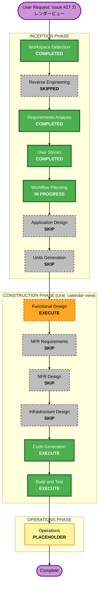

# Execution Plan — カレンダービュー（Issue #27）

## Detailed Analysis Summary

### Transformation Scope（Brownfield）

- **Transformation Type**: Single component change（既存のリソース詳細画面・予約申請フォーム画面への機能追加。アーキテクチャ変更・デプロイモデル変更なし）
- **Primary Changes**: `frontend/src/app/(authenticated)/resources/[id]/page.tsx` に、新規クライアントコンポーネント（カレンダー本体・週月切替・期間ナビゲーション）を追加する。加えて `frontend/src/app/(authenticated)/reservations/new/page.tsx`・`ReservationForm.tsx` に `startAt` クエリパラメータの読み取り・フォーム初期値設定を追加する（RSV-09。Functional Design時に既存`ReservationForm.tsx`が`startAt`クエリパラメータを解釈しない実装であることが判明したため、当初計画から範囲を拡大した）
- **Related Components**: `server/actions/resources.ts`（既存の`getAvailabilityAction`をそのまま利用、変更なし）、`screen-spec.md`（仕様反映先）

### Change Impact Assessment

- **User-facing changes**: Yes（カレンダーUIの新規追加、既存リスト表示は維持）
- **Structural changes**: No（新規の画面・API・データモデルなし。既存画面内への機能追加）
- **Data model changes**: No
- **API changes**: No（既存の`GET /api/resources/{id}/availability`を変更なしで利用）
- **NFR impact**: Minor（月表示は日単位要約セル〈最大42セル〉、週表示は1時間刻みグリッド〈168セル〉といずれも小規模。専用のNFR設計ステージを要するほどの新規非機能要求ではない）

### Component Relationships（Brownfield）

- **Primary Component**: `frontend/src/app/(authenticated)/resources/[id]/`（本タスクで新規コンポーネントを追加する対象ディレクトリ）
- **Shared Components**: `server/actions/resources.ts`（`getAvailabilityAction`。呼び出し方は変更しない）
- **Dependent Components**: `/reservations/new`（カレンダーからのクリックで遷移先となる。当初「遷移先画面自体の変更は不要」としていたが、既存`ReservationForm.tsx`が`startAt`クエリパラメータを解釈しない実装であることが判明したため、`page.tsx`・`ReservationForm.tsx`双方への変更を要する）
- **Supporting Components**: なし（監視・ログ・デプロイへの影響なし）

### Risk Assessment

- **Risk Level**: Low（frontendのみ、単一画面内への追加、バックエンド・DB変更なし）
- **Rollback Complexity**: Easy（新規ファイル追加が中心で、既存ファイルへの変更は`page.tsx`への呼び出し追加程度）
- **Testing Complexity**: Simple〜Moderate（日付グリッド計算・スロット重複判定にユニットテストが必要だが、対象ロジックは純粋関数として切り出し可能）

## Workflow Visualization

```mermaid
flowchart TD
    Start(["User Request: Issue #27 カレンダービュー"])

    subgraph INCEPTION["INCEPTION PHASE"]
        WD["Workspace Detection<br/><b>COMPLETED</b>"]
        RE["Reverse Engineering<br/><b>SKIPPED</b>"]
        RA["Requirements Analysis<br/><b>COMPLETED</b>"]
        US["User Stories<br/><b>COMPLETED</b>"]
        WP["Workflow Planning<br/><b>IN PROGRESS</b>"]
        AD["Application Design<br/><b>SKIP</b>"]
        UG["Units Generation<br/><b>SKIP</b>"]
    end

    subgraph CONSTRUCTION["CONSTRUCTION PHASE (Unit: calendar-view)"]
        FD["Functional Design<br/><b>EXECUTE</b>"]
        NFRA["NFR Requirements<br/><b>SKIP</b>"]
        NFRD["NFR Design<br/><b>SKIP</b>"]
        ID["Infrastructure Design<br/><b>SKIP</b>"]
        CG["Code Generation<br/><b>EXECUTE</b>"]
        BT["Build and Test<br/><b>EXECUTE</b>"]
    end

    subgraph OPERATIONS["OPERATIONS PHASE"]
        OPS["Operations<br/><b>PLACEHOLDER</b>"]
    end

    Start --> WD
    WD --> RE
    RE --> RA
    RA --> US
    US --> WP
    WP --> AD
    AD --> UG
    UG --> FD
    FD --> NFRA
    NFRA --> NFRD
    NFRD --> ID
    ID --> CG
    CG --> BT
    BT --> OPS
    OPS --> End(["Complete"])

    style WD fill:#4CAF50,stroke:#1B5E20,stroke-width:3px,color:#fff
    style RA fill:#4CAF50,stroke:#1B5E20,stroke-width:3px,color:#fff
    style US fill:#4CAF50,stroke:#1B5E20,stroke-width:3px,color:#fff
    style WP fill:#4CAF50,stroke:#1B5E20,stroke-width:3px,color:#fff
    style CG fill:#4CAF50,stroke:#1B5E20,stroke-width:3px,color:#fff
    style BT fill:#4CAF50,stroke:#1B5E20,stroke-width:3px,color:#fff
    style FD fill:#FFA726,stroke:#E65100,stroke-width:3px,stroke-dasharray: 5 5,color:#000
    style RE fill:#BDBDBD,stroke:#424242,stroke-width:2px,stroke-dasharray: 5 5,color:#000
    style AD fill:#BDBDBD,stroke:#424242,stroke-width:2px,stroke-dasharray: 5 5,color:#000
    style UG fill:#BDBDBD,stroke:#424242,stroke-width:2px,stroke-dasharray: 5 5,color:#000
    style NFRA fill:#BDBDBD,stroke:#424242,stroke-width:2px,stroke-dasharray: 5 5,color:#000
    style NFRD fill:#BDBDBD,stroke:#424242,stroke-width:2px,stroke-dasharray: 5 5,color:#000
    style ID fill:#BDBDBD,stroke:#424242,stroke-width:2px,stroke-dasharray: 5 5,color:#000
    style OPS fill:#FFF59D,stroke:#F57F17,stroke-width:2px,color:#000
    style Start fill:#CE93D8,stroke:#6A1B9A,stroke-width:3px,color:#000
    style End fill:#CE93D8,stroke:#6A1B9A,stroke-width:3px,color:#000

    linkStyle default stroke:#333,stroke-width:2px
```

## Phases to Execute

### INCEPTION PHASE

- [x] Workspace Detection (COMPLETED)
- [x] Reverse Engineering (SKIPPED — 既存成果物あり、対象ファイルは個別に読み直し済み)
- [x] Requirements Analysis (COMPLETED)
- [x] User Stories (COMPLETED)
- [x] Workflow Planning (IN PROGRESS — 本ドキュメント)
- [ ] Application Design - **SKIP**
  - **Rationale**: 本タスクは既存のリソース詳細画面（`/resources/{id}`）という単一画面内への機能追加であり、新規の「サービス」や画面をまたぐコンポーネント間契約を新設しない。個々のUIコンポーネント（カレンダーグリッド・週月切替・期間ナビゲーション）の分割と責務は、Functional Designでの業務ロジック定義（日付グリッド計算・スロット重複判定）とCode Generation Planningでのファイル単位の計画で十分にカバーできる。Application Designが本来対象とする「新規サービス間の設計」に該当する変更がないため、Issue #22と同じSKIP判定だが、判定基準（新規コンポーネント/サービスの有無）自体を本タスクに当てはめて独立に判断した。
- [ ] Units Generation - **SKIP**
  - **Rationale**: 新規データモデル・新規APIエンドポイントがなく、対象パッケージはfrontend単一。日付グリッド計算やスロット重複判定という複雑なロジックはあるが、複数ユニットへの分割を要する規模ではない（単一ユニット `calendar-view` として扱う）。

### CONSTRUCTION PHASE（Unit: calendar-view）

- [ ] Functional Design - **EXECUTE**
  - **Rationale**: (1) 表示モード（週/月）ごとの`from`/`to`算出ロジック、(2) `OccupiedSlot[]`を1時間グリッドへ写像し空き/予約済みを判定するロジック（STORY-04 AC4で指摘した境界不一致ケースを含む）、(3) 週の開始曜日・時間帯範囲の定数化、という3つの業務ロジックが新規に発生し、いずれも受け入れ基準の充足に直結するため、コード生成前に設計を固める価値がある。
- [ ] NFR Requirements - **SKIP**
  - **Rationale**: 拡張機能（Resiliency/Security/PBT）はいずれも不適用と確定済み。唯一のNFR的懸念（月表示時の描画セル数）は`requirements.md`のNon-Functional Requirements節に実装時の配慮事項として既に明記済みで、独立したNFR要求ステージを要するほどの規模・リスクではない。
- [ ] NFR Design - **SKIP**
  - **Rationale**: NFR RequirementsをSKIPしたため連動してSKIP。
- [ ] Infrastructure Design - **SKIP**
  - **Rationale**: インフラ・デプロイモデルの変更なし（frontendのみの変更、既存のNext.jsアプリ内で完結）。
- [ ] Code Generation - **EXECUTE (ALWAYS)**
  - **Rationale**: 実装計画の立案とコード生成が必要。
- [ ] Build and Test - **EXECUTE (ALWAYS)**
  - **Rationale**: ビルド・テスト・検証が必要。

### OPERATIONS PHASE

- [ ] Operations - **PLACEHOLDER**
  - **Rationale**: BookFlow翻案によりCI品質ゲート（CI Frontend）運用に委譲。`/aidlc`スキルとしての成果物生成はBuild and Testまで。

## Estimated Timeline

- **Total Stages Executed**: 5（Workspace Detection・Requirements Analysis・User Stories・Workflow Planning・Functional Design・Code Generation・Build and Test）※Workflow Planning含め計7ステージがCOMPLETED/EXECUTE対象
- **Estimated Duration**: 半日〜1日（ビジネス要求シートの見積り工数どおり）

## Success Criteria

- **Primary Goal**: `Docs/spec/enhancements/calendar-view.md` の受入条件6点をすべて満たす
- **Key Deliverables**: Functional Design成果物（`business-logic-model.md`・`business-rules.md`）、新規frontendコンポーネント一式、Vitestユニットテスト、`Docs/spec/screen-spec.md`の更新
- **Quality Gates**: `pnpm lint`・`pnpm test`・`pnpm build`（型チェック兼ねる）がすべて成功すること。バックエンドの変更が発生していないこと（`git diff`で`backend/`配下に差分がないことを確認）
