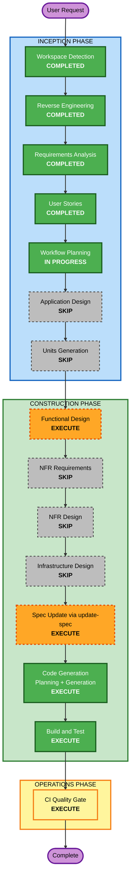

# Execution Plan — リソース一覧のキーワード検索追加

対象：`docs-next/docs/spec/enhancements/beginner/resource-list-filter.md`
ブランチ：`feature/CHS-UTSUMI-KENTA/23-resource-list-filter-aidlc`
ユニット名：`resource-keyword-search`（単一ユニット）

## Detailed Analysis Summary

### Transformation Scope

- **Transformation Type**: Single component change（既存コンポーネント境界の内側での機能追加）
- **Primary Changes**: `GET /api/resources` への `keyword` クエリパラメータ追加と、リソース一覧フィルタフォームへの入力欄追加
- **Related Components**: なし。インフラ・デプロイモデル・ネットワーク構成への波及はない

### Change Impact Assessment

- **User-facing changes**: Yes。フィルタフォームに入力欄が1つ増え、一覧の絞り込み結果が変わる
- **Structural changes**: No。新規コンポーネント・新規レイヤーは生じない。リポジトリ層の条件表現が派生クエリから Specification に変わるが、4レイヤーの境界は動かない
- **Data model changes**: No。`resources` テーブルのスキーマは変更しない。Flyway マイグレーションの追加なし
- **API changes**: Yes（後方互換）。任意パラメータの追加であり、未指定時の挙動は現行と同一
- **NFR impact**: No。読み取り専用のパラメータ追加であり、新たな障害点・外部依存・状態を持ち込まない

### Component Relationships

- **Primary Component**: `backend`（`presentation` / `application` / `domain` の3レイヤー）
- **Infrastructure Components**: なし
- **Shared Components**: なし
- **Dependent Components**: `frontend`（Server Actions が API を呼ぶ。API 契約は Zod スキーマとして手書きで二重管理されている）
- **Supporting Components**: `docs-next/docs/spec/`（`api-spec.md`・`screen-spec.md`）

| 関連コンポーネント | Change Type | Change Reason | Change Priority |
|---|---|---|---|
| `backend` | Minor（後方互換） | 直接の変更対象 | Critical |
| `frontend` | Minor | API 契約の変更に追随しなければ機能が利用されない | Critical |
| `docs-next/docs/spec/` | Minor | Spec-first の原則により実装より先に更新する | Critical |
| `backend` のテスト | Minor | シグネチャ変更とスタブの陳腐化により追随が必須 | Critical |
| `frontend` のテスト | Minor | `keyword` 受け渡しの検証 | Important |

### Risk Assessment

- **Risk Level**: Low
- **Rollback Complexity**: Easy（スキーマ変更がないため、コードの revert のみで元に戻る）
- **Testing Complexity**: Moderate

Testing Complexity を Simple ではなく Moderate としたのは、次の2点による。

1. `ResourceService.list` が `from` / `to` の有無で内部経路を分けており、両経路に対する検証が要る（ST-04 の AC-04-2・AC-04-4）。
2. `ResourceServiceTest` は Mockito の strict stubs を使う。リポジトリ呼び出しを Specification ベースに変えると既存スタブが未使用となり `UnnecessaryStubbingException` を起こすため、一覧系テストの書き換えが避けられない。

## Workflow Visualization


```mermaid
flowchart TD
    Start(["User Request"])

    subgraph INCEPTION["INCEPTION PHASE"]
        WD["Workspace Detection<br/><b>COMPLETED</b>"]
        RE["Reverse Engineering<br/><b>COMPLETED</b>"]
        RA["Requirements Analysis<br/><b>COMPLETED</b>"]
        US["User Stories<br/><b>COMPLETED</b>"]
        WP["Workflow Planning<br/><b>IN PROGRESS</b>"]
        AD["Application Design<br/><b>SKIP</b>"]
        UG["Units Generation<br/><b>SKIP</b>"]
    end

    subgraph CONSTRUCTION["CONSTRUCTION PHASE"]
        FD["Functional Design<br/><b>EXECUTE</b>"]
        NFRA["NFR Requirements<br/><b>SKIP</b>"]
        NFRD["NFR Design<br/><b>SKIP</b>"]
        ID["Infrastructure Design<br/><b>SKIP</b>"]
        SPEC["Spec Update via update-spec<br/><b>EXECUTE</b>"]
        CG["Code Generation<br/>Planning + Generation<br/><b>EXECUTE</b>"]
        BT["Build and Test<br/><b>EXECUTE</b>"]
    end

    subgraph OPERATIONS["OPERATIONS PHASE"]
        OPS["CI Quality Gate<br/><b>EXECUTE</b>"]
    end

    Start --> WD
    WD --> RE
    RE --> RA
    RA --> US
    US --> WP
    WP --> AD
    AD --> UG
    UG --> FD
    FD --> NFRA
    NFRA --> NFRD
    NFRD --> ID
    ID --> SPEC
    SPEC --> CG
    CG --> BT
    BT --> OPS
    OPS --> End(["Complete"])

    style WD fill:#4CAF50,stroke:#1B5E20,stroke-width:3px,color:#fff
    style RE fill:#4CAF50,stroke:#1B5E20,stroke-width:3px,color:#fff
    style RA fill:#4CAF50,stroke:#1B5E20,stroke-width:3px,color:#fff
    style US fill:#4CAF50,stroke:#1B5E20,stroke-width:3px,color:#fff
    style WP fill:#4CAF50,stroke:#1B5E20,stroke-width:3px,color:#fff
    style AD fill:#BDBDBD,stroke:#424242,stroke-width:2px,stroke-dasharray: 5 5,color:#000
    style UG fill:#BDBDBD,stroke:#424242,stroke-width:2px,stroke-dasharray: 5 5,color:#000
    style FD fill:#FFA726,stroke:#E65100,stroke-width:3px,stroke-dasharray: 5 5,color:#000
    style NFRA fill:#BDBDBD,stroke:#424242,stroke-width:2px,stroke-dasharray: 5 5,color:#000
    style NFRD fill:#BDBDBD,stroke:#424242,stroke-width:2px,stroke-dasharray: 5 5,color:#000
    style ID fill:#BDBDBD,stroke:#424242,stroke-width:2px,stroke-dasharray: 5 5,color:#000
    style SPEC fill:#FFA726,stroke:#E65100,stroke-width:3px,stroke-dasharray: 5 5,color:#000
    style CG fill:#4CAF50,stroke:#1B5E20,stroke-width:3px,color:#fff
    style BT fill:#4CAF50,stroke:#1B5E20,stroke-width:3px,color:#fff
    style OPS fill:#FFF59D,stroke:#F57F17,stroke-width:3px,color:#000
    style INCEPTION fill:#BBDEFB,stroke:#1565C0,stroke-width:3px,color:#000
    style CONSTRUCTION fill:#C8E6C9,stroke:#2E7D32,stroke-width:3px,color:#000
    style OPERATIONS fill:#FFF59D,stroke:#F57F17,stroke-width:3px,color:#000
    style Start fill:#CE93D8,stroke:#6A1B9A,stroke-width:3px,color:#000
    style End fill:#CE93D8,stroke:#6A1B9A,stroke-width:3px,color:#000

    linkStyle default stroke:#333,stroke-width:2px
```

### Text Alternative

```
INCEPTION PHASE
  1. Workspace Detection ....... COMPLETED
  2. Reverse Engineering ....... COMPLETED
  3. Requirements Analysis ..... COMPLETED
  4. User Stories .............. COMPLETED（学習者の指示により追加実行）
  5. Workflow Planning ......... IN PROGRESS
  6. Application Design ........ SKIP
  7. Units Generation .......... SKIP

CONSTRUCTION PHASE（unit: resource-keyword-search）
  8.  Functional Design ........ EXECUTE
  9.  NFR Requirements ......... SKIP
  10. NFR Design ............... SKIP
  11. Infrastructure Design .... SKIP
  12. Spec Update (/update-spec) EXECUTE
  13. Code Generation .......... EXECUTE
  14. Build and Test ........... EXECUTE

OPERATIONS PHASE
  15. CI Quality Gate .......... EXECUTE
```

## Phases to Execute

### INCEPTION PHASE

- [x] Workspace Detection（COMPLETED）
- [x] Reverse Engineering（COMPLETED）
- [x] Requirements Analysis（COMPLETED）
- [x] User Stories（COMPLETED）
- [x] Workflow Planning（IN PROGRESS）
- [ ] Application Design — **SKIP**
  - **Rationale**: 新規コンポーネント・新規サービスが生じない。変更はすべて既存の `ResourceController` / `ResourceService` / `ResourceRepository` の境界内で完結し、メソッドのシグネチャにパラメータが1つ増えるだけである。`ResourceSpecifications` を新設するが、これは domain 層に置く述語の組み立てユーティリティであり、サービス層設計を要する新規コンポーネントではない。
- [ ] Units Generation — **SKIP**
  - **Rationale**: 変更は1つの縦切りユニット `resource-keyword-search` に収まる。バックエンドとフロントエンドにまたがるが、`CLAUDE.md` の縦切り実装の方針どおり機能単位で1つにまとめる。分割すると片側だけでは動作しない中間状態が生じる。

### CONSTRUCTION PHASE（unit: `resource-keyword-search`）

- [ ] Functional Design — **EXECUTE**
  - **Rationale**: キーワード照合の意味論を実装前に確定させる必要がある。具体的には (1) 空文字・空白のみ・null の正規化規則、(2) `name` と `description` の OR 条件で `description` が null の行を落とさない組み立て、(3) `%` / `_` / エスケープ文字のエスケープ規則、(4) `list` の2経路それぞれでの Specification の適用点。これらを文書化せずに実装に入ると、ST-03・ST-04・ST-05 の受入基準で手戻りが生じる。detail level は最小とする。
- [ ] NFR Requirements — **SKIP**
  - **Rationale**: 新たな性能・セキュリティ・スケーラビリティ要件が生じない。既存の認証認可境界の内側に閉じ、外部依存も状態も増えない。`LIKE '%...%'` が B-tree インデックスを使えない点は要件定義書に非目標として記録済みであり、ステージを起こす対象ではない。拡張3件（Security / Resiliency / Property-Based Testing）はいずれも opt-out 済み。
- [ ] NFR Design — **SKIP**
  - **Rationale**: NFR Requirements をスキップするため、前提が成立しない。
- [ ] Infrastructure Design — **SKIP**
  - **Rationale**: インフラ資源・デプロイ構成・ネットワークへの変更がない。DB スキーマ変更もない。
- [ ] Spec Update（`/update-spec` スキル）— **EXECUTE**
  - **Rationale**: `CLAUDE.md` の Spec-first 原則により、`docs-next/docs/spec/` の更新は実装より先に行う。対象は要求シートの影響範囲が指定する2ファイル。`api-spec.md` の `GET /api/resources` 節に `keyword` パラメータと挙動を追記し、`screen-spec.md` の `/resources` 節にキーワード入力欄を追記する。`docs-next/CLAUDE.md` の文章規範に従い、`cd docs-next && npm run build` で検証する。
- [ ] Code Generation — **EXECUTE**（ALWAYS）
  - **Rationale**: 実装計画の作成とコード生成。
- [ ] Build and Test — **EXECUTE**（ALWAYS）
  - **Rationale**: ビルドとテストの実行および検証。

### OPERATIONS PHASE

- [ ] CI Quality Gate — **EXECUTE**
  - **Rationale**: BookFlow 翻案として、`CI Frontend` / `CI Backend` の通過を Operations 相当とする。

## Multi-Module Coordination

### Module Update Strategy

- **Update Approach**: Sequential
- **Critical Path**: `docs-next/docs/spec/` → `backend` → `frontend`
- **Coordination Points**: `GET /api/resources` のクエリパラメータ契約。バックエンドが `keyword` を受け付けるようになってはじめて、フロントエンドからの送出が意味を持つ
- **Testing Checkpoints**: バックエンドのテスト実行後にフロントエンドへ進み、最後に両方を通して確認する
- **Rollback Strategy**: スキーマ変更がないため、コミットの revert のみで復旧する

### Package Change Sequence

1. **`docs-next/docs/spec/`** — Spec-first の原則。実装の判断根拠を先に固定する
2. **`backend`** — API 契約の提供側。`domain` → `application` → `presentation` の順にレイヤーを下から積む
3. **`backend` のテスト** — シグネチャ変更とスタブの陳腐化により、実装と同一コミット単位で追随する
4. **`frontend`** — API 契約の消費側。Server Action → 画面 → フォームの順
5. **`frontend` のテスト**

## Estimated Timeline

- **Total Stages**: 15（完了5・スキップ5・実行予定5）
- **Estimated Duration**: 2〜3時間（要求シートの推定工数どおり）

## Success Criteria

- **Primary Goal**: リソース一覧で、リソース名または説明文への大文字小文字を区別しない部分一致検索ができ、既存のカテゴリ・期間フィルタと AND で組み合わせられること
- **Key Deliverables**:
  - `api-spec.md`・`screen-spec.md` の更新
  - バックエンド：Specification による条件合成、`keyword` パラメータの受け付け、対応するユニットテスト
  - フロントエンド：キーワード入力欄、URL パラメータの往復、対応するユニットテスト
- **Quality Gates**:
  - `./gradlew test` が pass する
  - `./gradlew spotlessApply` および `./gradlew checkstyleMain` が通る
  - `pnpm test` が pass する
  - `pnpm lint` および `pnpm format:check` が通る
  - `cd docs-next && npm run build` が成功する（リンク・アンカー破損なし）
  - ユーザーストーリー ST-01〜ST-11 の受入基準が満たされる
  - 要求シートの受入条件6項目が満たされる
- **Integration Testing**: `ResourceControllerTest` で `keyword` パラメータの受け渡しを含む API 層の動作を確認する
- **Operational Readiness**: `CI Frontend` / `CI Backend` の両ジョブが green になる
