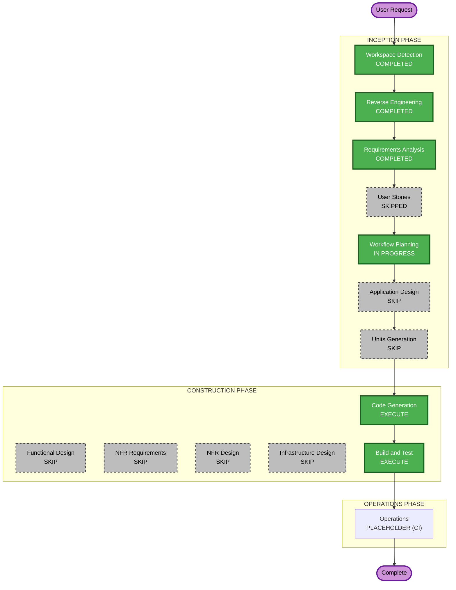

# Execution Plan — リソース一覧の検索・フィルタ追加（Issue #23）

## Detailed Analysis Summary

### Transformation Scope (Brownfield Only)

- **Transformation Type**: Single component change（`ResourceService`/`ResourceRepository`/`ResourceController` と `ResourceFilterForm` 周辺の拡張のみ。アーキテクチャ変更・デプロイモデル変更はない）
- **Primary Changes**:
  - backend: `GET /api/resources` に `keyword` クエリパラメータを追加し、`ResourceService.list()` の分岐を再構成して Java 側フィルタ経路（`listWithAvailabilityFilter` 相当）に `keyword` を組み込む。
  - frontend: `ResourceFilterForm.tsx` にキーワード入力欄を追加し、`resources.ts`（Server Action）の `ListResourcesParams`/`listResourcesAction` と `resources/page.tsx` の `SearchParams`/`listResourcesAction` 呼び出しに `keyword` を通す。
- **Related Components**: なし（他のバックエンド Service・他画面への影響はない）

### Change Impact Assessment

- **User-facing changes**: Yes — `/resources` 画面のフィルタフォームにキーワード入力欄が追加される。
- **Structural changes**: No — 新規パッケージ・新規レイヤーの追加はない。
- **Data model changes**: No — 新規エンティティ・新規カラム・新規マイグレーションは不要（既存の `resources.name`/`resources.description` を対象とする）。
- **API changes**: Yes（後方互換）— `GET /api/resources` に任意の `keyword` クエリパラメータを追加。既存クライアントの挙動は変わらない。
- **NFR impact**: Minor — `requirements.md` に記載の設計方針（DB側フィルタを行わず Java 側の全件取得後フィルタパターンを踏襲）のみ。新規の性能・セキュリティ要件はない。

### Component Relationships (Brownfield Only)

- **Primary Component**: `backend/application/ResourceService.java`, `backend/domain/ResourceRepository.java`, `backend/presentation/ResourceController.java`
- **Infrastructure Components**: なし
- **Shared Components**: なし
- **Dependent Components**:
  - `frontend/src/app/(authenticated)/resources/ResourceFilterForm.tsx`（キーワード入力欄の追加）
  - `frontend/src/app/(authenticated)/resources/page.tsx`（`SearchParams`/`listResourcesAction` 呼び出しへの `keyword` 追加。エンハンス要求シートに明記はないが、既存の `category`/`from`/`to` と同じ配線パターンのため対応が必要）
  - `frontend/src/server/actions/resources.ts`（`ListResourcesParams`/`listResourcesAction` への `keyword` 追加）
- **Supporting Components**: `backend/src/test/java/.../ResourceServiceTest.java`, `ResourceControllerTest.java`（テストケース追加）

各コンポーネントの変更種別:

| コンポーネント | Change Type | Change Reason | Change Priority |
|---|---|---|---|
| `ResourceController.java` | Minor（既存メソッドへのパラメータ追加） | 直接依存 | Critical |
| `ResourceService.java` | Minor〜Moderate（分岐の再構成） | 直接依存 | Critical |
| `ResourceRepository.java` | 変更なし | Java側フィルタ方針のため新規メソッド不要 | - |
| `ResourceFilterForm.tsx` | Minor | 直接依存 | Critical |
| `resources.ts`（Server Action） | Minor | 直接依存 | Critical |
| `resources/page.tsx` | Minor | 直接依存（配線） | Important |
| `ResourceServiceTest.java` / `ResourceControllerTest.java` | Minor（テスト追加） | 受入条件 | Critical |

### Risk Assessment

- **Risk Level**: Low（既存の1エンドポイント・1コンポーネントへの限定的な拡張。新規データモデル・新規承認フローはない）
- **Rollback Complexity**: Easy（`keyword` パラメータは任意であり、未指定時は既存動作と同一。単一コミット/PRの取り消しで復旧できる）
- **Testing Complexity**: Simple（既存のユニット・統合テストパターンにケースを追加するのみ）

## Workflow Visualization


```mermaid
flowchart TD
    Start(["User Request"])

    subgraph INCEPTION["INCEPTION PHASE"]
        WD["Workspace Detection<br/>COMPLETED"]
        RE["Reverse Engineering<br/>COMPLETED"]
        RA["Requirements Analysis<br/>COMPLETED"]
        US["User Stories<br/>SKIPPED"]
        WP["Workflow Planning<br/>IN PROGRESS"]
        AD["Application Design<br/>SKIP"]
        UG["Units Generation<br/>SKIP"]
    end

    subgraph CONSTRUCTION["CONSTRUCTION PHASE"]
        FD["Functional Design<br/>SKIP"]
        NFRA["NFR Requirements<br/>SKIP"]
        NFRD["NFR Design<br/>SKIP"]
        ID["Infrastructure Design<br/>SKIP"]
        CG["Code Generation<br/>EXECUTE"]
        BT["Build and Test<br/>EXECUTE"]
    end

    subgraph OPERATIONS["OPERATIONS PHASE"]
        OPS["Operations<br/>PLACEHOLDER (CI)"]
    end

    Start --> WD
    WD --> RE
    RE --> RA
    RA --> US
    US --> WP
    WP --> AD
    AD --> UG
    UG --> CG
    CG --> BT
    BT --> OPS
    OPS --> End(["Complete"])

    style WD fill:#4CAF50,stroke:#1B5E20,stroke-width:3px,color:#fff
    style RE fill:#4CAF50,stroke:#1B5E20,stroke-width:3px,color:#fff
    style RA fill:#4CAF50,stroke:#1B5E20,stroke-width:3px,color:#fff
    style US fill:#BDBDBD,stroke:#424242,stroke-width:2px,stroke-dasharray: 5 5,color:#000
    style WP fill:#4CAF50,stroke:#1B5E20,stroke-width:3px,color:#fff
    style AD fill:#BDBDBD,stroke:#424242,stroke-width:2px,stroke-dasharray: 5 5,color:#000
    style UG fill:#BDBDBD,stroke:#424242,stroke-width:2px,stroke-dasharray: 5 5,color:#000
    style FD fill:#BDBDBD,stroke:#424242,stroke-width:2px,stroke-dasharray: 5 5,color:#000
    style NFRA fill:#BDBDBD,stroke:#424242,stroke-width:2px,stroke-dasharray: 5 5,color:#000
    style NFRD fill:#BDBDBD,stroke:#424242,stroke-width:2px,stroke-dasharray: 5 5,color:#000
    style ID fill:#BDBDBD,stroke:#424242,stroke-width:2px,stroke-dasharray: 5 5,color:#000
    style CG fill:#4CAF50,stroke:#1B5E20,stroke-width:3px,color:#fff
    style BT fill:#4CAF50,stroke:#1B5E20,stroke-width:3px,color:#fff
    style Start fill:#CE93D8,stroke:#6A1B9A,stroke-width:3px,color:#000
    style End fill:#CE93D8,stroke:#6A1B9A,stroke-width:3px,color:#000

    linkStyle default stroke:#333,stroke-width:2px
```

### Text Alternative

```
INCEPTION PHASE
- Workspace Detection      : COMPLETED
- Reverse Engineering      : COMPLETED
- Requirements Analysis    : COMPLETED
- User Stories             : SKIPPED
- Workflow Planning        : IN PROGRESS (this document)
- Application Design       : SKIP
- Units Generation         : SKIP

CONSTRUCTION PHASE
- Functional Design        : SKIP
- NFR Requirements         : SKIP
- NFR Design               : SKIP
- Infrastructure Design    : SKIP
- Code Generation          : EXECUTE
- Build and Test           : EXECUTE

OPERATIONS PHASE
- Operations (CI)          : PLACEHOLDER（BookFlowではCI品質ゲートに相当）
```

## Phases to Execute

### INCEPTION PHASE

- [x] Workspace Detection (COMPLETED)
- [x] Reverse Engineering (COMPLETED)
- [x] Requirements Analysis (COMPLETED)
- [x] User Stories (SKIPPED)
  - **Rationale**: 既存画面（`/resources`）への1フィールド追加であり、新規ペルソナ・複雑な業務要件・チーム横断的な合意形成を要しない。`requirements.md` の User Scenarios 節が利用シナリオを既に網羅している。
- [x] Workflow Planning (IN PROGRESS — 本ドキュメント)
- [ ] Application Design - **SKIP**
  - **Rationale**: 新規コンポーネント・新規サービスの追加はない。既存の `ResourceService`/`ResourceController` の境界内で完結する変更であり、サービス層設計の見直しは不要。
- [ ] Units Generation - **SKIP**
  - **Rationale**: 単一の小さな縦切り変更であり、複数ユニットへの分解価値がない。CONSTRUCTION フェーズは本課題を単一の実装単位（unit）として扱う。

### CONSTRUCTION PHASE

- [ ] Functional Design - **SKIP**
  - **Rationale**: 新規データモデル・新規業務ルールはない。`requirements.md` が未解決のまま残した唯一の設計判断（`ResourceService.list()` の分岐再構成）は、Code Generation Part 1（実装計画の作成・承認）で十分にカバーできる粒度であり、独立した Functional Design ステージを設けるほどの複雑さはない。
- [ ] NFR Requirements - **SKIP**
  - **Rationale**: Extension opt-in（Security/Resiliency/PBT）はいずれも Requirements Analysis で「無効」と決定済み。新規の性能・セキュリティ・スケーラビリティ要件はない。
- [ ] NFR Design - **SKIP**
  - **Rationale**: NFR Requirements を実行しないため連動して SKIP。
- [ ] Infrastructure Design - **SKIP**
  - **Rationale**: インフラ・デプロイ構成の変更はない。
- [ ] Code Generation - **EXECUTE (ALWAYS)**
  - **Rationale**: 実装計画の作成（Part 1）と実装（Part 2）が必要。**Spec-first の原則により、Part 2（コード生成）に着手する前に `/update-spec` スキルで `docs-next/docs/spec/api-spec.md`（`GET /api/resources` の `keyword` パラメータ）と `docs-next/docs/spec/screen-spec.md`（`/resources` のキーワード入力欄）を更新する**（CLAUDE.md・SKILL.md の Spec-first 原則、および `requirements.md` の Technical Context に明記済み）。
- [ ] Build and Test - **EXECUTE (ALWAYS)**
  - **Rationale**: `backend`（`./gradlew test`）・`frontend`（`pnpm test`）双方の既存テストスイートが引き続き pass することを確認し、追加したユニットテストの実行結果を検証する。

### OPERATIONS PHASE

- [ ] Operations - **PLACEHOLDER**
  - **Rationale**: BookFlow では CI 品質ゲート（`CI Frontend` / `CI Backend`）が Operations 相当。PR 作成時に自動実行される。

## Package Change Sequence (Brownfield Only)

1. **backend**（`ResourceRepository` は変更なし → `ResourceService` → `ResourceController`）— API 契約側を先に固める。
2. **frontend**（`resources.ts` → `ResourceFilterForm.tsx` → `resources/page.tsx`）— backend の `keyword` パラメータ仕様確定後に配線する。

バックエンドとフロントエンドは同一 PR（縦切り Issue 単位、CLAUDE.md の「縦切り実装」原則）でまとめて実装する。

## Estimated Timeline

- **Total Phases**: 2（Code Generation, Build and Test。うち Code Generation は Part 1 計画 + Part 2 実装の2段階）
- **Estimated Duration**: 2〜3時間（エンハンス要求シート記載の見積りと整合）

## Success Criteria

- **Primary Goal**: `GET /api/resources` へのキーワード検索追加により、リソース名・説明文の部分一致検索ができる。
- **Key Deliverables**:
  - backend: `keyword` クエリパラメータ対応（`ResourceController`/`ResourceService`）
  - frontend: `ResourceFilterForm` へのキーワード入力欄、`resources.ts`/`resources/page.tsx` の配線
  - `docs-next/docs/spec/api-spec.md`・`screen-spec.md` の更新（`/update-spec`）
  - `ResourceServiceTest`/`ResourceControllerTest` への新規テストケース
- **Quality Gates**:
  - 既存の `ResourceServiceTest`・`ResourceControllerTest`・frontend `tests/unit` が引き続き pass する
  - `requirements.md` の受入条件をすべて満たす
  - CI（`CI Frontend`/`CI Backend`）が green になる

- **Integration Testing**: `ResourceControllerTest`（`@SpringBootTest` + H2）による Controller〜Service〜Repository〜DBスキーマの統合検証。
- **Operational Readiness**: 対象外（既存の運用監視体制の変更は不要）。
