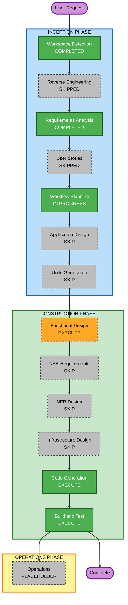

# Execution Plan - リソース一覧の検索・フィルタ追加

## Detailed Analysis Summary

### Transformation Scope（Brownfield）
- **Transformation Type**: 単一コンポーネント内の変更（既存の縦切りスライスへの機能追加。新規パッケージ・新規サービスの導入なし）
- **Primary Changes**: `GET /api/resources` へのキーワード検索クエリパラメータ追加（BE）、`ResourceFilterForm` へのキーワード入力欄追加（FE）
- **Related Components**: `ResourceRepository`（`@Query` 統合）・`ResourceService`（呼び出し整理）・`ResourceController`（クエリパラメータ追加）・`ResourceFilterForm.tsx`・`resources/page.tsx`・`server/actions/resources.ts`

### Change Impact Assessment
- **User-facing changes**: Yes — リソース一覧のフィルタフォームにキーワード入力欄が追加される
- **Structural changes**: No — 既存の 4 レイヤーアーキテクチャ内に収まる
- **Data model changes**: No — 既存カラム（`resources.name`/`resources.description`）を検索対象にするのみ。スキーマ変更なし
- **API changes**: Yes — `GET /api/resources` に任意パラメータ `keyword` を追加（後方互換）
- **NFR impact**: No — 性能・セキュリティ要件に新規追加なし（Requirements Analysis で確認済み）

### Component Relationships（Brownfield）

- **Primary Component**: `ResourceRepository`（検索条件を `@Query` JPQL 1メソッドに集約）
- **Infrastructure Components**: なし
- **Shared Components**: なし（新規の共通モデル・ユーティリティは不要）
- **Dependent Components**: `ResourceService.list()`（`ResourceRepository` の統合後メソッドを呼び出すよう変更）
- **Supporting Components**: `ResourceServiceTest`・`ResourceControllerTest`（既存テストが継続 pass すること）、`docs-next/docs/spec/api-spec.md`・`docs-next/docs/spec/screen-spec.md`（`/update-spec` で更新）

各コンポーネントの変更種別：

| コンポーネント | 変更種別 | 理由 | 優先度 |
|---|---|---|---|
| `ResourceRepository` | Major（既存6メソッドを1メソッドに置換） | 検索条件の組み合わせ爆発を回避する設計変更 | Critical |
| `ResourceService` | Minor（呼び出し整理） | Repository 変更に追従 | Critical |
| `ResourceController` | Minor（パラメータ追加） | `keyword` クエリパラメータの受け口 | Important |
| `ResourceFilterForm.tsx` | Minor（入力欄追加） | UI 反映 | Important |
| `resources/page.tsx` / `server/actions/resources.ts` | Minor（パラメータ中継） | keyword を BE まで伝搬 | Important |
| `docs-next/docs/spec/api-spec.md` / `screen-spec.md` | Minor（追記） | Spec-first 原則（`/update-spec` で対応） | Important |

### Risk Assessment
- **Risk Level**: Low（既存の縦切りスライス内に閉じた追加的変更。ロールバックは変更ファイルの取り消しのみで容易）
- **Rollback Complexity**: Easy
- **Testing Complexity**: Simple（既存テストパターンの延長でユニットテスト追加）

## Workflow Visualization

```mermaid
flowchart TD
    Start(["User Request"])

    subgraph INCEPTION["INCEPTION PHASE"]
        WD["Workspace Detection<br/>COMPLETED"]
        RE["Reverse Engineering<br/>SKIPPED"]
        RA["Requirements Analysis<br/>COMPLETED"]
        US["User Stories<br/>SKIPPED"]
        WP["Workflow Planning<br/>IN PROGRESS"]
        AD["Application Design<br/>SKIP"]
        UG["Units Generation<br/>SKIP"]
    end

    subgraph CONSTRUCTION["CONSTRUCTION PHASE"]
        FD["Functional Design<br/>EXECUTE"]
        NFRA["NFR Requirements<br/>SKIP"]
        NFRD["NFR Design<br/>SKIP"]
        ID["Infrastructure Design<br/>SKIP"]
        CG["Code Generation<br/>EXECUTE"]
        BT["Build and Test<br/>EXECUTE"]
    end

    subgraph OPERATIONS["OPERATIONS PHASE"]
        OPS["Operations<br/>PLACEHOLDER"]
    end

    Start --> WD
    WD --> RE
    RE --> RA
    RA --> US
    US --> WP
    WP --> AD
    AD --> UG
    UG --> FD
    FD --> NFRA
    NFRA --> NFRD
    NFRD --> ID
    ID --> CG
    CG --> BT
    BT --> OPS
    BT --> End(["Complete"])

    style WD fill:#4CAF50,stroke:#1B5E20,stroke-width:3px,color:#fff
    style RA fill:#4CAF50,stroke:#1B5E20,stroke-width:3px,color:#fff
    style WP fill:#4CAF50,stroke:#1B5E20,stroke-width:3px,color:#fff
    style CG fill:#4CAF50,stroke:#1B5E20,stroke-width:3px,color:#fff
    style BT fill:#4CAF50,stroke:#1B5E20,stroke-width:3px,color:#fff
    style OPS fill:#BDBDBD,stroke:#424242,stroke-width:2px,stroke-dasharray: 5 5,color:#000
    style RE fill:#BDBDBD,stroke:#424242,stroke-width:2px,stroke-dasharray: 5 5,color:#000
    style US fill:#BDBDBD,stroke:#424242,stroke-width:2px,stroke-dasharray: 5 5,color:#000
    style AD fill:#BDBDBD,stroke:#424242,stroke-width:2px,stroke-dasharray: 5 5,color:#000
    style UG fill:#BDBDBD,stroke:#424242,stroke-width:2px,stroke-dasharray: 5 5,color:#000
    style NFRA fill:#BDBDBD,stroke:#424242,stroke-width:2px,stroke-dasharray: 5 5,color:#000
    style NFRD fill:#BDBDBD,stroke:#424242,stroke-width:2px,stroke-dasharray: 5 5,color:#000
    style ID fill:#BDBDBD,stroke:#424242,stroke-width:2px,stroke-dasharray: 5 5,color:#000
    style FD fill:#FFA726,stroke:#E65100,stroke-width:3px,stroke-dasharray: 5 5,color:#000
    style INCEPTION fill:#BBDEFB,stroke:#1565C0,stroke-width:3px,color:#000
    style CONSTRUCTION fill:#C8E6C9,stroke:#2E7D32,stroke-width:3px,color:#000
    style OPERATIONS fill:#FFF59D,stroke:#F57F17,stroke-width:3px,color:#000
    style Start fill:#CE93D8,stroke:#6A1B9A,stroke-width:3px,color:#000
    style End fill:#CE93D8,stroke:#6A1B9A,stroke-width:3px,color:#000

    linkStyle default stroke:#333,stroke-width:2px
```

## Phases to Execute

### 🔵 INCEPTION PHASE
- [x] Workspace Detection (COMPLETED)
- [x] Reverse Engineering (SKIPPED)
  - **Rationale**: 変更範囲が単一スライスに閉じており、対象コード（Controller/Service/Repository/Entity/フォーム/ページ/Server Action）はビジネス要求シートと `docs-next/docs/spec/api-spec.md` に既に十分明記されているため（詳細は監査ログ参照）
- [x] Requirements Analysis (COMPLETED)
- [x] User Stories (SKIPPED)
  - **Rationale**: 新規ユーザーワークフロー・新規ペルソナ・ロール間の挙動差異が生じない既存画面への追加的変更であり、受入条件はビジネス要求シートに既に完全な形で記載されている
- [x] Execution Plan (IN PROGRESS — 本ドキュメント)
- [ ] Application Design - SKIP
  - **Rationale**: 新規コンポーネント・新規サービス層の導入はなく、既存の `ResourceController`/`ResourceService`/`ResourceRepository` の境界内の変更に収まる
- [ ] Units Generation - SKIP
  - **Rationale**: フロントエンド・バックエンドにまたがるが単一の縦切りスライス（施設予約ドメインのリソース検索機能）であり、並行開発のための複数ユニットへの分解は不要

### 🟢 CONSTRUCTION PHASE
- [ ] Functional Design - EXECUTE
  - **Rationale**: `keyword`・`category`・`isActive` の AND 条件、大文字小文字非依存の部分一致、空文字時のフィルタ解除という業務ルールを、`@Query` JPQL 1メソッドへの集約という設計決定に沿って実装前に明文化する必要があるため（新規ドメインエンティティは無く、簡潔な深度で実施する）
- [ ] NFR Requirements - SKIP
  - **Rationale**: Requirements Analysis で新規の性能・セキュリティ要件なしと確認済み。既存の可視性ルール（ADMIN/一般）は変更しない
- [ ] NFR Design - SKIP
  - **Rationale**: NFR Requirements を SKIP したため
- [ ] Infrastructure Design - SKIP
  - **Rationale**: インフラ構成・デプロイモデルへの変更なし
- [ ] Code Generation - EXECUTE (ALWAYS)
  - **Rationale**: 実装計画の立案とコード生成が必要
- [ ] Build and Test - EXECUTE (ALWAYS)
  - **Rationale**: ビルド・既存テストの継続 pass 確認・新規ユニットテスト追加の検証が必要

### 🟡 OPERATIONS PHASE
- [ ] Operations - PLACEHOLDER
  - **Rationale**: BookFlow では CI 品質ゲート（CI Frontend / CI Backend）が Operations 相当。PR 作成後に自動実行される

## Estimated Timeline
- **Total Phases**: 4（Requirements Analysis・Workflow Planning・Functional Design・Code Generation + Build and Test）
- **Estimated Duration**: 2〜3時間（ビジネス要求シート記載の見積りと一致）

## Success Criteria
- **Primary Goal**: `GET /api/resources` のキーワード検索と `ResourceFilterForm` への入力欄追加を、既存の可視性・ページネーション・期間フィルタと整合させて実装する
- **Key Deliverables**: `keyword` 対応の `ResourceRepository`/`ResourceService`/`ResourceController`、`ResourceFilterForm.tsx` の入力欄、対応するユニットテスト、`api-spec.md`/`screen-spec.md` の更新
- **Quality Gates**: 既存バックエンドテスト（`ResourceServiceTest`・`ResourceControllerTest`）の継続 pass、新規ユニットテストの pass、`pnpm lint`/`./gradlew checkstyleMain` の通過
