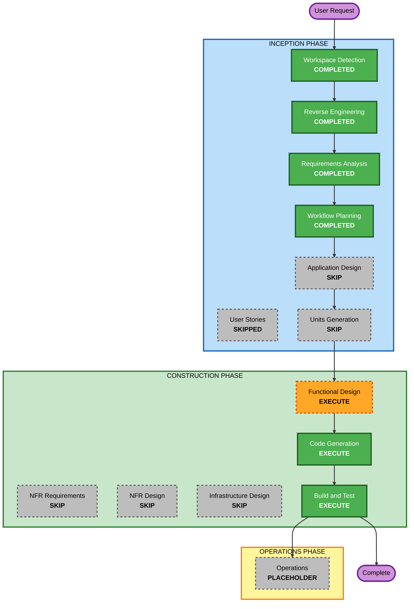

# Execution Plan — リソース一覧のソート順選択（Issue #22）

## Detailed Analysis Summary

### Transformation Scope（Brownfield）

- **Transformation Type**: Single component change（既存の「リソース」機能内の変更。新規パッケージ・新規サービスは生じない）
- **Primary Changes**: `GET /api/resources` への `sort` パラメータ追加とそれに伴うバックエンド2経路（`listPaginated`/`listWithAvailabilityFilter`）・フロントエンド（`ResourceFilterForm`/BFF）の対応
- **Related Components**: `ResourceController`・`ResourceService`・`ResourceRepository`・`ResourceFilterForm.tsx`・`page.tsx`・`server/actions/resources.ts`・`lib/labels.ts`

### Change Impact Assessment

- **User-facing changes**: Yes — 一覧画面にソート選択ドロップダウンが追加され、選択に応じて表示順が変わる
- **Structural changes**: No — 既存の4層構成・BFFパターンの範囲内
- **Data model changes**: No — `resources` テーブルへのカラム追加は不要
- **API changes**: Yes — 既存エンドポイントへの後方互換なクエリパラメータ追加（破壊的変更ではない）
- **NFR impact**: No — 想定データ規模（数十〜数百件）ではインメモリソートの性能影響は無視できる

### Component Relationships（Brownfield）

- **Primary Component**: リソース一覧機能（backend: presentation/application/domain、frontend: resources画面 + BFF）
- **Infrastructure Components**: なし
- **Shared Components**: `frontend/src/lib/labels.ts`（ソート選択肢ラベル追加）
- **Dependent Components**: なし（他機能からリソース一覧APIを呼び出す箇所は現状確認されていない）
- **Supporting Components**: なし（新規監視・ロギングは不要）

### Risk Assessment

- **Risk Level**: Low（既存機能への隔離された追加、既存の回帰テストで検知可能、ロールバックはgit revertのみで容易）
- **Rollback Complexity**: Easy
- **Testing Complexity**: Simple〜Moderate（2経路それぞれへのテスト追加が必要な点でやや複雑）

## Workflow Visualization


```mermaid
flowchart TD
    Start(["User Request"])

    subgraph INCEPTION["INCEPTION PHASE"]
        WD["Workspace Detection<br/><b>COMPLETED</b>"]
        RE["Reverse Engineering<br/><b>COMPLETED</b>"]
        RA["Requirements Analysis<br/><b>COMPLETED</b>"]
        US["User Stories<br/><b>SKIPPED</b>"]
        WP["Workflow Planning<br/><b>COMPLETED</b>"]
        AD["Application Design<br/><b>SKIP</b>"]
        UG["Units Generation<br/><b>SKIP</b>"]
    end

    subgraph CONSTRUCTION["CONSTRUCTION PHASE"]
        FD["Functional Design<br/><b>EXECUTE</b>"]
        NFRA["NFR Requirements<br/><b>SKIP</b>"]
        NFRD["NFR Design<br/><b>SKIP</b>"]
        ID["Infrastructure Design<br/><b>SKIP</b>"]
        CG["Code Generation<br/><b>EXECUTE</b>"]
        BT["Build and Test<br/><b>EXECUTE</b>"]
    end

    subgraph OPERATIONS["OPERATIONS PHASE"]
        OPS["Operations<br/><b>PLACEHOLDER</b>"]
    end

    Start --> WD
    WD --> RE
    RE --> RA
    RA --> WP
    WP --> AD
    AD --> UG
    UG --> FD
    FD --> CG
    CG --> BT
    BT --> OPS
    BT --> End(["Complete"])

    style WD fill:#4CAF50,stroke:#1B5E20,stroke-width:3px,color:#fff
    style RE fill:#4CAF50,stroke:#1B5E20,stroke-width:3px,color:#fff
    style RA fill:#4CAF50,stroke:#1B5E20,stroke-width:3px,color:#fff
    style WP fill:#4CAF50,stroke:#1B5E20,stroke-width:3px,color:#fff
    style CG fill:#4CAF50,stroke:#1B5E20,stroke-width:3px,color:#fff
    style BT fill:#4CAF50,stroke:#1B5E20,stroke-width:3px,color:#fff
    style US fill:#BDBDBD,stroke:#424242,stroke-width:2px,stroke-dasharray: 5 5,color:#000
    style AD fill:#BDBDBD,stroke:#424242,stroke-width:2px,stroke-dasharray: 5 5,color:#000
    style UG fill:#BDBDBD,stroke:#424242,stroke-width:2px,stroke-dasharray: 5 5,color:#000
    style NFRA fill:#BDBDBD,stroke:#424242,stroke-width:2px,stroke-dasharray: 5 5,color:#000
    style NFRD fill:#BDBDBD,stroke:#424242,stroke-width:2px,stroke-dasharray: 5 5,color:#000
    style ID fill:#BDBDBD,stroke:#424242,stroke-width:2px,stroke-dasharray: 5 5,color:#000
    style FD fill:#FFA726,stroke:#E65100,stroke-width:3px,stroke-dasharray: 5 5,color:#000
    style OPS fill:#BDBDBD,stroke:#424242,stroke-width:2px,stroke-dasharray: 5 5,color:#000
    style INCEPTION fill:#BBDEFB,stroke:#1565C0,stroke-width:3px,color:#000
    style CONSTRUCTION fill:#C8E6C9,stroke:#2E7D32,stroke-width:3px,color:#000
    style OPERATIONS fill:#FFF59D,stroke:#F57F17,stroke-width:3px,color:#000
    style Start fill:#CE93D8,stroke:#6A1B9A,stroke-width:3px,color:#000
    style End fill:#CE93D8,stroke:#6A1B9A,stroke-width:3px,color:#000

    linkStyle default stroke:#333,stroke-width:2px
```

### Text Alternative

```
INCEPTION
- Workspace Detection: COMPLETED
- Reverse Engineering: COMPLETED
- Requirements Analysis: COMPLETED
- User Stories: SKIPPED（単一ペルソナ・単純な要求のため）
- Workflow Planning: COMPLETED（本ドキュメント）
- Application Design: SKIP（新規コンポーネント・新規サービス層なし、既存境界内の変更）
- Units Generation: SKIP（単一の小規模エンハンスメント、複数ユニットへの分解は不要）

CONSTRUCTION（Unit: リソース一覧ソート機能、単一ユニット扱い）
- Functional Design: EXECUTE（2経路へのソート適用方法、null定員の扱い、比較ロジックの詳細設計が必要）
- NFR Requirements: SKIP（性能・セキュリティ・スケーラビリティへの新規要求なし）
- NFR Design: SKIP（NFR Requirementsを実行しないため）
- Infrastructure Design: SKIP（インフラ変更なし）
- Code Generation: EXECUTE（常時）
- Build and Test: EXECUTE（常時）

OPERATIONS
- Operations: PLACEHOLDER（BookFlowではCI品質ゲートが相当）
```

## Phases to Execute

### INCEPTION PHASE

- [x] Workspace Detection (COMPLETED)
- [x] Reverse Engineering (COMPLETED)
- [x] Requirements Analysis (COMPLETED)
- [x] User Stories (SKIPPED — 単一ペルソナ・単純な要求のため)
- [x] Workflow Planning (本ドキュメント)
- [ ] Application Design - **SKIP**
  - **Rationale**: 新規コンポーネント・新規サービスは発生せず、既存の `ResourceController`/`ResourceService`/`ResourceRepository`/`ResourceFilterForm` の境界内での変更に留まる
- [ ] Units Generation - **SKIP**
  - **Rationale**: 単一の小規模エンハンスメントであり、複数ユニットへの分解による並行/順序制御の必要がない。Construction フェーズは「リソース一覧ソート機能」を単一ユニットとして扱う

### CONSTRUCTION PHASE（Unit: リソース一覧ソート機能）

- [ ] Functional Design - **EXECUTE**
  - **Rationale**: RES-04〜07（2経路それぞれへのソート適用方法、`capacity` null の末尾固定、大文字小文字を区別しない名称比較、不正な `sort` 値の400応答）は具体的な比較ロジック・データフローとして設計してから実装した方が手戻りが少ない
- [ ] NFR Requirements - **SKIP**
  - **Rationale**: 要件定義時点で性能・セキュリティ・スケーラビリティへの新規要求がないことを確認済み（`requirements.md` Non-Functional Requirements 節）
- [ ] NFR Design - **SKIP**
  - **Rationale**: NFR Requirements を実行しないため連動してSKIP
- [ ] Infrastructure Design - **SKIP**
  - **Rationale**: デプロイアーキテクチャ・クラウドリソースへの変更なし
- [ ] Code Generation - EXECUTE (ALWAYS)
  - **Rationale**: 実装計画の作成とコード生成が必要
- [ ] Build and Test - EXECUTE (ALWAYS)
  - **Rationale**: ビルド・テスト・検証が必要

### OPERATIONS PHASE

- [ ] Operations - PLACEHOLDER
  - **Rationale**: BookFlowではCI品質ゲート（`CI Frontend`/`CI Backend`）がOperations相当として運用される（`Docs/guide/dev-workflow.md`参照）

## Package Change Sequence（Brownfield）

単一ユニット・単一機能のため順序制御は不要。backend（`ResourceController`/`ResourceService`/`ResourceRepository`）→ frontend（`ResourceFilterForm.tsx`/`page.tsx`/`server/actions/resources.ts`/`labels.ts`）の順で実装するが、両者は疎結合（APIコントラクトの`sort`パラメータのみで接続）なため並行実装も可能。

## Estimated Timeline

- **Total Phases**: 5（Functional Design, Code Generation, Build and Test を残す。Workspace Detection/Reverse Engineering/Requirements Analysis/Workflow Planningは完了済み、User Stories/Application Design/Units Generation/NFR系/Infrastructure DesignはSKIP）
- **Estimated Duration**: 半日（issue #22 の見積りどおり）

## Success Criteria

- **Primary Goal**: `resource-list-sort.md` の受入条件（キーワード検索関連を除く4点）を満たす
- **Key Deliverables**: バックエンドAPI（`sort`パラメータ対応）、フロントエンドUI（ソート選択ドロップダウン）、新規ユニットテスト、`api-spec.md`/`screen-spec.md`の更新
- **Quality Gates**: `./gradlew test`・`./gradlew spotlessCheck`・`./gradlew checkstyleMain`、`pnpm lint`・`pnpm test` がいずれもpass

- **Integration Testing**: フロントエンドのソート選択→URL反映→バックエンドのソート適用までの一連の流れを手動確認する
