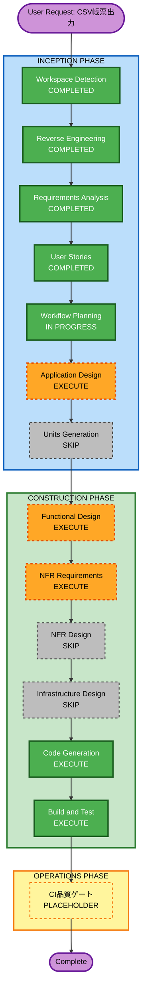

# Execution Plan: CSV 帳票出力

## Detailed Analysis Summary

### Transformation Scope（Brownfield）
- **Transformation Type**: Single component change（既存の予約ドメイン・既存の管理者ページ体系に新規コンポーネントを追加する縦切り機能。アーキテクチャ変換ではない）
- **Primary Changes**: バックエンドに新規エンドポイント + 4層それぞれへの追加、フロントエンドに新規ページ + Route Handler
- **Related Components**: `ReservationRepository`（既存クラスへのメソッド追加）、`backend/build.gradle.kts`（opencsv 追加）、`nav-items.ts`（既存メニューへの追加）

### Change Impact Assessment
- **User-facing changes**: Yes — ADMIN 向けの新規ページ `/admin/reports` とサイドナビ項目
- **Structural changes**: No — 既存の4層アーキテクチャ・既存の BFF パターンの範囲内
- **Data model changes**: Yes（限定的） — `ReservationCsvRow`（新規射影 record）を追加。DB スキーマ変更なし
- **API changes**: Yes — `GET /api/reports/reservations/csv` を新設（既存エンドポイントの変更なし）
- **NFR impact**: Yes — ストリーミング出力・CSV インジェクション対策という新しい非機能要件が加わる

### Component Relationships（Brownfield）
- **Primary Component**: `backend`（新規4クラス）、`frontend`（新規2ファイル + 新規ページ2ファイル）
- **Infrastructure Components**: なし（新規インフラなし）
- **Shared Components**: なし（フロントエンド・バックエンドは型を共有しない既存方針のまま）
- **Dependent Components**: なし（既存エンドポイントに依存されない新規追加）
- **Supporting Components**: `GlobalExceptionHandler`・`SecurityConfig`・`RegisteredUserInterceptor`（変更せず再利用）

### Risk Assessment
- **Risk Level**: Low〜Medium。ロジック自体は既存パターンの組み合わせだが、`StreamingResponseBody` とトランザクション境界の両立という、リポジトリ内に前例のない技術的な作り込みが1箇所ある
- **Rollback Complexity**: Easy（新規エンドポイント・新規ページの追加のみで、既存エンドポイントの変更を伴わない）
- **Testing Complexity**: Moderate（非同期ストリーミングの MockMvc 検証という前例のないテスト手法が必要）

## Workflow Visualization


```mermaid
flowchart TD
    Start(["User Request: CSV帳票出力"])

    subgraph INCEPTION["INCEPTION PHASE"]
        WD["Workspace Detection<br/>COMPLETED"]
        RE["Reverse Engineering<br/>COMPLETED"]
        RA["Requirements Analysis<br/>COMPLETED"]
        US["User Stories<br/>COMPLETED"]
        WP["Workflow Planning<br/>IN PROGRESS"]
        AD["Application Design<br/>EXECUTE"]
        UG["Units Generation<br/>SKIP"]
    end

    subgraph CONSTRUCTION["CONSTRUCTION PHASE"]
        FD["Functional Design<br/>EXECUTE"]
        NFRA["NFR Requirements<br/>EXECUTE"]
        NFRD["NFR Design<br/>SKIP"]
        ID["Infrastructure Design<br/>SKIP"]
        CG["Code Generation<br/>EXECUTE"]
        BT["Build and Test<br/>EXECUTE"]
    end

    subgraph OPERATIONS["OPERATIONS PHASE"]
        OPS["CI品質ゲート<br/>PLACEHOLDER"]
    end

    Start --> WD --> RE --> RA --> US --> WP --> AD --> UG --> FD --> NFRA --> NFRD --> ID --> CG --> BT --> OPS --> End(["Complete"])

    style WD fill:#4CAF50,stroke:#1B5E20,stroke-width:3px,color:#fff
    style RE fill:#4CAF50,stroke:#1B5E20,stroke-width:3px,color:#fff
    style RA fill:#4CAF50,stroke:#1B5E20,stroke-width:3px,color:#fff
    style US fill:#4CAF50,stroke:#1B5E20,stroke-width:3px,color:#fff
    style WP fill:#4CAF50,stroke:#1B5E20,stroke-width:3px,color:#fff
    style AD fill:#FFA726,stroke:#E65100,stroke-width:3px,stroke-dasharray: 5 5,color:#000
    style UG fill:#BDBDBD,stroke:#424242,stroke-width:2px,stroke-dasharray: 5 5,color:#000
    style FD fill:#FFA726,stroke:#E65100,stroke-width:3px,stroke-dasharray: 5 5,color:#000
    style NFRA fill:#FFA726,stroke:#E65100,stroke-width:3px,stroke-dasharray: 5 5,color:#000
    style NFRD fill:#BDBDBD,stroke:#424242,stroke-width:2px,stroke-dasharray: 5 5,color:#000
    style ID fill:#BDBDBD,stroke:#424242,stroke-width:2px,stroke-dasharray: 5 5,color:#000
    style CG fill:#4CAF50,stroke:#1B5E20,stroke-width:3px,color:#fff
    style BT fill:#4CAF50,stroke:#1B5E20,stroke-width:3px,color:#fff
    style OPS fill:#FFF59D,stroke:#F57F17,stroke-width:2px,stroke-dasharray: 5 5,color:#000
    style INCEPTION fill:#BBDEFB,stroke:#1565C0,stroke-width:3px,color:#000
    style CONSTRUCTION fill:#C8E6C9,stroke:#2E7D32,stroke-width:3px,color:#000
    style OPERATIONS fill:#FFF59D,stroke:#F57F17,stroke-width:3px,color:#000
    style Start fill:#CE93D8,stroke:#6A1B9A,stroke-width:3px,color:#000
    style End fill:#CE93D8,stroke:#6A1B9A,stroke-width:3px,color:#000

    linkStyle default stroke:#333,stroke-width:2px
```

### テキスト代替（Mermaid が読めない場合）

```
Phase 1: INCEPTION
- Workspace Detection (COMPLETED)
- Reverse Engineering (COMPLETED)
- Requirements Analysis (COMPLETED)
- User Stories (COMPLETED)
- Workflow Planning (IN PROGRESS)
- Application Design (EXECUTE)
- Units Generation (SKIP)

Phase 2: CONSTRUCTION（単一ユニットとして実行）
- Functional Design (EXECUTE)
- NFR Requirements (EXECUTE)
- NFR Design (SKIP)
- Infrastructure Design (SKIP)
- Code Generation (EXECUTE)
- Build and Test (EXECUTE)

Phase 3: OPERATIONS
- CI 品質ゲート（プレースホルダー相当。CI Frontend / CI Backend）
```

## Phases to Execute

### INCEPTION PHASE
- [x] Workspace Detection (COMPLETED)
- [x] Reverse Engineering (COMPLETED)
- [x] Requirements Analysis (COMPLETED)
- [x] User Stories (COMPLETED)
- [x] Workflow Planning (IN PROGRESS — this document)
- [ ] Application Design — **EXECUTE**
  - **Rationale**: 新規コンポーネント（`ReportController`・`ReservationReportService`・`ReservationCsvWriter`・`ReservationCsvRow`・`ReportExportClient`・Route Handler）を追加するため。plan mode の調査・設計エージェントの成果をこのステージの正式な成果物として整理する
- [ ] Units Generation — **SKIP**
  - **Rationale**: BookFlow の開発フローでは「フロントエンド・バックエンドにまたがる変更は機能単位でまとめて実装する（units of work = 縦切り Issue 単位）」（CLAUDE.md）。本タスクは Issue #29 という単一の縦切りであり、複数ユニットへの分解や複数チームへの割り当てを必要としない。単一の単純なユニットとして扱う

### CONSTRUCTION PHASE（単一ユニット: `csv-export`）
- [ ] Functional Design — **EXECUTE**
  - **Rationale**: 新規データモデル（`ReservationCsvRow` への射影）と、業務ルール（CSV インジェクション対策の適用範囲・期間の閉区間の意味・全ユーザー出力という業務判断）の詳細設計が必要
- [ ] NFR Requirements — **EXECUTE**
  - **Rationale**: パフォーマンス（ストリーミング・上限なし）とセキュリティ（CSV インジェクション・認可）の要件があり、技術選定（opencsv 5.12.0）も確定させる必要がある
- [ ] NFR Design — **SKIP**
  - **Rationale**: 本ステージの目的は「NFR パターンを論理コンポーネントに落とし込む」ことだが、本タスクには論理コンポーネント↔インフラのマッピングを必要とする抽象化層がない（Infrastructure Design も SKIP）。ストリーミング・トランザクション境界・インジェクション対策という技術パターンは、いずれも単一クラス内で完結する実装判断であり、NFR Requirements の成果物で具体的に記述しきれる
- [ ] Infrastructure Design — **SKIP**
  - **Rationale**: 新規のクラウドリソース・デプロイ先の変更を伴わない。既存の Spring Boot / Next.js コンテナ内に新規クラスを追加するのみ（Reverse Engineering の `architecture.md` で確認済み）
- [ ] Code Generation — **EXECUTE (ALWAYS)**
  - **Rationale**: 実装そのもの
- [ ] Build and Test — **EXECUTE (ALWAYS)**
  - **Rationale**: ビルド・テストの実行指示生成

### OPERATIONS PHASE
- [ ] CI 品質ゲート — PLACEHOLDER 相当
  - **Rationale**: BookFlow では `CI Frontend` / `CI Backend` の既存ワークフローが Operations 相当を担う（`docs-next/docs/develop/aidlc-guide.md#phases`）。新規のパイプライン追加は不要

## Package Change Sequence

単一ユニットのため厳密な順序調整は不要だが、依存関係上の推奨順序は以下のとおり（Code Generation ステージの実装順序として採用）。

1. `backend/build.gradle.kts`（opencsv 追加）+ ADR-033
2. バックエンド：`ReservationCsvRow` → `ReservationRepository` → `ReservationCsvWriter`（+テスト）→ `ReservationReportService`（+テスト）→ `ReportController`（+テスト）
3. 仕様書更新（Spec-first）：`requirements.md`・`api-spec.md`・`screen-spec.md`・`enhancements/intermediate/csv-export.md`
4. フロントエンド：`nav-items.ts` → `lib/reports.ts`（+テスト）→ Route Handler（+テスト）→ `/admin/reports` ページ + `ReportExportClient.tsx`

## Estimated Timeline
- **Total Phases**: INCEPTION（Application Design のみ残） + CONSTRUCTION（Functional Design・NFR Requirements・Code Generation・Build and Test） + OPERATIONS（CI）
- **Estimated Duration**: エンハンス要求シート記載の見積もり「半日〜1日」を踏襲

## Success Criteria
- **Primary Goal**: ADMIN が予約実績を CSV でダウンロードできる
- **Key Deliverables**: 新規バックエンド4クラス + フロントエンド4ファイル、Spec-first に基づく仕様書更新、ADR-033
- **Quality Gates**: `./gradlew test spotlessCheck checkstyleMain`、`pnpm lint format:check build test`、`npm run build`（docs-next）がすべて成功すること
- **Integration Testing**: MEMBER/APPROVER/無認証/ADMIN の4点セットが `ReportControllerTest` で通ること
