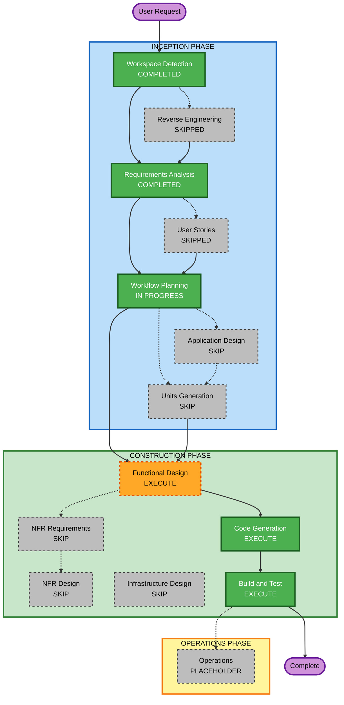

# Execution Plan - リソース一覧の検索・フィルタ追加

## Detailed Analysis Summary

### Transformation Scope（Brownfield）

- **Transformation Type**: Single component change（既存コンポーネント境界内の拡張）
- **Primary Changes**: `GET /api/resources` へのキーワード検索クエリパラメータ追加、`ResourceFilterForm` へのキーワード入力欄追加
- **Related Components**: `ResourceController`・`ResourceService`・`ResourceRepository`（バックエンド）、`ResourceFilterForm.tsx`・呼び出し元 `page.tsx`（フロントエンド）

### Change Impact Assessment

- **User-facing changes**: Yes（フィルタフォームにキーワード入力欄が増える）
- **Structural changes**: No（新規コンポーネント・新規サービスは発生しない。既存の4レイヤー構造内で完結する）
- **Data model changes**: No（`resources.name`・`resources.description` は既存カラムで、Flyway マイグレーションは不要）
- **API changes**: Yes（既存エンドポイントへの任意クエリパラメータ追加。後方互換）
- **NFR impact**: No（新規の性能・セキュリティ要件は発生しない）

### Component Relationships

- **Primary Component**: `backend/.../domain/ResourceRepository.java`、`backend/.../application/ResourceService.java`、`backend/.../presentation/ResourceController.java`、`frontend/.../resources/ResourceFilterForm.tsx`
- **Infrastructure Components**: なし
- **Shared Components**: なし（DTO は既存の `ResourceListResponse` 系を流用する想定）
- **Dependent Components**: `frontend/.../resources/page.tsx`（`SearchParams` 型・Server Action 呼び出し）
- **Supporting Components**: `ResourceServiceTest`・`ResourceControllerTest`（既存テストファイル）

### Risk Assessment

- **Risk Level**: Low（単一コンポーネント内の変更で、既存の可視性ルール・ページネーションロジックへの影響が限定的）
- **Rollback Complexity**: Easy（新規追加のクエリパラメータのみで、既存動作は `keyword` 未指定時に変化しない）
- **Testing Complexity**: Simple（既存の `ResourceServiceTest` の `List_` ネストクラスにケースを追加する形で完結する）

## Workflow Visualization


```mermaid
flowchart TD
    Start(["User Request"])

    subgraph INCEPTION["INCEPTION PHASE"]
        WD["Workspace Detection<br/>COMPLETED"]
        RE["Reverse Engineering<br/>SKIPPED"]
        RA["Requirements Analysis<br/>COMPLETED"]
        US["User Stories<br/>SKIPPED"]
        WP["Workflow Planning<br/>IN PROGRESS"]
        AD["Application Design<br/>SKIP"]
        UG["Units Generation<br/>SKIP"]
    end

    subgraph CONSTRUCTION["CONSTRUCTION PHASE"]
        FD["Functional Design<br/>EXECUTE"]
        NFRA["NFR Requirements<br/>SKIP"]
        NFRD["NFR Design<br/>SKIP"]
        ID["Infrastructure Design<br/>SKIP"]
        CG["Code Generation<br/>EXECUTE"]
        BT["Build and Test<br/>EXECUTE"]
    end

    subgraph OPERATIONS["OPERATIONS PHASE"]
        OPS["Operations<br/>PLACEHOLDER"]
    end

    Start --> WD
    WD -.-> RE
    WD --> RA
    RE --> RA
    RA -.-> US
    RA --> WP
    US --> WP
    WP -.-> AD
    WP -.-> UG
    AD -.-> UG
    WP --> FD
    UG --> FD
    FD --> CG
    NFRA -.-> NFRD
    FD -.-> NFRA
    CG --> BT
    BT -.-> OPS
    BT --> End(["Complete"])

    style WD fill:#4CAF50,stroke:#1B5E20,stroke-width:3px,color:#fff
    style RA fill:#4CAF50,stroke:#1B5E20,stroke-width:3px,color:#fff
    style WP fill:#4CAF50,stroke:#1B5E20,stroke-width:3px,color:#fff
    style FD fill:#FFA726,stroke:#E65100,stroke-width:3px,stroke-dasharray: 5 5,color:#000
    style CG fill:#4CAF50,stroke:#1B5E20,stroke-width:3px,color:#fff
    style BT fill:#4CAF50,stroke:#1B5E20,stroke-width:3px,color:#fff
    style RE fill:#BDBDBD,stroke:#424242,stroke-width:2px,stroke-dasharray: 5 5,color:#000
    style US fill:#BDBDBD,stroke:#424242,stroke-width:2px,stroke-dasharray: 5 5,color:#000
    style AD fill:#BDBDBD,stroke:#424242,stroke-width:2px,stroke-dasharray: 5 5,color:#000
    style UG fill:#BDBDBD,stroke:#424242,stroke-width:2px,stroke-dasharray: 5 5,color:#000
    style NFRA fill:#BDBDBD,stroke:#424242,stroke-width:2px,stroke-dasharray: 5 5,color:#000
    style NFRD fill:#BDBDBD,stroke:#424242,stroke-width:2px,stroke-dasharray: 5 5,color:#000
    style ID fill:#BDBDBD,stroke:#424242,stroke-width:2px,stroke-dasharray: 5 5,color:#000
    style OPS fill:#BDBDBD,stroke:#424242,stroke-width:2px,stroke-dasharray: 5 5,color:#000
    style INCEPTION fill:#BBDEFB,stroke:#1565C0,stroke-width:3px,color:#000
    style CONSTRUCTION fill:#C8E6C9,stroke:#2E7D32,stroke-width:3px,color:#000
    style OPERATIONS fill:#FFF59D,stroke:#F57F17,stroke-width:3px,color:#000
    style Start fill:#CE93D8,stroke:#6A1B9A,stroke-width:3px,color:#000
    style End fill:#CE93D8,stroke:#6A1B9A,stroke-width:3px,color:#000

    linkStyle default stroke:#333,stroke-width:2px
```

### Text Alternative

```
INCEPTION PHASE
- Workspace Detection: COMPLETED
- Reverse Engineering: SKIPPED（既存 Docs/spec/ で代替）
- Requirements Analysis: COMPLETED
- User Stories: SKIPPED（既存フォームへの単一項目追加のため）
- Workflow Planning: IN PROGRESS（本ドキュメント）
- Application Design: SKIP（新規コンポーネント・サービスなし）
- Units Generation: SKIP（単一ユニットで完結、分解不要）

CONSTRUCTION PHASE（単一ユニット: resource-keyword-filter）
- Functional Design: EXECUTE（keyword の組み合わせロジック・クエリ方式を設計）
- NFR Requirements: SKIP（新規 NFR なし）
- NFR Design: SKIP（NFR Requirements を実行しないため）
- Infrastructure Design: SKIP（インフラ変更なし）
- Code Generation: EXECUTE（常時）
- Build and Test: EXECUTE（常時）

OPERATIONS PHASE
- Operations: PLACEHOLDER（CI 品質ゲートで代替運用）
```

## Phases to Execute

### INCEPTION PHASE

- [x] Workspace Detection (COMPLETED)
- [x] Reverse Engineering (SKIPPED — 既存 `Docs/spec/` を代替として採用、ユーザー承認済み)
- [x] Requirements Analysis (COMPLETED)
- [x] User Stories (SKIPPED — 新規ペルソナ・新規ワークフローを伴わない既存フォームへの単一項目追加)
- [x] Workflow Planning (本ドキュメント)
- [ ] Application Design - SKIP
  - **Rationale**: 新規コンポーネント・新規サービスは発生せず、既存の `ResourceController`/`ResourceService`/`ResourceRepository`/`ResourceFilterForm.tsx` の境界内で完結する
- [ ] Units Generation - SKIP
  - **Rationale**: バックエンド・フロントエンドにまたがるが、単一の縦切り単位（CLAUDE.md の「縦切り実装」原則）として一体で実装でき、並行開発のための複数ユニット分解は不要

### CONSTRUCTION PHASE（単一ユニット: `resource-keyword-filter`）

- [ ] Functional Design - EXECUTE
  - **Rationale**: `ResourceRepository` の既存実装（Spring Data メソッド名派生、category × isActive × ページ有無で既に6メソッド）に `keyword` を単純追加すると組み合わせが破綻するため、`@Query`（JPQL）か `Specification` かの設計判断と、`listPaginated`/`listWithAvailabilityFilter` 両経路への適用方法を、コード生成の前に確定する
- [ ] NFR Requirements - SKIP
  - **Rationale**: 新規の性能・セキュリティ・スケーラビリティ要件は発生しない
- [ ] NFR Design - SKIP
  - **Rationale**: NFR Requirements を実行しないため
- [ ] Infrastructure Design - SKIP
  - **Rationale**: インフラ・デプロイ構成の変更を伴わない
- [ ] Code Generation - EXECUTE (ALWAYS)
  - **Rationale**: 実装計画の策定とコード生成が必要
- [ ] Build and Test - EXECUTE (ALWAYS)
  - **Rationale**: ビルド・既存テストの回帰確認・新規ユニットテスト追加が必要

### OPERATIONS PHASE

- [ ] Operations - PLACEHOLDER
  - **Rationale**: BookFlow では CI 品質ゲート（CI Frontend / CI Backend）で代替運用する

## Package Change Sequence

単一ユニットのため順序調整は不要。バックエンド（`ResourceRepository`→`ResourceService`→`ResourceController`）を先に実装し、フロントエンド（`ResourceFilterForm.tsx`→呼び出し元 `page.tsx`）を後続で実装する想定（API 契約が先に確定している方が FE 実装時の手戻りが少ないため）。

## Estimated Timeline

- **Total Phases**: 4（Functional Design、Code Generation、Build and Test、および仕様書更新）
- **Estimated Duration**: 2〜3時間（シートの見積りどおり）

## Success Criteria

- **Primary Goal**: `GET /api/resources` にキーワード検索を追加し、既存のカテゴリ・期間フィルタと AND 条件で組み合わせられるようにする
- **Key Deliverables**: バックエンドの検索ロジック・API 仕様更新・フロントエンドのキーワード入力欄・ユニットテスト追加
- **Quality Gates**: 既存バックエンドテスト（`ResourceServiceTest` 等）の pass、新規ユニットテストの追加、`Docs/spec/api-spec.md`・`Docs/spec/screen-spec.md` の更新

- **Integration Testing**: フィルタフォームからの絞り込み操作が API と一致した結果を返すことを確認する
