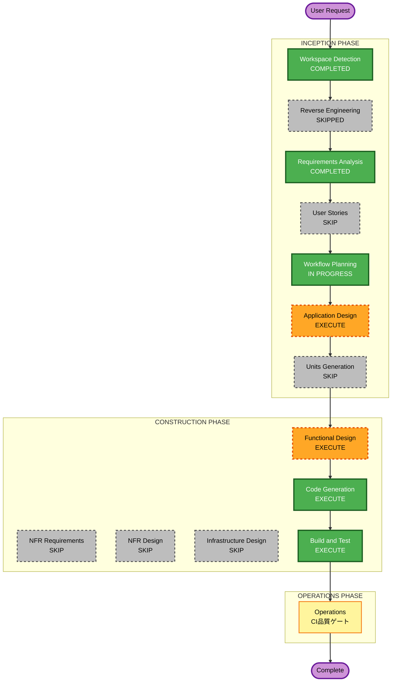

# Execution Plan — CSV 帳票出力（Issue #29）

## Detailed Analysis Summary

### Transformation Scope（Brownfield）

- **Transformation Type**: Single component change（既存 `reservations` ドメインを対象とした新規の帳票出力コンポーネント追加。アーキテクチャ変更・インフラ変更なし）
- **Primary Changes**: バックエンドに新規 Controller/Service（レポート出力用）を追加し、既存 `Reservation`/`ReservationResponse` のデータを CSV 化する。フロントエンドに管理者ページの CSV ダウンロードボタンを追加する。
- **Related Components**: `ReservationRepository`（新規クエリメソッドの追加要否を Application Design で判断）、`SecurityConfig`/`RoleJwtAuthenticationConverter`（既存の ADMIN 認可パターンを再利用するのみで変更なし）

### Change Impact Assessment

- **User-facing changes**: Yes — 管理者ページに「CSV ダウンロード」ボタンが追加される
- **Structural changes**: Minor — 新規 Controller/Service クラスを追加するが、既存の 4 レイヤーアーキテクチャの境界内に収まる
- **Data model changes**: No — 新規エンティティ・マイグレーションは不要（既存 `Reservation` を読み取るのみ）
- **API changes**: Yes — `GET /api/reports/reservations/csv` を新設
- **NFR impact**: Minor — 認可（ADMIN 限定）は既存パターンの再利用。パフォーマンス・エンコーディングは Requirements Analysis で `ResponseEntity<byte[]>` 一括生成・BOM 付き UTF-8 に決定済み

### Component Relationships（Brownfield）

- **Primary Component**: 新規 `ReportController`/`ReportService`（想定パッケージ: `presentation`/`application`）
- **Shared Components**: `Reservation`・`ReservationRepository`・`User`（既存、変更なし）
- **Dependent Components**: なし（新規エンドポイントのため既存コンポーネントへの影響なし）
- **Supporting Components**: フロントエンド管理者ページ（既存ページへのボタン追加のみ）

### Risk Assessment

- **Risk Level**: Low（既存データを読み取るだけの孤立した新規機能。ロールバックも当該ファイル群の削除のみで容易）
- **Rollback Complexity**: Easy
- **Testing Complexity**: Simple〜Moderate（CSV 生成・フィルタリング・認可の 3 観点のユニットテストが必要）

## Workflow Visualization


```mermaid
flowchart TD
    Start(["User Request"])

    subgraph INCEPTION["INCEPTION PHASE"]
        WD["Workspace Detection<br/>COMPLETED"]
        RE["Reverse Engineering<br/>SKIPPED"]
        RA["Requirements Analysis<br/>COMPLETED"]
        US["User Stories<br/>SKIP"]
        WP["Workflow Planning<br/>IN PROGRESS"]
        AD["Application Design<br/>EXECUTE"]
        UG["Units Generation<br/>SKIP"]
    end

    subgraph CONSTRUCTION["CONSTRUCTION PHASE"]
        FD["Functional Design<br/>EXECUTE"]
        NFRA["NFR Requirements<br/>SKIP"]
        NFRD["NFR Design<br/>SKIP"]
        ID["Infrastructure Design<br/>SKIP"]
        CG["Code Generation<br/>EXECUTE"]
        BT["Build and Test<br/>EXECUTE"]
    end

    subgraph OPERATIONS["OPERATIONS PHASE"]
        OPS["Operations<br/>CI品質ゲート"]
    end

    Start --> WD
    WD --> RE
    RE --> RA
    RA --> US
    US --> WP
    WP --> AD
    AD --> UG
    UG --> FD
    FD --> CG
    CG --> BT
    BT --> OPS
    OPS --> End(["Complete"])

    style WD fill:#4CAF50,stroke:#1B5E20,stroke-width:3px,color:#fff
    style RE fill:#BDBDBD,stroke:#424242,stroke-width:2px,stroke-dasharray: 5 5,color:#000
    style RA fill:#4CAF50,stroke:#1B5E20,stroke-width:3px,color:#fff
    style US fill:#BDBDBD,stroke:#424242,stroke-width:2px,stroke-dasharray: 5 5,color:#000
    style WP fill:#4CAF50,stroke:#1B5E20,stroke-width:3px,color:#fff
    style AD fill:#FFA726,stroke:#E65100,stroke-width:3px,stroke-dasharray: 5 5,color:#000
    style UG fill:#BDBDBD,stroke:#424242,stroke-width:2px,stroke-dasharray: 5 5,color:#000
    style FD fill:#FFA726,stroke:#E65100,stroke-width:3px,stroke-dasharray: 5 5,color:#000
    style NFRA fill:#BDBDBD,stroke:#424242,stroke-width:2px,stroke-dasharray: 5 5,color:#000
    style NFRD fill:#BDBDBD,stroke:#424242,stroke-width:2px,stroke-dasharray: 5 5,color:#000
    style ID fill:#BDBDBD,stroke:#424242,stroke-width:2px,stroke-dasharray: 5 5,color:#000
    style CG fill:#4CAF50,stroke:#1B5E20,stroke-width:3px,color:#fff
    style BT fill:#4CAF50,stroke:#1B5E20,stroke-width:3px,color:#fff
    style OPS fill:#FFF59D,stroke:#F57F17,stroke-width:2px,color:#000
    style Start fill:#CE93D8,stroke:#6A1B9A,stroke-width:3px,color:#000
    style End fill:#CE93D8,stroke:#6A1B9A,stroke-width:3px,color:#000

    linkStyle default stroke:#333,stroke-width:2px
```

### テキスト代替表現

```
INCEPTION PHASE
- Workspace Detection      : COMPLETED
- Reverse Engineering      : SKIPPED
- Requirements Analysis    : COMPLETED
- User Stories             : SKIP
- Workflow Planning        : IN PROGRESS（本ドキュメント）
- Application Design       : EXECUTE
- Units Generation         : SKIP

CONSTRUCTION PHASE（Unit: csv-export、単一ユニット）
- Functional Design        : EXECUTE
- NFR Requirements         : SKIP
- NFR Design               : SKIP
- Infrastructure Design    : SKIP
- Code Generation          : EXECUTE（必須）
- Build and Test           : EXECUTE（必須）

OPERATIONS PHASE
- Operations（CI品質ゲート運用）
```

## Phases to Execute

### INCEPTION PHASE

- [x] Workspace Detection（COMPLETED）
- [x] Reverse Engineering（SKIPPED — 既存 `architecture.md`/`requirements.md`/`api-spec.md` で代替可能）
- [x] Requirements Analysis（COMPLETED — `Docs/spec/aidlc-docs/inception/requirements/requirements.md`）
- [x] User Stories — **SKIP**
  - **Rationale**: 単一ペルソナ（ADMIN）のみが対象で、他ペルソナへの影響・複数ステークホルダー間の調整は不要。ビジネス要求シート（`csv-export.md`）が既に 5 件の明確な受入条件を持ち、User Stories が担う「受入条件の明確化」の役割を代替している。#22・#23 と同じ判断基準。
- [x] Workflow Planning（IN PROGRESS — 本ドキュメント）
- [ ] Application Design — **EXECUTE**
  - **Rationale**: #22・#23 は既存サービスへの private メソッド追加のみだったが、本タスクは `reservations` を扱う既存 Controller/Service とは別の、レポート出力専用の新規コンポーネント（Controller + Service 相当）を追加する。新規コンポーネントの責務境界・メソッドシグネチャを Functional Design/Code Generation の前に明確化する価値がある。
- [ ] Units Generation — **SKIP**
  - **Rationale**: 単一の小規模機能であり、並行開発が必要な複数ユニットへの分解は不要。単一ユニット（`csv-export`）として扱う。

### CONSTRUCTION PHASE（Unit: csv-export）

- [ ] Functional Design — **EXECUTE**
  - **Rationale**: CSV 列マッピング・エスケープ処理（カンマ・改行・ダブルクォート）・期間＋ステータスの絞り込みクエリ条件など、既存コードに前例のない新規の業務ルールが発生する。#22・#23（既存パターンの踏襲のみ）とは異なり、明文化する価値がある。
- [ ] NFR Requirements — **SKIP**
  - **Rationale**: パフォーマンス（一括生成で十分）・認可（既存 `@PreAuthorize` パターン踏襲）は Requirements Analysis で既に決定済み。新規の NFR 要求は発生しない。
- [ ] NFR Design — **SKIP**
  - **Rationale**: NFR Requirements 未実行のため連動 SKIP。
- [ ] Infrastructure Design — **SKIP**
  - **Rationale**: インフラ変更なし。
- [ ] Code Generation — EXECUTE（ALWAYS）
  - **Rationale**: 実装計画立案・コード生成が必要
- [ ] Build and Test — EXECUTE（ALWAYS）
  - **Rationale**: ビルド・テスト・検証が必要

### OPERATIONS PHASE

- [ ] Operations — PLACEHOLDER（BookFlow 翻案：CI 品質ゲート運用に委譲）

## Estimated Timeline

- **Total Phases実行**: 6（Requirements Analysis・Workflow Planning・Application Design・Functional Design・Code Generation・Build and Test）
- **Estimated Duration**: 半日〜1日（`csv-export.md` の見積もりと同水準）

## Success Criteria

- **Primary Goal**: ADMIN が期間・ステータスを指定して予約一覧を CSV（UTF-8 BOM 付き）でダウンロードできる
- **Key Deliverables**: 新規エンドポイント `GET /api/reports/reservations/csv`、フロントエンドの CSV ダウンロードボタン、バックエンドのユニットテスト
- **Quality Gates**: `csv-export.md` の受入条件 5 件を全て満たす。バックエンド `./gradlew test`・`spotlessCheck`・`checkstyleMain`、フロントエンド `pnpm test`・`pnpm lint`・`pnpm build` が全て成功する
- **Integration Testing**: MEMBER/APPROVER ロールでの 403 確認を含む
