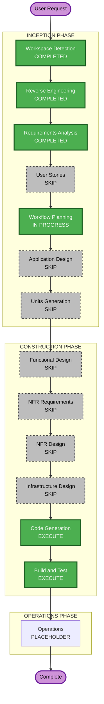

# Execution Plan — e2e-test-coverage

## Detailed Analysis Summary

### Transformation Scope（Brownfield）

- **Transformation Type**: Single component change（frontend の E2E テスト層への追加のみ）
- **Primary Changes**: Playwright のテストシナリオ追加（サインイン/サインアウト・リソース閲覧・予約申請・承認操作）、認証状態共有のための `global-setup`/`storageState` 導入
- **Related Components**: `frontend/tests/e2e/`、`frontend/playwright.config.ts`

### Change Impact Assessment

- **User-facing changes**: No — アプリケーションの挙動・UI に変更なし
- **Structural changes**: No — 新規コンポーネント・新規サービスは発生しない
- **Data model changes**: No
- **API changes**: No
- **NFR impact**: No — 性能・セキュリティ・スケーラビリティへの新規要求なし

### Component Relationships

- **Primary Component**: `frontend/tests/e2e/`（新規テストファイル群）
- **Dependent Components**: なし（アプリケーションコードはテスト対象として参照するのみで変更しない）
- **Supporting Components**: `frontend/src/server/actions/dev-auth.ts`（開発用ロールログイン、テストのセットアップから利用）

### Risk Assessment

- **Risk Level**: Low（アプリケーションコードを一切変更しないテスト追加のみ）
- **Rollback Complexity**: Easy（テストファイルの追加のみで、既存動作への影響なし）
- **Testing Complexity**: Simple〜Moderate（認証状態の共有・テストデータの自己フィクスチャ化など設計判断はあるが、実装自体は定型的）

## Workflow Visualization

```mermaid
flowchart TD
    Start(["User Request"])

    subgraph INCEPTION["INCEPTION PHASE"]
        WD["Workspace Detection<br/>COMPLETED"]
        RE["Reverse Engineering<br/>COMPLETED"]
        RA["Requirements Analysis<br/>COMPLETED"]
        US["User Stories<br/>SKIP"]
        WP["Workflow Planning<br/>IN PROGRESS"]
        AD["Application Design<br/>SKIP"]
        UG["Units Generation<br/>SKIP"]
    end

    subgraph CONSTRUCTION["CONSTRUCTION PHASE"]
        FD["Functional Design<br/>SKIP"]
        NFRA["NFR Requirements<br/>SKIP"]
        NFRD["NFR Design<br/>SKIP"]
        ID["Infrastructure Design<br/>SKIP"]
        CG["Code Generation<br/>EXECUTE"]
        BT["Build and Test<br/>EXECUTE"]
    end

    subgraph OPERATIONS["OPERATIONS PHASE"]
        OPS["Operations<br/>PLACEHOLDER"]
    end

    Start --> WD
    WD --> RE
    RE --> RA
    RA --> US
    US --> WP
    WP --> AD
    AD --> UG
    UG --> FD
    FD --> NFRA
    NFRA --> NFRD
    NFRD --> ID
    ID --> CG
    CG --> BT
    BT --> OPS
    OPS --> End(["Complete"])

    style WD fill:#4CAF50,stroke:#1B5E20,stroke-width:3px,color:#fff
    style RE fill:#4CAF50,stroke:#1B5E20,stroke-width:3px,color:#fff
    style RA fill:#4CAF50,stroke:#1B5E20,stroke-width:3px,color:#fff
    style US fill:#BDBDBD,stroke:#424242,stroke-width:2px,stroke-dasharray: 5 5,color:#000
    style WP fill:#4CAF50,stroke:#1B5E20,stroke-width:3px,color:#fff
    style AD fill:#BDBDBD,stroke:#424242,stroke-width:2px,stroke-dasharray: 5 5,color:#000
    style UG fill:#BDBDBD,stroke:#424242,stroke-width:2px,stroke-dasharray: 5 5,color:#000
    style FD fill:#BDBDBD,stroke:#424242,stroke-width:2px,stroke-dasharray: 5 5,color:#000
    style NFRA fill:#BDBDBD,stroke:#424242,stroke-width:2px,stroke-dasharray: 5 5,color:#000
    style NFRD fill:#BDBDBD,stroke:#424242,stroke-width:2px,stroke-dasharray: 5 5,color:#000
    style ID fill:#BDBDBD,stroke:#424242,stroke-width:2px,stroke-dasharray: 5 5,color:#000
    style CG fill:#4CAF50,stroke:#1B5E20,stroke-width:3px,color:#fff
    style BT fill:#4CAF50,stroke:#1B5E20,stroke-width:3px,color:#fff
    style Start fill:#CE93D8,stroke:#6A1B9A,stroke-width:3px,color:#000
    style End fill:#CE93D8,stroke:#6A1B9A,stroke-width:3px,color:#000

    linkStyle default stroke:#333,stroke-width:2px
```

## Phases to Execute

### INCEPTION PHASE

- [x] Workspace Detection (COMPLETED)
- [x] Reverse Engineering (COMPLETED) — 認証フロー・各画面のスコープ追加調査を実施
- [x] Requirements Analysis (COMPLETED)
- [ ] User Stories — **SKIP**
  - **Rationale**: Developer Tooling（テスト追加のみ）に該当。新規ユーザー向け機能・UX変更が一切なく、既存の画面仕様・API仕様に対する検証コードの追加に留まる
- [x] Workflow Planning (IN PROGRESS)
- [ ] Application Design — **SKIP**
  - **Rationale**: 新規コンポーネント・新規サービスは発生しない（テストファイル・フィクスチャの追加のみ）
- [ ] Units Generation — **SKIP**
  - **Rationale**: Issue = 単一 units of work

### CONSTRUCTION PHASE

- [ ] Functional Design — **SKIP**
  - **Rationale**: 新規データモデル・業務ロジックは発生しない（既存機能を検証するテストコードのみ）
- [ ] NFR Requirements — **SKIP**
  - **Rationale**: 性能・セキュリティ・スケーラビリティへの新規要求なし
- [ ] NFR Design — **SKIP**
  - **Rationale**: NFR Requirements が SKIP のため連動
- [ ] Infrastructure Design — **SKIP**
  - **Rationale**: CI インフラ整備は Requirements Analysis の決定によりスコープ外
- [ ] Code Generation — **EXECUTE (ALWAYS)**
  - **Rationale**: テストシナリオ・フィクスチャの実装が必要
- [ ] Build and Test — **EXECUTE (ALWAYS)**
  - **Rationale**: `pnpm test:e2e` の実行・検証が必要

### OPERATIONS PHASE

- [ ] Operations — **PLACEHOLDER**
  - **Rationale**: BookFlow では CI 品質ゲート（`CI Frontend`/`CI Backend`）として運用。学習者は `/commit-push`・`/create-pr` で引き継ぐ

## Estimated Timeline

- **Total Phases**: 6 Execute（Workspace Detection・Reverse Engineering・Requirements Analysis・Workflow Planning・Code Generation・Build and Test）、6 Skip（User Stories・Application Design・Units Generation・Functional Design・NFR系・Infrastructure Design）
- **Estimated Duration**: ビジネス要求シート記載どおり 3〜5時間

## Success Criteria

- **Primary Goal**: サインイン/サインアウト・リソース閲覧・予約申請・承認操作の4シナリオを Playwright でカバーし、`pnpm test:e2e` で全件 pass すること
- **Key Deliverables**: 新規 E2E テストファイル（4シナリオ分）、`global-setup`/`storageState` によるロール別認証状態の共有フィクスチャ
- **Quality Gates**: 既存の `example.spec.ts` を含め `pnpm test:e2e` が全件 pass すること。各テストが再実行可能であること
