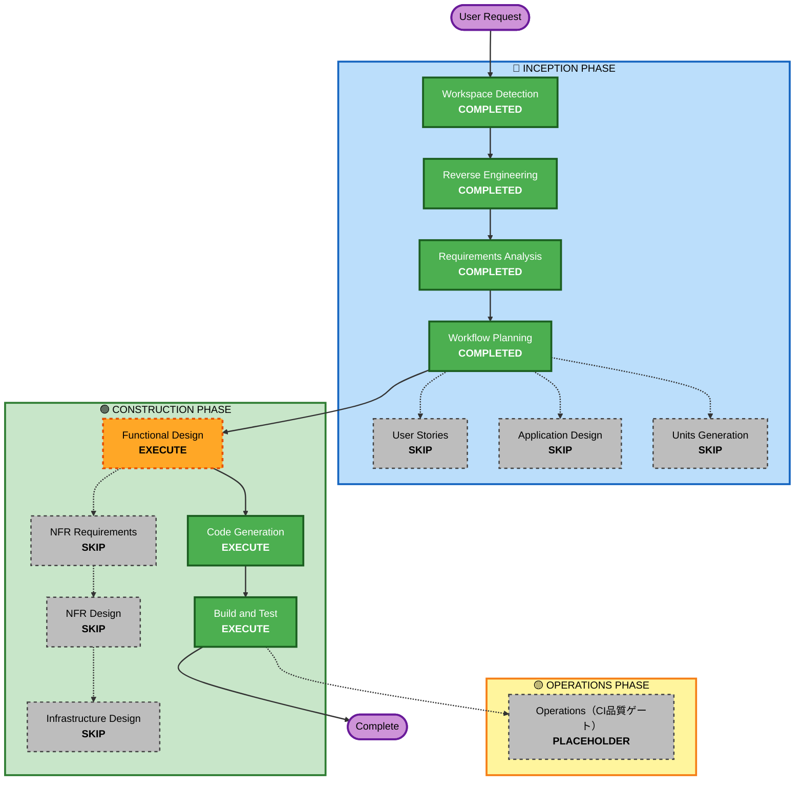

# Execution Plan

## Detailed Analysis Summary

### Transformation Scope（Brownfield）
- **Transformation Type**: Single component change（既存の `ResourceController`/`ResourceService`/`ResourceRepository`、`ResourceFilterForm.tsx` 等、既存コンポーネント境界内の変更）
- **Primary Changes**: `GET /api/resources` への `keyword` クエリパラメータ追加、`ResourceFilterForm` へのキーワード入力欄追加
- **Related Components**: なし（新規コンポーネント・新規サービスの追加は不要）

### Change Impact Assessment
- **User-facing changes**: Yes — `/resources` 画面にキーワード検索欄が増える
- **Structural changes**: No — 4層アーキテクチャ・既存コンポーネント境界は変わらない
- **Data model changes**: No — 既存の `name`/`description` カラムを検索対象にするのみ、スキーマ変更なし
- **API changes**: Yes — `GET /api/resources` に任意の `keyword` パラメータを追加（非破壊的変更、既存クライアントに影響なし）
- **NFR impact**: No — パフォーマンス・セキュリティ・スケーラビリティへの新規要求はなし（拡張機能はすべてスキップ済み）

### Component Relationships（Brownfield）
- **Primary Component**: `ResourceController` / `ResourceService` / `ResourceRepository`（backend）、`ResourceFilterForm.tsx` / `page.tsx` / `resources.ts`（frontend）
- **Infrastructure Components**: なし
- **Shared Components**: なし
- **Dependent Components**: なし（他サービスからの呼び出しに影響なし）
- **Supporting Components**: `ResourceServiceTest.java` / `ResourceControllerTest.java` / `frontend/tests/unit/server/actions/resources.test.ts`（既存テストの拡充が必要）

### Risk Assessment
- **Risk Level**: Low（単一の既存機能の拡張、ロールバックは容易、既存テスト資産が充実）
- **Rollback Complexity**: Easy（git revert で容易に戻せる。DBスキーマ変更がないためマイグレーションのロールバックも不要）
- **Testing Complexity**: Simple（既存のテストパターン（Mockito / MockMvc+H2 / Vitest+MSW）をそのまま踏襲できる）

## Workflow Visualization

```mermaid
flowchart TD
    Start(["User Request"])

    subgraph INCEPTION["🔵 INCEPTION PHASE"]
        WD["Workspace Detection<br/><b>COMPLETED</b>"]
        RE["Reverse Engineering<br/><b>COMPLETED</b>"]
        RA["Requirements Analysis<br/><b>COMPLETED</b>"]
        US["User Stories<br/><b>SKIP</b>"]
        WP["Workflow Planning<br/><b>COMPLETED</b>"]
        AD["Application Design<br/><b>SKIP</b>"]
        UG["Units Generation<br/><b>SKIP</b>"]
    end

    subgraph CONSTRUCTION["🟢 CONSTRUCTION PHASE"]
        FD["Functional Design<br/><b>EXECUTE</b>"]
        NFRA["NFR Requirements<br/><b>SKIP</b>"]
        NFRD["NFR Design<br/><b>SKIP</b>"]
        ID["Infrastructure Design<br/><b>SKIP</b>"]
        CG["Code Generation<br/><b>EXECUTE</b>"]
        BT["Build and Test<br/><b>EXECUTE</b>"]
    end

    subgraph OPERATIONS["🟡 OPERATIONS PHASE"]
        OPS["Operations（CI品質ゲート）<br/><b>PLACEHOLDER</b>"]
    end

    Start --> WD --> RE --> RA --> WP
    WP -.-> US
    WP -.-> AD
    WP -.-> UG
    WP --> FD
    FD -.-> NFRA -.-> NFRD -.-> ID
    FD --> CG
    CG --> BT
    BT -.-> OPS
    BT --> End(["Complete"])

    style WD fill:#4CAF50,stroke:#1B5E20,stroke-width:3px,color:#fff
    style RE fill:#4CAF50,stroke:#1B5E20,stroke-width:3px,color:#fff
    style RA fill:#4CAF50,stroke:#1B5E20,stroke-width:3px,color:#fff
    style WP fill:#4CAF50,stroke:#1B5E20,stroke-width:3px,color:#fff
    style FD fill:#FFA726,stroke:#E65100,stroke-width:3px,stroke-dasharray: 5 5,color:#000
    style CG fill:#4CAF50,stroke:#1B5E20,stroke-width:3px,color:#fff
    style BT fill:#4CAF50,stroke:#1B5E20,stroke-width:3px,color:#fff
    style US fill:#BDBDBD,stroke:#424242,stroke-width:2px,stroke-dasharray: 5 5,color:#000
    style AD fill:#BDBDBD,stroke:#424242,stroke-width:2px,stroke-dasharray: 5 5,color:#000
    style UG fill:#BDBDBD,stroke:#424242,stroke-width:2px,stroke-dasharray: 5 5,color:#000
    style NFRA fill:#BDBDBD,stroke:#424242,stroke-width:2px,stroke-dasharray: 5 5,color:#000
    style NFRD fill:#BDBDBD,stroke:#424242,stroke-width:2px,stroke-dasharray: 5 5,color:#000
    style ID fill:#BDBDBD,stroke:#424242,stroke-width:2px,stroke-dasharray: 5 5,color:#000
    style OPS fill:#BDBDBD,stroke:#424242,stroke-width:2px,stroke-dasharray: 5 5,color:#000
    style INCEPTION fill:#BBDEFB,stroke:#1565C0,stroke-width:3px,color:#000
    style CONSTRUCTION fill:#C8E6C9,stroke:#2E7D32,stroke-width:3px,color:#000
    style OPERATIONS fill:#FFF59D,stroke:#F57F17,stroke-width:3px,color:#000
    style Start fill:#CE93D8,stroke:#6A1B9A,stroke-width:3px,color:#000
    style End fill:#CE93D8,stroke:#6A1B9A,stroke-width:3px,color:#000

    linkStyle default stroke:#333,stroke-width:2px
```

## Phases to Execute

### 🔵 INCEPTION PHASE
- [x] Workspace Detection (COMPLETED)
- [x] Reverse Engineering (COMPLETED)
- [x] Requirements Analysis (COMPLETED)
- [x] User Stories (SKIPPED)
  - **Rationale**: 既存ユースケースUC-02の軽微な拡張であり、新規ペルソナ・新規ユーザーワークフローを伴わない。受入条件は要件シートに既に明記済み
- [x] Workflow Planning (IN PROGRESS → 本ファイル)
- [ ] Application Design - SKIP
  - **Rationale**: 新規コンポーネント・新規サービスは不要。既存の `ResourceController`/`ResourceService`/`ResourceRepository` のコンポーネント境界内での変更にとどまる
- [ ] Units Generation - SKIP
  - **Rationale**: 単一のユニットオブワーク（縦切り機能1本）であり、複数ユニットへの分解は不要

### 🟢 CONSTRUCTION PHASE
- [ ] Functional Design - EXECUTE
  - **Rationale**: クエリ実装方式（`@Query` JPQLへの統合）、大文字小文字非区別の実現方法（`LOWER(...) LIKE`、H2互換のため`ILIKE`不使用）、既存6種の派生クエリの統合方針など、Code Generation前に確定すべき業務ロジック設計がある
- [ ] NFR Requirements - SKIP
  - **Rationale**: 拡張機能（Security/Resiliency/PBT）はすべて明確化質問でスキップ済み。新規の性能・セキュリティ要求はない
- [ ] NFR Design - SKIP
  - **Rationale**: NFR Requirementsをスキップしたため連動してスキップ
- [ ] Infrastructure Design - SKIP
  - **Rationale**: インフラ構成（CDK/Terraform等）への変更は不要
- [ ] Code Generation - EXECUTE (ALWAYS)
  - **Rationale**: 実装計画の立案とコード生成が必要
- [ ] Build and Test - EXECUTE (ALWAYS)
  - **Rationale**: ビルド・テストによる検証が必要

### 🟡 OPERATIONS PHASE
- [ ] Operations - PLACEHOLDER
  - **Rationale**: BookFlowではCI品質ゲート（CI Frontend / CI Backend）がOperations相当。PR作成・CIパスがこれに該当し、別途のエンジン成果物は生成しない

## Package/Layer Update Sequence（Brownfield）

1. **バックエンド**（`ResourceRepository` → `ResourceService` → `ResourceController`、テスト）— API契約を先に確定させる
2. **フロントエンド**（`ResourceFilterForm.tsx` → `page.tsx` / `resources.ts`、テスト）— 確定したAPI契約（`keyword`パラメータ）に合わせて実装する

縦切り機能として1 PR・1ユニットオブワークにまとめる（`CLAUDE.md` の縦切り実装原則に従う）。

## Estimated Timeline
- **Total Stages Executing**: 5（Reverse Engineering・Requirements Analysis・Workflow Planning・Functional Design・Code Generation・Build and Test のうち、本計画時点で残っているのはFunctional Design以降）
- **Estimated Duration**: 2〜3時間（要件シート記載の見積もりと一致）

## Success Criteria
- **Primary Goal**: `GET /api/resources` の `keyword` パラメータ追加と `ResourceFilterForm` のキーワード入力欄追加により、要件RES-01〜04（= requirements.md RES-09）の受入条件をすべて満たす
- **Key Deliverables**: バックエンド実装・フロントエンド実装・両層のユニットテスト・spec更新（完了済み）
- **Quality Gates**: `./gradlew test`・`pnpm test` が全てpass、Checkstyle/Spotless/oxlintがクリーン、AIレビュー（`@claude pr-review`）の総合判定が「完了」
