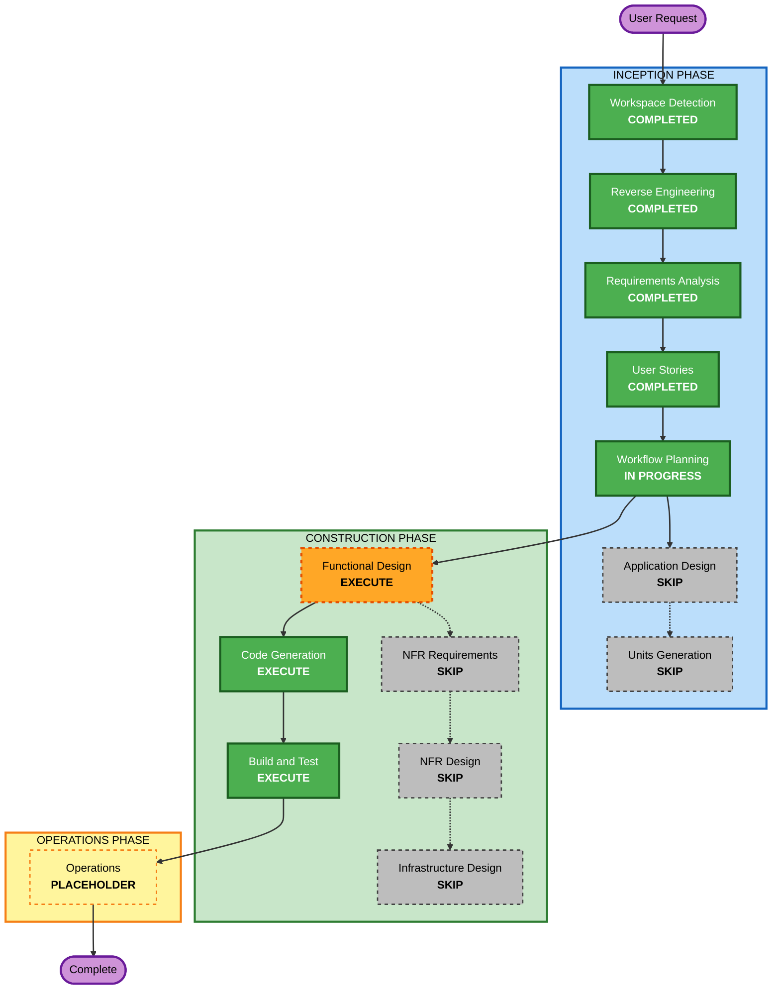

# Execution Plan — リソース一覧の検索・フィルタ追加（Issue #23）

## Detailed Analysis Summary

### Transformation Scope（Brownfield）
- **Transformation Type**: Single component change（アーキテクチャ変更・デプロイモデル変更は伴わない）
- **Primary Changes**: `GET /api/resources` への `keyword` クエリパラメータ追加、`ResourceFilterForm` への入力欄追加、検索結果 0 件時の空状態メッセージ改善
- **Related Components**: `ResourceController` / `ResourceService` / `ResourceRepository`（backend）、`ResourceFilterForm.tsx` / `resources/page.tsx` / `server/actions/resources.ts`（frontend）

### Change Impact Assessment
- **User-facing changes**: Yes — `/resources` 画面にキーワード入力欄が追加され、検索結果 0 件時の表示文言が変わる
- **Structural changes**: No — 新規コンポーネント・新規レイヤーは追加しない。既存の 4 層アーキテクチャ内で完結
- **Data model changes**: No — `resources` テーブルのスキーマ変更は不要（`name`/`description` は既存カラム）
- **API changes**: Yes（後方互換）— `GET /api/resources` に任意パラメータ `keyword` を追加。既存クライアント・既存パラメータの挙動は変更しない
- **NFR impact**: Minimal — パフォーマンス・セキュリティ・スケーラビリティへの新規要求はない（Security/Resiliency 拡張は Requirements Analysis で不採用と決定済み）。既存の `ResourceRepository` の派生クエリ方式の保守性への影響のみ

### Component Relationships（Brownfield）

```markdown
## Component Relationships
- **Primary Component**: backend の `ResourceService`/`ResourceRepository`、frontend の `ResourceFilterForm`/`resources/page.tsx`
- **Infrastructure Components**: なし（インフラ変更不要）
- **Shared Components**: `docs-next/docs/spec/api-spec.md`・`screen-spec.md`（`/update-spec` スキルで Code Generation 前に更新）
- **Dependent Components**: なし（`ResourceService#list` の呼び出し元は `ResourceController` のみ）
- **Supporting Components**: 既存テスト（`ResourceServiceTest`・`ResourceControllerTest`・`resources.test.ts`）
```

| コンポーネント | Change Type | Change Reason | Change Priority |
|---|---|---|---|
| `ResourceRepository` | Major（クエリ機構刷新） | keyword 条件追加に伴い派生クエリ方式の組み合わせ限界に対応 | Critical |
| `ResourceService` | Minor（引数追加・分岐追加） | keyword 正規化（trim・null 判定）と両経路（listPaginated/listWithAvailabilityFilter）への適用 | Critical |
| `ResourceController` | Minor（パラメータ追加） | `keyword` クエリパラメータの受付 | Critical |
| `ResourceFilterForm.tsx` | Minor（入力欄追加） | keyword 入力・空白 trim・URL パラメータ組み立て | Important |
| `resources/page.tsx` | Minor（空状態分岐拡張） | keyword 検索 0 件時の専用メッセージ | Important |
| `server/actions/resources.ts` | Minor（パラメータ追加） | `keyword` を BFF 層で中継 | Important |
| `docs-next/docs/spec/api-spec.md`・`screen-spec.md` | Minor（追記） | Spec-first 原則に基づく仕様反映 | Important |

### Risk Assessment
- **Risk Level**: Medium（複数コンポーネントにまたがるが、影響範囲は明確で既存パターンに沿える）
- **Rollback Complexity**: Easy（git revert 1コミット相当。DB マイグレーション不要）
- **Testing Complexity**: Moderate（既存 strict-stubs テストを壊さない設計が必要、H2/PostgreSQL 双方での動作確認が必要）

## Workflow Visualization


```mermaid
flowchart TD
    Start(["User Request"])

    subgraph INCEPTION["INCEPTION PHASE"]
        WD["Workspace Detection<br/><b>COMPLETED</b>"]
        RE["Reverse Engineering<br/><b>COMPLETED</b>"]
        RA["Requirements Analysis<br/><b>COMPLETED</b>"]
        US["User Stories<br/><b>COMPLETED</b>"]
        WP["Workflow Planning<br/><b>IN PROGRESS</b>"]
        AD["Application Design<br/><b>SKIP</b>"]
        UG["Units Generation<br/><b>SKIP</b>"]
    end

    subgraph CONSTRUCTION["CONSTRUCTION PHASE"]
        FD["Functional Design<br/><b>EXECUTE</b>"]
        NFRA["NFR Requirements<br/><b>SKIP</b>"]
        NFRD["NFR Design<br/><b>SKIP</b>"]
        ID["Infrastructure Design<br/><b>SKIP</b>"]
        CG["Code Generation<br/><b>EXECUTE</b>"]
        BT["Build and Test<br/><b>EXECUTE</b>"]
    end

    subgraph OPERATIONS["OPERATIONS PHASE"]
        OPS["Operations<br/><b>PLACEHOLDER</b>"]
    end

    Start --> WD --> RE --> RA --> US --> WP
    WP --> AD -.-> UG
    WP --> FD
    FD -.-> NFRA -.-> NFRD -.-> ID
    FD --> CG
    CG --> BT --> OPS --> End(["Complete"])

    style WD fill:#4CAF50,stroke:#1B5E20,stroke-width:3px,color:#fff
    style RE fill:#4CAF50,stroke:#1B5E20,stroke-width:3px,color:#fff
    style RA fill:#4CAF50,stroke:#1B5E20,stroke-width:3px,color:#fff
    style US fill:#4CAF50,stroke:#1B5E20,stroke-width:3px,color:#fff
    style WP fill:#4CAF50,stroke:#1B5E20,stroke-width:3px,color:#fff
    style AD fill:#BDBDBD,stroke:#424242,stroke-width:2px,stroke-dasharray: 5 5,color:#000
    style UG fill:#BDBDBD,stroke:#424242,stroke-width:2px,stroke-dasharray: 5 5,color:#000
    style FD fill:#FFA726,stroke:#E65100,stroke-width:3px,stroke-dasharray: 5 5,color:#000
    style NFRA fill:#BDBDBD,stroke:#424242,stroke-width:2px,stroke-dasharray: 5 5,color:#000
    style NFRD fill:#BDBDBD,stroke:#424242,stroke-width:2px,stroke-dasharray: 5 5,color:#000
    style ID fill:#BDBDBD,stroke:#424242,stroke-width:2px,stroke-dasharray: 5 5,color:#000
    style CG fill:#4CAF50,stroke:#1B5E20,stroke-width:3px,color:#fff
    style BT fill:#4CAF50,stroke:#1B5E20,stroke-width:3px,color:#fff
    style OPS fill:#FFF59D,stroke:#F57F17,stroke-width:2px,stroke-dasharray: 5 5,color:#000
    style Start fill:#CE93D8,stroke:#6A1B9A,stroke-width:3px,color:#000
    style End fill:#CE93D8,stroke:#6A1B9A,stroke-width:3px,color:#000
    style INCEPTION fill:#BBDEFB,stroke:#1565C0,stroke-width:3px,color:#000
    style CONSTRUCTION fill:#C8E6C9,stroke:#2E7D32,stroke-width:3px,color:#000
    style OPERATIONS fill:#FFF59D,stroke:#F57F17,stroke-width:3px,color:#000

    linkStyle default stroke:#333,stroke-width:2px
```

## Phases to Execute

### INCEPTION PHASE
- [x] Workspace Detection (COMPLETED)
- [x] Reverse Engineering (COMPLETED)
- [x] Requirements Analysis (COMPLETED)
- [x] User Stories (COMPLETED)
- [x] Workflow Planning (IN PROGRESS — 本ドキュメント)
- [ ] Application Design — **SKIP**
  - **Rationale**: 新規コンポーネント・新規サービスは不要。変更は既存の `ResourceController`/`ResourceService`/`ResourceRepository`/`ResourceFilterForm` の境界内で完結する
- [ ] Units Generation — **SKIP**
  - **Rationale**: BookFlow の縦切り実装方針（`CLAUDE.md` §AI 駆動開発の進め方）により、Issue #23 自体がすでに 1 つの units of work（縦切りイシュー単位）。フロントエンド・バックエンドにまたがるが単一機能であり、これ以上の分解は価値を生まない。Construction フェーズは単一ユニット「リソース検索・フィルタ追加」として進める

### CONSTRUCTION PHASE（ユニット: リソース検索・フィルタ追加）
- [ ] Functional Design — **EXECUTE**
  - **Rationale**: `ResourceRepository` のクエリ機構刷新（派生クエリ方式 → `@Query`/`Specification`）は複数の条件（category × isActive × keyword × from/to 可用性判定）が絡む設計判断であり、かつ既存の strict-stubs テスト（`ResourceServiceTest`）を壊さないための呼び出し経路設計が必要。コード生成前に明文化する価値がある
- [ ] NFR Requirements — **SKIP**
  - **Rationale**: 新規のパフォーマンス・セキュリティ・スケーラビリティ要求はない。Security/Resiliency 拡張は Requirements Analysis で不採用と決定済み
- [ ] NFR Design — **SKIP**
  - **Rationale**: NFR Requirements を SKIP したため連動して SKIP
- [ ] Infrastructure Design — **SKIP**
  - **Rationale**: インフラ構成・デプロイモデルの変更なし
- [ ] Code Generation — **EXECUTE (ALWAYS)**
  - **Rationale**: Functional Design で確定した設計に基づき、backend（Controller/Service/Repository）・frontend（Form/Page/Server Action）・仕様書（api-spec.md/screen-spec.md）を実装する
- [ ] Build and Test — **EXECUTE (ALWAYS)**
  - **Rationale**: lint・既存テスト・追加テストの実行と検証

### OPERATIONS PHASE
- [ ] Operations — PLACEHOLDER
  - **Rationale**: BookFlow では CI 品質ゲート（CI Frontend / CI Backend）が相当。追加の運用ワークフローは不要

## Package Change Sequence（Brownfield）

1. **backend**（`ResourceRepository` → `ResourceService` → `ResourceController`）— API 契約を先に確定させる
2. **frontend**（`server/actions/resources.ts` → `ResourceFilterForm.tsx` → `resources/page.tsx`）— backend の契約に追従
3. **docs-next**（`api-spec.md`・`screen-spec.md`）— `/update-spec` スキルで Code Generation 内に統合

バックエンドとフロントエンドは独立した層のため並列実装も可能だが、API 契約（`keyword` パラメータの型・エラー時挙動）を backend 側で先に固めてから frontend を実装する順序を推奨する。

## Estimated Timeline
- **Total Phases**: 3（Functional Design、Code Generation、Build and Test）
- **Estimated Duration**: 2〜3時間（エンハンス課題シート記載の見積りと一致）

## Success Criteria
- **Primary Goal**: `requirements.md` の受入条件 6 件をすべて満たす
- **Key Deliverables**: backend/frontend の実装、追加ユニットテスト、`api-spec.md`/`screen-spec.md` の更新
- **Quality Gates**: `./gradlew test`・`pnpm test`・`pnpm lint`・`./gradlew checkstyleMain` が pass すること
- **Integration Testing**: `/resources` 画面での keyword × category × from/to の組み合わせ動作確認（手動 or 既存 E2E の範囲内）
