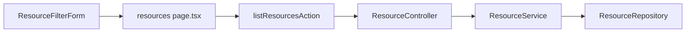
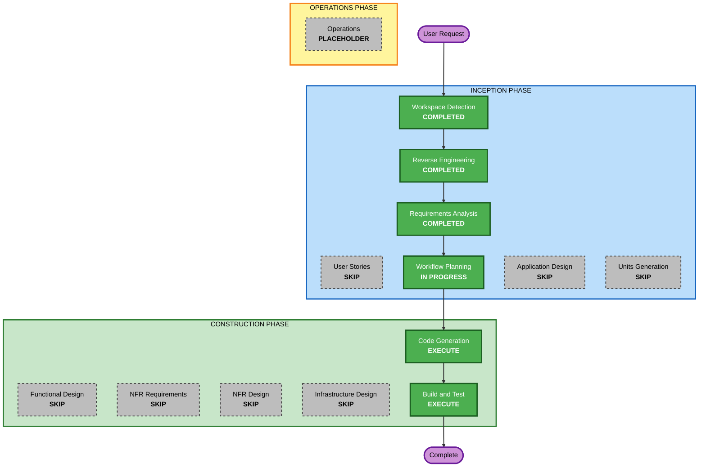

# Execution Plan

## Detailed Analysis Summary

### Transformation Scope (Brownfield Only)
- **Transformation Type**: Single component change（既存のリソース一覧機能の拡張。backend と frontend の縦切り 1 本）
- **Primary Changes**: `GET /api/resources` への `keyword` 追加（JPQL による部分一致）、フィルタフォームとページへのキーワード入力の追加
- **Related Components**: `ResourceController`、`ResourceService`、`ResourceRepository`、`ResourceFilterForm.tsx`、`page.tsx`、`listResourcesAction`、`api-spec.md`、`screen-spec.md`

### Change Impact Assessment
- **User-facing changes**: Yes（一覧画面にキーワード入力欄が加わる）
- **Structural changes**: No（4 層構造・コンポーネント構成は変わらない）
- **Data model changes**: No（テーブル・Flyway マイグレーションの変更なし）
- **API changes**: Yes（任意の `keyword` クエリパラメータを追加。後方互換）
- **NFR impact**: No（認可は現状維持。性能・可用性の新要件なし）

### Component Relationships (Brownfield Only)


```mermaid
flowchart LR
    Form["ResourceFilterForm"] --> Page["resources page.tsx"]
    Page --> Action["listResourcesAction"]
    Action --> Ctrl["ResourceController"]
    Ctrl --> Svc["ResourceService"]
    Svc --> Repo["ResourceRepository"]
```

- **Primary Component**: backend の一覧 API（`ResourceController` から `ResourceRepository`）
- **Dependent Components**: frontend の一覧ページ（API の呼び出し側）
- **Shared / Infrastructure / Supporting Components**: なし

| コンポーネント | Change Type | Change Reason | Priority |
|---|---|---|---|
| `ResourceRepository` | Minor | JPQL クエリの追加 | Critical |
| `ResourceService` | Minor | `keyword` を 2 つの一覧経路に通す | Critical |
| `ResourceController` | Minor | `keyword` の受け取り | Critical |
| `ResourceFilterForm` / `page.tsx` / `listResourcesAction` | Minor | 入力欄と URL・API への受け渡し | Critical |
| `api-spec.md` / `screen-spec.md` | Minor | Spec-first の仕様更新 | Critical |
| `ResourceService.overlaps` | 変更なし | 予約の重複判定と共用のため触れない | - |

### Risk Assessment
- **Risk Level**: Low（任意パラメータの追加で、未指定時は既存動作のまま）
- **Rollback Complexity**: Easy（コミットの取り消しだけで戻せる。DB 変更なし）
- **Testing Complexity**: Moderate（一覧に 2 経路（空き確認あり・なし）と、ロール別（ADMIN・それ以外）の組み合わせがある）

## Workflow Visualization


```mermaid
flowchart TD
    Start(["User Request"])

    subgraph INCEPTION["INCEPTION PHASE"]
        WD["Workspace Detection<br/><b>COMPLETED</b>"]
        RE["Reverse Engineering<br/><b>COMPLETED</b>"]
        RA["Requirements Analysis<br/><b>COMPLETED</b>"]
        US["User Stories<br/><b>SKIP</b>"]
        WP["Workflow Planning<br/><b>IN PROGRESS</b>"]
        AD["Application Design<br/><b>SKIP</b>"]
        UG["Units Generation<br/><b>SKIP</b>"]
    end

    subgraph CONSTRUCTION["CONSTRUCTION PHASE"]
        FD["Functional Design<br/><b>SKIP</b>"]
        NFRA["NFR Requirements<br/><b>SKIP</b>"]
        NFRD["NFR Design<br/><b>SKIP</b>"]
        ID["Infrastructure Design<br/><b>SKIP</b>"]
        CG["Code Generation<br/><b>EXECUTE</b>"]
        BT["Build and Test<br/><b>EXECUTE</b>"]
    end

    subgraph OPERATIONS["OPERATIONS PHASE"]
        OPS["Operations<br/><b>PLACEHOLDER</b>"]
    end

    Start --> WD
    WD --> RE
    RE --> RA
    RA --> WP
    WP --> CG
    CG --> BT
    BT --> End(["Complete"])

    style WD fill:#4CAF50,stroke:#1B5E20,stroke-width:3px,color:#fff
    style RE fill:#4CAF50,stroke:#1B5E20,stroke-width:3px,color:#fff
    style RA fill:#4CAF50,stroke:#1B5E20,stroke-width:3px,color:#fff
    style WP fill:#4CAF50,stroke:#1B5E20,stroke-width:3px,color:#fff
    style CG fill:#4CAF50,stroke:#1B5E20,stroke-width:3px,color:#fff
    style BT fill:#4CAF50,stroke:#1B5E20,stroke-width:3px,color:#fff
    style US fill:#BDBDBD,stroke:#424242,stroke-width:2px,stroke-dasharray: 5 5,color:#000
    style AD fill:#BDBDBD,stroke:#424242,stroke-width:2px,stroke-dasharray: 5 5,color:#000
    style UG fill:#BDBDBD,stroke:#424242,stroke-width:2px,stroke-dasharray: 5 5,color:#000
    style FD fill:#BDBDBD,stroke:#424242,stroke-width:2px,stroke-dasharray: 5 5,color:#000
    style NFRA fill:#BDBDBD,stroke:#424242,stroke-width:2px,stroke-dasharray: 5 5,color:#000
    style NFRD fill:#BDBDBD,stroke:#424242,stroke-width:2px,stroke-dasharray: 5 5,color:#000
    style ID fill:#BDBDBD,stroke:#424242,stroke-width:2px,stroke-dasharray: 5 5,color:#000
    style OPS fill:#BDBDBD,stroke:#424242,stroke-width:2px,stroke-dasharray: 5 5,color:#000
    style Start fill:#CE93D8,stroke:#6A1B9A,stroke-width:3px,color:#000
    style End fill:#CE93D8,stroke:#6A1B9A,stroke-width:3px,color:#000
    style INCEPTION fill:#BBDEFB,stroke:#1565C0,stroke-width:3px,color:#000
    style CONSTRUCTION fill:#C8E6C9,stroke:#2E7D32,stroke-width:3px,color:#000
    style OPERATIONS fill:#FFF59D,stroke:#F57F17,stroke-width:3px,color:#000

    linkStyle default stroke:#333,stroke-width:2px
```

### Text Alternative

```
INCEPTION:    Workspace Detection (COMPLETED) -> Reverse Engineering (COMPLETED)
              -> Requirements Analysis (COMPLETED) -> Workflow Planning (IN PROGRESS)
              User Stories / Application Design / Units Generation (SKIP)
CONSTRUCTION: Functional Design / NFR Requirements / NFR Design /
              Infrastructure Design (SKIP)
              Code Generation (EXECUTE) -> Build and Test (EXECUTE)
OPERATIONS:   PLACEHOLDER（CI 品質ゲートで代替）
```

## Phases to Execute

### INCEPTION PHASE
- [x] Workspace Detection (COMPLETED)
- [x] Reverse Engineering (COMPLETED)
- [x] Requirements Analysis (COMPLETED)
- [x] User Stories (SKIPPED)
  - **Rationale**: 利用者像は一覧を見る全ロール 1 種類で、要件に受入条件がすでにある。学習者が Requirements 承認時に追加を選ばなかった
- [x] Workflow Planning (IN PROGRESS)
- [ ] Application Design - SKIP
  - **Rationale**: 新しいコンポーネントやサービスはなく、既存の 4 層の境界の中で完結する
- [ ] Units Generation - SKIP
  - **Rationale**: 分解の必要がなく、単一ユニット `resource-list-filter`（縦切り 1 本、Issue #76）として Code Generation に進む

### CONSTRUCTION PHASE
- [ ] Functional Design - SKIP
  - **Rationale**: 業務ルール（部分一致、大文字小文字無視、空白除去、AND 結合）は要件で確定済みで、データモデルの変更もない。クエリの具体的な形は Code Generation の計画で示す
- [ ] NFR Requirements - SKIP
  - **Rationale**: 性能・セキュリティの新要件がなく、拡張機能も 3 つとも無効
- [ ] NFR Design - SKIP
  - **Rationale**: NFR Requirements を実行しないため
- [ ] Infrastructure Design - SKIP
  - **Rationale**: インフラ・デプロイの変更がない
- [ ] Code Generation - EXECUTE (ALWAYS)
  - **Rationale**: 実装が必要。計画の最初のステップで `/update-spec` による仕様更新（Spec-first）を行い、承認を得てから実装する
- [ ] Build and Test - EXECUTE (ALWAYS)
  - **Rationale**: backend（`./gradlew test`、Spotless、Checkstyle）と frontend（`pnpm test`、`pnpm lint`、`pnpm format:check`）の検証が必要

### OPERATIONS PHASE
- [ ] Operations - PLACEHOLDER
  - **Rationale**: BookFlow では CI の品質ゲート（`CI Frontend` / `CI Backend`）で代替する

## Package Change Sequence (Brownfield Only)

- **Update Approach**: Sequential（仕様、backend、frontend の順）
- **Critical Path**: backend の `keyword` が先。frontend はそれを呼ぶため
- **Coordination Points**: `keyword` パラメータ名と挙動を `api-spec.md` に固定する（backend と frontend の共通の約束）
- **Testing Checkpoints**: backend 実装後に `./gradlew test`、frontend 実装後に `pnpm test`。最後に両方と lint を通す

1. `docs-next/docs/spec/`（`api-spec.md`、`screen-spec.md`）：真実の源を先に更新
2. backend：Repository、Service、Controller、テスト
3. frontend：Server Action、ページ、フォーム、テスト

## Estimated Timeline
- **Total Phases**: 実行 2 ステージ（Code Generation、Build and Test）
- **Estimated Duration**: 課題シートの推定工数 2〜3 時間

## Success Criteria
- **Primary Goal**: リソース一覧でキーワード検索ができる
- **Key Deliverables**: 更新済みの仕様 2 ファイル、backend と frontend の実装、追加テスト
- **Quality Gates**: 受入条件 6 項目、lint とフォーマット、backend と frontend のテストがすべて pass
- **Integration Testing**: キーワードと、カテゴリ・空き確認の併用を確認する
