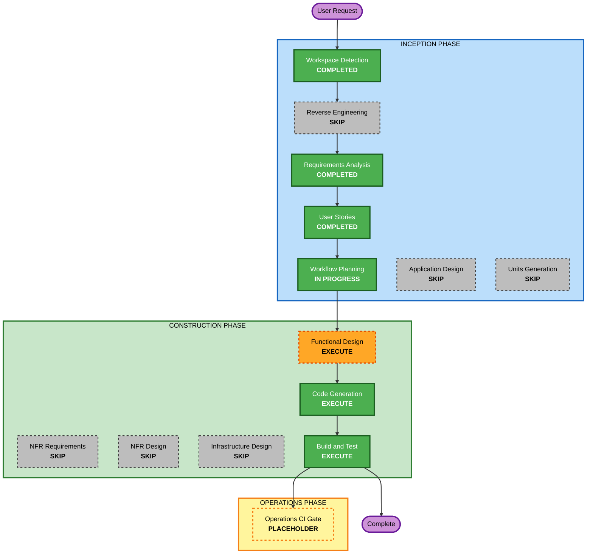

# Execution Plan — カレンダービュー（Issue #27）

## Detailed Analysis Summary

### Transformation Scope（Brownfield）
- **Transformation Type**: Single component change（`/resources/{id}` 画面への表示機能追加のみ）
- **Primary Changes**: リソース詳細画面にカレンダー形式の空き状況ビュー（週/月表示）を追加する。既存の空き確認リストは維持する
- **Related Components**: `frontend/src/app/resources/[id]/`（画面）、`frontend/src/components/`（新規カレンダーコンポーネント）。バックエンド・DB・インフラへの変更なし

### Change Impact Assessment
- **User-facing changes**: Yes — `/resources/{id}` に新しい操作（週/月切替・カレンダークリック・期間移動）が加わる
- **Structural changes**: No — 既存のフロントエンド・バックエンド構成（4レイヤーアーキテクチャ・BFF構成）に変更はない
- **Data model changes**: No — DB・エンティティの変更なし
- **API changes**: No — 既存の `GET /api/resources/{id}/availability` をそのまま利用する
- **NFR impact**: No — Requirements Analysis で Security/Resiliency/PBT 拡張はいずれも不要と判断済み

### Component Relationships（Brownfield）
- **Primary Component**: `frontend`（リソース詳細画面・新規カレンダーコンポーネント群）
- **Infrastructure Components**: なし
- **Shared Components**: `frontend/src/lib/`（型定義。`OccupiedSlot` 等の既存型を再利用）
- **Dependent Components**: `/reservations/new`（カレンダーのクリックから遷移する既存の予約申請フォーム。`resourceId` クエリパラメータの受け取り方は変更しない）
- **Supporting Components**: なし（監視・ロギング等の変更不要）

### Risk Assessment
- **Risk Level**: Low（単一画面・フロントエンドのみ・既存APIの読み取り専用利用）
- **Rollback Complexity**: Easy（フロントエンドの表示機能追加のみで、PR単位の revert で切り戻せる）
- **Testing Complexity**: Simple〜Moderate（週/月表示・2種類のクリック遷移・期間移動の組み合わせを Vitest + Playwright で検証する）

## Workflow Visualization


```mermaid
flowchart TD
    Start(["User Request"])

    subgraph INCEPTION["INCEPTION PHASE"]
        WD["Workspace Detection<br/><b>COMPLETED</b>"]
        RE["Reverse Engineering<br/><b>SKIP</b>"]
        RA["Requirements Analysis<br/><b>COMPLETED</b>"]
        US["User Stories<br/><b>COMPLETED</b>"]
        WP["Workflow Planning<br/><b>IN PROGRESS</b>"]
        AD["Application Design<br/><b>SKIP</b>"]
        UG["Units Generation<br/><b>SKIP</b>"]
    end

    subgraph CONSTRUCTION["CONSTRUCTION PHASE"]
        FD["Functional Design<br/><b>EXECUTE</b>"]
        NFRA["NFR Requirements<br/><b>SKIP</b>"]
        NFRD["NFR Design<br/><b>SKIP</b>"]
        ID["Infrastructure Design<br/><b>SKIP</b>"]
        CG["Code Generation<br/><b>EXECUTE</b>"]
        BT["Build and Test<br/><b>EXECUTE</b>"]
    end

    subgraph OPERATIONS["OPERATIONS PHASE"]
        OPS["Operations CI Gate<br/><b>PLACEHOLDER</b>"]
    end

    Start --> WD
    WD --> RE
    RE --> RA
    RA --> US
    US --> WP
    WP --> FD
    FD --> CG
    CG --> BT
    BT --> OPS
    BT --> End(["Complete"])

    style WD fill:#4CAF50,stroke:#1B5E20,stroke-width:3px,color:#fff
    style RE fill:#BDBDBD,stroke:#424242,stroke-width:2px,stroke-dasharray: 5 5,color:#000
    style RA fill:#4CAF50,stroke:#1B5E20,stroke-width:3px,color:#fff
    style US fill:#4CAF50,stroke:#1B5E20,stroke-width:3px,color:#fff
    style WP fill:#4CAF50,stroke:#1B5E20,stroke-width:3px,color:#fff
    style AD fill:#BDBDBD,stroke:#424242,stroke-width:2px,stroke-dasharray: 5 5,color:#000
    style UG fill:#BDBDBD,stroke:#424242,stroke-width:2px,stroke-dasharray: 5 5,color:#000
    style FD fill:#FFA726,stroke:#E65100,stroke-width:3px,stroke-dasharray: 5 5,color:#000
    style NFRA fill:#BDBDBD,stroke:#424242,stroke-width:2px,stroke-dasharray: 5 5,color:#000
    style NFRD fill:#BDBDBD,stroke:#424242,stroke-width:2px,stroke-dasharray: 5 5,color:#000
    style ID fill:#BDBDBD,stroke:#424242,stroke-width:2px,stroke-dasharray: 5 5,color:#000
    style CG fill:#4CAF50,stroke:#1B5E20,stroke-width:3px,color:#fff
    style BT fill:#4CAF50,stroke:#1B5E20,stroke-width:3px,color:#fff
    style OPS fill:#FFF59D,stroke:#F57F17,stroke-width:3px,stroke-dasharray: 5 5,color:#000
    style INCEPTION fill:#BBDEFB,stroke:#1565C0,stroke-width:3px,color:#000
    style CONSTRUCTION fill:#C8E6C9,stroke:#2E7D32,stroke-width:3px,color:#000
    style OPERATIONS fill:#FFF59D,stroke:#F57F17,stroke-width:3px,color:#000
    style Start fill:#CE93D8,stroke:#6A1B9A,stroke-width:3px,color:#000
    style End fill:#CE93D8,stroke:#6A1B9A,stroke-width:3px,color:#000

    linkStyle default stroke:#333,stroke-width:2px
```

### Text Alternative

```
INCEPTION PHASE
- Workspace Detection: COMPLETED
- Reverse Engineering: SKIP
- Requirements Analysis: COMPLETED
- User Stories: COMPLETED
- Workflow Planning: IN PROGRESS（本ドキュメント）
- Application Design: SKIP
- Units Generation: SKIP

CONSTRUCTION PHASE（単一ユニット: calendar-view）
- Functional Design: EXECUTE
- NFR Requirements: SKIP
- NFR Design: SKIP
- Infrastructure Design: SKIP
- Code Generation: EXECUTE
- Build and Test: EXECUTE

OPERATIONS PHASE
- Operations（BookFlow では CI品質ゲートに相当）: PLACEHOLDER
```

## Phases to Execute

### 🔵 INCEPTION PHASE
- [x] Workspace Detection (COMPLETED)
- [x] Reverse Engineering (SKIPPED — 既存の `docs-next/docs/reference/architecture.md`・`docs-next/docs/spec/{screen-spec,api-spec}.md` が代替。詳細は監査ログ参照)
- [x] Requirements Analysis (COMPLETED)
- [x] User Stories (COMPLETED)
- [x] Execution Plan (IN PROGRESS — 本ドキュメント)
- [ ] Application Design — **SKIP**
  - **Rationale**: 新規のバックエンドサービス・ドメインコンポーネントは発生しない。新規カレンダーコンポーネントは既存のフロントエンドのコンポーネント構成（`frontend/src/components/`）の範囲内に収まり、サービス層設計を要する境界変更がないため
- [ ] Units Generation — **SKIP**
  - **Rationale**: 単一の小規模ユニット（calendar-view）に閉じており、複数ユニットへの分解や並行開発の必要がないため

### 🟢 CONSTRUCTION PHASE（ユニット: `calendar-view`）
- [ ] Functional Design — **EXECUTE**
  - **Rationale**: `OccupiedSlot` の一覧を週/月のカレンダーセルへ変換するロジック、予約済み判定、月表示での日クリック時の週表示遷移（RSV-06）といった業務ルールの設計が必要なため
- [ ] NFR Requirements — **SKIP**
  - **Rationale**: Requirements Analysis で Security/Resiliency/PBT 拡張をいずれも不要と判断済み。新規の性能・可用性要件も発生しない
- [ ] NFR Design — **SKIP**
  - **Rationale**: NFR Requirements を SKIP したため連動して SKIP
- [ ] Infrastructure Design — **SKIP**
  - **Rationale**: インフラ変更が発生しない（フロントエンドのみの変更）
- [ ] Code Generation — **EXECUTE (ALWAYS)**
  - **Rationale**: 実装計画の立案とコード生成が必要
- [ ] Build and Test — **EXECUTE (ALWAYS)**
  - **Rationale**: `pnpm lint`・`pnpm test`・（必要に応じて）`pnpm test:e2e` によるビルド・テスト検証が必要

### 🟡 OPERATIONS PHASE
- [ ] Operations — PLACEHOLDER
  - **Rationale**: BookFlow では CI品質ゲート（`CI Frontend`）が Operations 相当として運用される（`docs-next/docs/develop/aidlc-guide.md#phases`）。PR作成・マージ時に自動実行される

## Package Change Sequence（Brownfield）

単一パッケージ（`frontend`）のみが変更対象のため、更新順序の調整は不要。

## Estimated Timeline
- **Total Stages (実行対象)**: 5（Workflow Planning・Functional Design・Code Generation・Build and Test・Operations[CI]）
- **Estimated Duration**: 半日〜1日（課題シートの見積りと一致）

## Success Criteria
- **Primary Goal**: `/resources/{id}` でカレンダー形式の空き状況を週/月表示で確認でき、空き枠クリックから予約申請フォームへ日時を引き渡せる
- **Key Deliverables**: カレンダーコンポーネント一式、`docs-next/docs/spec/screen-spec.md` の更新、Vitest/Playwright テスト
- **Quality Gates**: `pnpm lint`・`pnpm test` の通過、既存の空き確認リスト・既存E2Eテストに回帰がないこと
