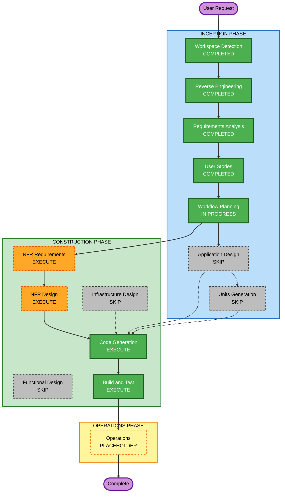

# Execution Plan

## Detailed Analysis Summary

### Transformation Scope（Brownfield）

- **Transformation Type**: Single component change（リソーススライスの拡張。アーキテクチャ変更・デプロイモデル変更なし）
- **Primary Changes**: `GET /api/resources` への `keyword` クエリパラメータ追加（backend: domain/application/presentation の3層）、`ResourceFilterForm` へのキーワード入力欄追加（frontend）
- **Related Components**: `ResourceController` / `ResourceService` / `ResourceRepository` / `ResourceFilterForm.tsx` / `resources.ts`（Server Action） / `resources/page.tsx`

### Change Impact Assessment

- **User-facing changes**: Yes — `ResourceFilterForm` にキーワード入力欄が増え、一覧の絞り込み結果が変わる
- **Structural changes**: No — 4層アーキテクチャ・既存コンポーネント境界は変更しない
- **Data model changes**: No — 新規カラム・新規テーブルなし
- **API changes**: Yes（後方互換）— `GET /api/resources` に任意パラメータ `keyword` を追加するのみで、既存の呼び出し（`keyword` 未指定）は現行どおり動作する
- **NFR impact**: Yes — Security Baseline 拡張（SECURITY-05: 入力バリデーション）が適用される

### Component Relationships

- **Primary Component**: Resource スライス（`domain`/`application`/`presentation` の `Resource*` クラス群）
- **Infrastructure Components**: なし
- **Shared Components**: なし（`ResourceResponse` 等の DTO はレスポンス形状変更なしのため影響なし）
- **Dependent Components**: `frontend/src/server/actions/resources.ts`（API 呼び出し側。`keyword` パラメータの型追加が必要）
- **Supporting Components**: なし

| コンポーネント | Change Type | Change Reason | Change Priority |
|---|---|---|---|
| `ResourceRepository` | Minor | `keyword` 条件を含む `@Query` メソッド追加 | Critical |
| `ResourceService` | Minor | `list`/`fetchAllCandidates` に `keyword` 引数を伝播 | Critical |
| `ResourceController` | Minor | `keyword` クエリパラメータの受付 | Critical |
| `frontend/server/actions/resources.ts` | Minor | `ListResourcesParams` に `keyword` 追加 | Important |
| `ResourceFilterForm.tsx` | Minor | キーワード入力欄追加 | Important |
| `resources/page.tsx` | Minor | `SearchParams` に `keyword` 追加 | Important |

### Risk Assessment

- **Risk Level**: Low（単一スライス・後方互換な追加・ロールバック容易）
- **Rollback Complexity**: Easy（新規マイグレーションなし。コード変更のみ）
- **Testing Complexity**: Simple（既存テストパターンの拡張で対応可能）

## Workflow Visualization


```mermaid
flowchart TD
    Start(["User Request"])

    subgraph INCEPTION["INCEPTION PHASE"]
        WD["Workspace Detection<br/>COMPLETED"]
        RE["Reverse Engineering<br/>COMPLETED"]
        RA["Requirements Analysis<br/>COMPLETED"]
        US["User Stories<br/>COMPLETED"]
        WP["Workflow Planning<br/>IN PROGRESS"]
        AD["Application Design<br/>SKIP"]
        UG["Units Generation<br/>SKIP"]
    end

    subgraph CONSTRUCTION["CONSTRUCTION PHASE"]
        FD["Functional Design<br/>SKIP"]
        NFRA["NFR Requirements<br/>EXECUTE"]
        NFRD["NFR Design<br/>EXECUTE"]
        ID["Infrastructure Design<br/>SKIP"]
        CG["Code Generation<br/>EXECUTE"]
        BT["Build and Test<br/>EXECUTE"]
    end

    subgraph OPERATIONS["OPERATIONS PHASE"]
        OPS["Operations<br/>PLACEHOLDER"]
    end

    Start --> WD --> RE --> RA --> US --> WP
    WP --> AD -.-> UG
    WP --> NFRA --> NFRD --> CG
    UG -.-> CG
    AD -.-> CG
    ID -.-> CG
    CG --> BT --> OPS --> End(["Complete"])

    style WD fill:#4CAF50,stroke:#1B5E20,stroke-width:3px,color:#fff
    style RE fill:#4CAF50,stroke:#1B5E20,stroke-width:3px,color:#fff
    style RA fill:#4CAF50,stroke:#1B5E20,stroke-width:3px,color:#fff
    style US fill:#4CAF50,stroke:#1B5E20,stroke-width:3px,color:#fff
    style WP fill:#4CAF50,stroke:#1B5E20,stroke-width:3px,color:#fff
    style AD fill:#BDBDBD,stroke:#424242,stroke-width:2px,stroke-dasharray: 5 5,color:#000
    style UG fill:#BDBDBD,stroke:#424242,stroke-width:2px,stroke-dasharray: 5 5,color:#000
    style FD fill:#BDBDBD,stroke:#424242,stroke-width:2px,stroke-dasharray: 5 5,color:#000
    style NFRA fill:#FFA726,stroke:#E65100,stroke-width:3px,stroke-dasharray: 5 5,color:#000
    style NFRD fill:#FFA726,stroke:#E65100,stroke-width:3px,stroke-dasharray: 5 5,color:#000
    style ID fill:#BDBDBD,stroke:#424242,stroke-width:2px,stroke-dasharray: 5 5,color:#000
    style CG fill:#4CAF50,stroke:#1B5E20,stroke-width:3px,color:#fff
    style BT fill:#4CAF50,stroke:#1B5E20,stroke-width:3px,color:#fff
    style OPS fill:#FFF59D,stroke:#F57F17,stroke-width:2px,stroke-dasharray: 5 5,color:#000
    style Start fill:#CE93D8,stroke:#6A1B9A,stroke-width:3px,color:#000
    style End fill:#CE93D8,stroke:#6A1B9A,stroke-width:3px,color:#000
    style INCEPTION fill:#BBDEFB,stroke:#1565C0,stroke-width:2px,color:#000
    style CONSTRUCTION fill:#C8E6C9,stroke:#2E7D32,stroke-width:2px,color:#000
    style OPERATIONS fill:#FFF59D,stroke:#F57F17,stroke-width:2px,color:#000

    linkStyle default stroke:#333,stroke-width:2px
```

### テキスト代替

```
INCEPTION PHASE
- Workspace Detection   : COMPLETED
- Reverse Engineering   : COMPLETED
- Requirements Analysis : COMPLETED
- User Stories          : COMPLETED
- Workflow Planning     : IN PROGRESS（本ドキュメント）
- Application Design    : SKIP
- Units Generation      : SKIP

CONSTRUCTION PHASE（単一ユニット: resource-list-filter）
- Functional Design     : SKIP
- NFR Requirements      : EXECUTE
- NFR Design            : EXECUTE
- Infrastructure Design : SKIP
- Code Generation       : EXECUTE
- Build and Test        : EXECUTE

OPERATIONS PHASE
- Operations            : PLACEHOLDER（BookFlowではCI品質ゲートが相当）
```

## Phases to Execute

### 🔵 INCEPTION PHASE

- [x] Workspace Detection (COMPLETED)
- [x] Reverse Engineering (COMPLETED)
- [x] Requirements Analysis (COMPLETED)
- [x] User Stories (COMPLETED)
- [x] Execution Plan (本ドキュメント)
- [ ] Application Design - **SKIP**
  - **Rationale**: 新規コンポーネント・新規サービス層は不要。変更は既存の `ResourceController`/`ResourceService`/`ResourceRepository` という確立された境界内に収まる。検索ロジックの実装方式（`@Query` カスタムJPQL）は Requirements Analysis の確認質問で既に決定済み
- [ ] Units Generation - **SKIP**
  - **Rationale**: BookFlow の運用（`CLAUDE.md`「縦切り実装」）では本タスク自体が単一の縦切り Issue = 単一ユニットであり、複数ユニットへの分解は不要。並列開発の必要もない

### 🟢 CONSTRUCTION PHASE（単一ユニット: `resource-list-filter`）

- [ ] Functional Design - **SKIP**
  - **Rationale**: 新規データモデルなし。業務ロジック（キーワード・カテゴリ・有効フラグの AND 結合、null許容条件パターン）は `requirements.md` の FR-01〜FR-07 で既に詳細化済みであり、改めてモデリングすべき新しい業務ルールはない
- [ ] NFR Requirements - **EXECUTE**
  - **Rationale**: Security Baseline 拡張が適用されており（SECURITY-05: 入力バリデーション）、`keyword` パラメータの長さ上限・エスケープ処理・パラメータ化クエリの具体的な実装方針を NFR として確定する必要がある
- [ ] NFR Design - **EXECUTE**
  - **Rationale**: NFR Requirements で特定した SECURITY-05 対応を、どのクラス（DTO バリデーション／Repository クエリ）にどう落とし込むかを設計する
- [ ] Infrastructure Design - **SKIP**
  - **Rationale**: デプロイモデル・インフラ構成の変更なし
- [ ] Code Generation - **EXECUTE (ALWAYS)**
  - **Rationale**: 実装計画の策定とコード生成が必要
- [ ] Build and Test - **EXECUTE (ALWAYS)**
  - **Rationale**: ビルド・既存テストの回帰確認・新規ユニットテストの実行が必要

### 🟡 OPERATIONS PHASE

- [ ] Operations - **PLACEHOLDER**
  - **Rationale**: BookFlow では CI 品質ゲート（`CI Backend`/`CI Frontend`）が Operations 相当。本エンジンでの追加作業はなし

## Package Change Sequence

- **Update Approach**: Sequential（backend → frontend）
- **Critical Path**: `ResourceRepository`（`@Query` 追加）→ `ResourceService`（引数伝播）→ `ResourceController`（パラメータ受付）→ `frontend/server/actions/resources.ts`（型追加）→ `ResourceFilterForm.tsx`／`resources/page.tsx`
- **Coordination Points**: `GET /api/resources` の `keyword` パラメータ契約（任意パラメータのため後方互換、どちらを先に実装しても既存動作は壊れない。ただしフロントエンドの動作確認にはバックエンドの実装完了が必要なため backend を先に実装する）
- **Testing Checkpoints**: backend 実装後に `ResourceServiceTest`/`ResourceControllerTest` を実行してから frontend に着手する

## Estimated Timeline

- **Total Phases**: 4（NFR Requirements, NFR Design, Code Generation, Build and Test）
- **Estimated Duration**: 半日〜1日（エンハンス課題シート記載の見積もりと整合）

## Success Criteria

- **Primary Goal**: `docs-next/docs/spec/enhancements/beginner/resource-list-filter.md` の受入条件6件をすべて満たす
- **Key Deliverables**: `GET /api/resources` の `keyword` 対応、`ResourceFilterForm` のキーワード入力欄、バックエンドの新規ユニットテスト
- **Quality Gates**: `pnpm lint` / `pnpm test` / `./gradlew test` / `./gradlew checkstyleMain` が pass すること。既存の `ResourceServiceTest`/`ResourceControllerTest` が回帰しないこと
- **Integration Testing**: フロントエンドの `ResourceFilterForm` からバックエンド API まで通した手動確認（`pnpm dev` + `./gradlew bootRun`）
