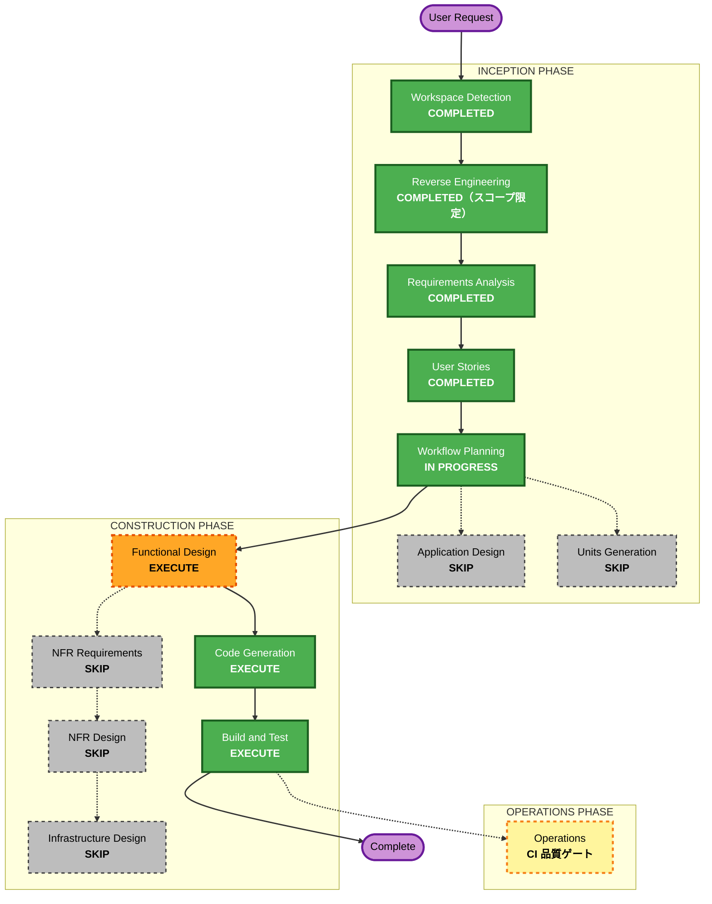

# Execution Plan — reservation-list-filter（Issue #24）

## Detailed Analysis Summary

### Transformation Scope（Brownfield）

- **Transformation Type**: Single component change（既存の `ReservationController`/`ReservationService`/`ReservationRepository`/予約一覧画面の拡張。新規コンポーネントなし）
- **Primary Changes**: `GET /api/reservations` に `resourceName`・`from`・`to` パラメータを追加し、既存の「ロール×status有無」4メソッド構成に組み込む
- **Related Components**: `ReservationController`・`ReservationService`・`ReservationRepository`（backend）、`reservations/page.tsx`・新規 `ReservationFilterForm.tsx`・`server/actions/reservations.ts`（frontend）

### Change Impact Assessment

- **User-facing changes**: Yes — `/reservations` にリソース名・期間フィルタ入力欄が追加される
- **Structural changes**: No — 既存の4層アーキテクチャ・既存コンポーネント境界内で完結
- **Data model changes**: No — スキーマ変更不要（既存カラム・既存関連でのフィルタのみ）
- **API changes**: Yes — `GET /api/reservations` に `resourceName`/`from`/`to` を追加（後方互換・既定値あり）
- **NFR impact**: No（新規の性能・セキュリティ・スケーラビリティ要件はなし。16メソッドへの組み合わせ拡張は Functional Design の業務ロジック設計として扱う）

### Component Relationships

- **Primary Component**: `ReservationRepository`・`ReservationService`・`ReservationController`（backend）、`ReservationFilterForm`・`reservations/page.tsx`・`server/actions/reservations.ts`（frontend）
- **Dependent Components**: `ReservationService#list` の呼び出し元は `ReservationController` のみ
- **Supporting Components**: なし

### Risk Assessment

- **Risk Level**: Medium（既存の4メソッド構成に resourceName・from/to を掛け合わせると最大16メソッドになり、実装量・レビュー負荷が増える。from/to の重複判定の意味論を既存の `checkConflict`/`overlaps` と一致させないと受入条件未達の回帰を生みやすい）
- **Rollback Complexity**: Easy（単一ユニットの変更、新規パラメータは後方互換）
- **Testing Complexity**: Moderate（16通りの組み合わせのうち代表的なパターンを選んでテストする必要がある）

## Workflow Visualization


```mermaid
flowchart TD
    Start(["User Request"])

    subgraph INCEPTION["INCEPTION PHASE"]
        WD["Workspace Detection<br/><b>COMPLETED</b>"]
        RE["Reverse Engineering<br/><b>COMPLETED（スコープ限定）</b>"]
        RA["Requirements Analysis<br/><b>COMPLETED</b>"]
        US["User Stories<br/><b>COMPLETED</b>"]
        WP["Workflow Planning<br/><b>IN PROGRESS</b>"]
        AD["Application Design<br/><b>SKIP</b>"]
        UG["Units Generation<br/><b>SKIP</b>"]
    end

    subgraph CONSTRUCTION["CONSTRUCTION PHASE"]
        FD["Functional Design<br/><b>EXECUTE</b>"]
        NFRA["NFR Requirements<br/><b>SKIP</b>"]
        NFRD["NFR Design<br/><b>SKIP</b>"]
        ID["Infrastructure Design<br/><b>SKIP</b>"]
        CG["Code Generation<br/><b>EXECUTE</b>"]
        BT["Build and Test<br/><b>EXECUTE</b>"]
    end

    subgraph OPERATIONS["OPERATIONS PHASE"]
        OPS["Operations<br/><b>CI 品質ゲート</b>"]
    end

    Start --> WD --> RE --> RA --> US --> WP
    WP -.-> AD
    WP -.-> UG
    WP --> FD
    FD -.-> NFRA
    NFRA -.-> NFRD
    NFRD -.-> ID
    FD --> CG
    CG --> BT
    BT -.-> OPS
    BT --> End(["Complete"])

    style WD fill:#4CAF50,stroke:#1B5E20,stroke-width:3px,color:#fff
    style RE fill:#4CAF50,stroke:#1B5E20,stroke-width:3px,color:#fff
    style RA fill:#4CAF50,stroke:#1B5E20,stroke-width:3px,color:#fff
    style US fill:#4CAF50,stroke:#1B5E20,stroke-width:3px,color:#fff
    style WP fill:#4CAF50,stroke:#1B5E20,stroke-width:3px,color:#fff
    style CG fill:#4CAF50,stroke:#1B5E20,stroke-width:3px,color:#fff
    style BT fill:#4CAF50,stroke:#1B5E20,stroke-width:3px,color:#fff
    style FD fill:#FFA726,stroke:#E65100,stroke-width:3px,stroke-dasharray: 5 5,color:#000
    style AD fill:#BDBDBD,stroke:#424242,stroke-width:2px,stroke-dasharray: 5 5,color:#000
    style UG fill:#BDBDBD,stroke:#424242,stroke-width:2px,stroke-dasharray: 5 5,color:#000
    style NFRA fill:#BDBDBD,stroke:#424242,stroke-width:2px,stroke-dasharray: 5 5,color:#000
    style NFRD fill:#BDBDBD,stroke:#424242,stroke-width:2px,stroke-dasharray: 5 5,color:#000
    style ID fill:#BDBDBD,stroke:#424242,stroke-width:2px,stroke-dasharray: 5 5,color:#000
    style OPS fill:#FFF59D,stroke:#F57F17,stroke-width:3px,stroke-dasharray: 5 5,color:#000
    style Start fill:#CE93D8,stroke:#6A1B9A,stroke-width:3px,color:#000
    style End fill:#CE93D8,stroke:#6A1B9A,stroke-width:3px,color:#000

    linkStyle default stroke:#333,stroke-width:2px
```

### テキスト代替（図のフォールバック）

```
Phase 1: INCEPTION
- Workspace Detection (COMPLETED)
- Reverse Engineering (COMPLETED・スコープ限定)
- Requirements Analysis (COMPLETED)
- User Stories (COMPLETED)
- Workflow Planning (IN PROGRESS)
- Application Design (SKIP)
- Units Generation (SKIP)

Phase 2: CONSTRUCTION（ユニット: reservation-list-filter）
- Functional Design (EXECUTE)
- NFR Requirements (SKIP)
- NFR Design (SKIP)
- Infrastructure Design (SKIP)
- Code Generation (EXECUTE)
- Build and Test (EXECUTE)

Phase 3: OPERATIONS
- CI 品質ゲート（PR 作成後に自動実行）
```

## Phases to Execute

### 🔵 INCEPTION PHASE

- [x] Workspace Detection (COMPLETED)
- [x] Reverse Engineering (COMPLETED・スコープ限定で `code-structure-reservation-list-filter.md` のみ追加)
- [x] Requirements Analysis (COMPLETED)
- [x] User Stories (COMPLETED)
- [x] Workflow Planning (IN PROGRESS)
- [ ] Application Design — **SKIP**
  - **Rationale**: 新規コンポーネント・サービス層設計は不要。既存の `ReservationController`/`ReservationService`/`ReservationRepository` の境界内で完結する
- [ ] Units Generation — **SKIP**
  - **Rationale**: Issue = 単一 units of work（BookFlow の縦切り方針）。複数ユニットへの分解は不要

### 🟢 CONSTRUCTION PHASE（ユニット: reservation-list-filter）

- [ ] Functional Design — **EXECUTE**
  - **Rationale**: 16メソッドへの組み合わせ拡張方式、resourceName/from-to の共通JPQL条件設計、from/toのoverlap意味論の確定など、技術非依存の業務ロジック設計判断が複数ある
- [ ] NFR Requirements — **SKIP**
  - **Rationale**: 新規の性能・セキュリティ・スケーラビリティ要件・技術スタック選定はない
- [ ] NFR Design — **SKIP**
  - **Rationale**: NFR Requirements が SKIP のため連動
- [ ] Infrastructure Design — **SKIP**
  - **Rationale**: インフラ構成に変更なし
- [ ] Code Generation — **EXECUTE (ALWAYS)**
  - **Rationale**: 実装計画の作成とコード生成が必要
- [ ] Build and Test — **EXECUTE (ALWAYS)**
  - **Rationale**: ビルド・テスト・検証が必要

### 🟡 OPERATIONS PHASE

- [ ] Operations — **PLACEHOLDER**
  - **Rationale**: BookFlow では CI 品質ゲート（`CI Frontend`/`CI Backend`）として運用。PR 作成・push 時に自動実行

## Estimated Timeline

- **Total Phases**: INCEPTION（完了）→ CONSTRUCTION（Functional Design・Code Generation・Build and Test）
- **Estimated Duration**: ビジネス要求シート記載どおり 2〜3 時間相当（Beginner 課題）

## Success Criteria

- **Primary Goal**: `/reservations` でステータスタブと組み合わせてリソース名・期間で予約を絞り込める
- **Key Deliverables**: backend（`resourceName`/`from`/`to` パラメータ・最大16メソッドの実装・ホワイトリスト不要な単純なバリデーション）、frontend（`ReservationFilterForm`）、対応するユニットテスト・結合テスト、仕様書更新（`api-spec.md`・`screen-spec.md`）
- **Quality Gates**: 既存テスト（`ReservationServiceTest`・`ReservationControllerTest`）が継続して pass すること。CI AIレビューの経験（keyword・sort ユニットでの複数ラウンド指摘）を踏まえ、各テストが「対象コードを無効化すると red になる」ことを実装時に自己検証する
- **Integration Testing**: resourceName・from/to・status の組み合わせパターンを H2 実データの結合テストで確認する
