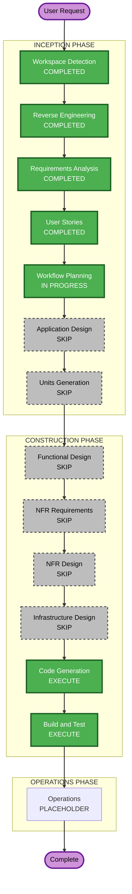

# Execution Plan — resource-detail-info

## Detailed Analysis Summary

### Transformation Scope（Brownfield）

- **Transformation Type**: Single component change（Resource ドメイン内の既存エンティティへのフィールド追加）
- **Primary Changes**: `resources` テーブルへの `equipment`・`notes` 列追加、エンティティ・DTO・Service・Controller への反映、frontend 2画面（詳細画面・管理画面フォーム）への反映
- **Related Components**: `Resource`/`ResourceResponse`/`CreateResourceRequest`/`UpdateResourceRequest`/`ResourceService`/`ResourceController`（backend）、`ResourceResponseSchema`/`CreateResourceSchema`/`ResourceManagementClient`/`resources/[id]/page.tsx`（frontend）

### Change Impact Assessment

- **User-facing changes**: Yes — ADMIN の登録・編集フォームに2項目追加、MEMBER/APPROVER の詳細画面に2項目の条件表示追加
- **Structural changes**: No — 新規コンポーネント・新規サービスは発生しない。既存の4レイヤー構成内で完結
- **Data model changes**: Yes — `resources` テーブルに2列追加（`NULL` 許容、既存データ非破壊）
- **API changes**: Yes — `ResourceResponse`/`CreateResourceRequest`/`UpdateResourceRequest` にフィールド追加（後方互換、破壊的変更なし）
- **NFR impact**: No — パフォーマンス・セキュリティ・スケーラビリティへの新規要求なし

### Component Relationships

- **Primary Component**: Resource ドメイン（backend の `domain`/`application`/`presentation`、frontend の `resources`/`admin/resources`）
- **Dependent Components**: なし（`Reservation` 等の他ドメインはこのフィールド追加の影響を受けない）
- **Supporting Components**: Flyway マイグレーション（`V002`）

### Risk Assessment

- **Risk Level**: Low（既存の確立されたパターン［`description` と同型の NULL 許容 TEXT 列］に従う定型拡張。新規ロジック・新規依存関係なし）
- **Rollback Complexity**: Easy（追加のみの変更であり、フィールドを無視すれば旧動作と等価）
- **Testing Complexity**: Simple（既存のテストパターンに新フィールドのケースを追加する形）

## Workflow Visualization

```mermaid
flowchart TD
    Start(["User Request"])

    subgraph INCEPTION["INCEPTION PHASE"]
        WD["Workspace Detection<br/>COMPLETED"]
        RE["Reverse Engineering<br/>COMPLETED"]
        RA["Requirements Analysis<br/>COMPLETED"]
        US["User Stories<br/>COMPLETED"]
        WP["Workflow Planning<br/>IN PROGRESS"]
        AD["Application Design<br/>SKIP"]
        UG["Units Generation<br/>SKIP"]
    end

    subgraph CONSTRUCTION["CONSTRUCTION PHASE"]
        FD["Functional Design<br/>SKIP"]
        NFRA["NFR Requirements<br/>SKIP"]
        NFRD["NFR Design<br/>SKIP"]
        ID["Infrastructure Design<br/>SKIP"]
        CG["Code Generation<br/>EXECUTE"]
        BT["Build and Test<br/>EXECUTE"]
    end

    subgraph OPERATIONS["OPERATIONS PHASE"]
        OPS["Operations<br/>PLACEHOLDER"]
    end

    Start --> WD
    WD --> RE
    RE --> RA
    RA --> US
    US --> WP
    WP --> AD
    AD --> UG
    UG --> FD
    FD --> NFRA
    NFRA --> NFRD
    NFRD --> ID
    ID --> CG
    CG --> BT
    BT --> OPS
    OPS --> End(["Complete"])

    style WD fill:#4CAF50,stroke:#1B5E20,stroke-width:3px,color:#fff
    style RE fill:#4CAF50,stroke:#1B5E20,stroke-width:3px,color:#fff
    style RA fill:#4CAF50,stroke:#1B5E20,stroke-width:3px,color:#fff
    style US fill:#4CAF50,stroke:#1B5E20,stroke-width:3px,color:#fff
    style WP fill:#4CAF50,stroke:#1B5E20,stroke-width:3px,color:#fff
    style AD fill:#BDBDBD,stroke:#424242,stroke-width:2px,stroke-dasharray: 5 5,color:#000
    style UG fill:#BDBDBD,stroke:#424242,stroke-width:2px,stroke-dasharray: 5 5,color:#000
    style FD fill:#BDBDBD,stroke:#424242,stroke-width:2px,stroke-dasharray: 5 5,color:#000
    style NFRA fill:#BDBDBD,stroke:#424242,stroke-width:2px,stroke-dasharray: 5 5,color:#000
    style NFRD fill:#BDBDBD,stroke:#424242,stroke-width:2px,stroke-dasharray: 5 5,color:#000
    style ID fill:#BDBDBD,stroke:#424242,stroke-width:2px,stroke-dasharray: 5 5,color:#000
    style CG fill:#4CAF50,stroke:#1B5E20,stroke-width:3px,color:#fff
    style BT fill:#4CAF50,stroke:#1B5E20,stroke-width:3px,color:#fff
    style Start fill:#CE93D8,stroke:#6A1B9A,stroke-width:3px,color:#000
    style End fill:#CE93D8,stroke:#6A1B9A,stroke-width:3px,color:#000

    linkStyle default stroke:#333,stroke-width:2px
```

## Phases to Execute

### INCEPTION PHASE

- [x] Workspace Detection (COMPLETED)
- [x] Reverse Engineering (COMPLETED) — Resource ドメインにスコープした調査を実施
- [x] Requirements Analysis (COMPLETED)
- [x] User Stories (COMPLETED)
- [x] Workflow Planning (IN PROGRESS)
- [ ] Application Design — **SKIP**
  - **Rationale**: 新規コンポーネント・新規サービスは不要。既存の `ResourceService`/`ResourceController` の既存メソッドにフィールドを追加するのみで、サービス境界・メソッドシグネチャの設計判断を要しない
- [ ] Units Generation — **SKIP**
  - **Rationale**: Issue = 単一 units of work（複数パッケージ・複数サービスへの分解は不要な単純な拡張）

### CONSTRUCTION PHASE

- [ ] Functional Design — **SKIP**
  - **Rationale**: 新規データモデル（新規エンティティ・新規関連）や複雑な業務ロジックが発生しない。`equipment`/`notes` は既存の `description` と同型の NULL 許容 TEXT フィールドであり、表示条件（未登録時非表示）も既存の `location`/`capacity` 等と同じ確立済みパターンの踏襲。設計判断を要する論点（データ格納先）は Requirements Analysis で既に確認・決定済み
- [ ] NFR Requirements — **SKIP**
  - **Rationale**: 性能・セキュリティ・スケーラビリティへの新規要求なし
- [ ] NFR Design — **SKIP**
  - **Rationale**: NFR Requirements が SKIP のため連動
- [ ] Infrastructure Design — **SKIP**
  - **Rationale**: インフラ構成（CDK 等）への変更なし
- [ ] Code Generation — **EXECUTE (ALWAYS)**
  - **Rationale**: 実装計画の策定とコード生成が必要
- [ ] Build and Test — **EXECUTE (ALWAYS)**
  - **Rationale**: ビルド・テスト・検証が必要

### OPERATIONS PHASE

- [ ] Operations — **PLACEHOLDER**
  - **Rationale**: BookFlow では CI 品質ゲート（`CI Frontend`/`CI Backend`）として運用。学習者は `/commit-push`・`/create-pr` で引き継ぐ

## Estimated Timeline

- **Total Phases**: 7 Execute（Workspace Detection・Reverse Engineering・Requirements Analysis・User Stories・Workflow Planning・Code Generation・Build and Test）、4 Skip（Application Design・Units Generation・Functional Design・NFR系・Infrastructure Design）
- **Estimated Duration**: ビジネス要求シート記載の推定工数どおり 3〜4時間

## Success Criteria

- **Primary Goal**: `resources` テーブルへの `equipment`・`notes` 追加と、バックエンド・フロントエンド両方への反映
- **Key Deliverables**: Flyway マイグレーション（V002）、エンティティ・DTO 拡張、API 反映、詳細画面・管理画面フォームへの反映、新規テスト
- **Quality Gates**: 既存バックエンドテストが引き続き pass すること、新フィールドを含む API 動作のテストを追加すること（受入条件どおり）
