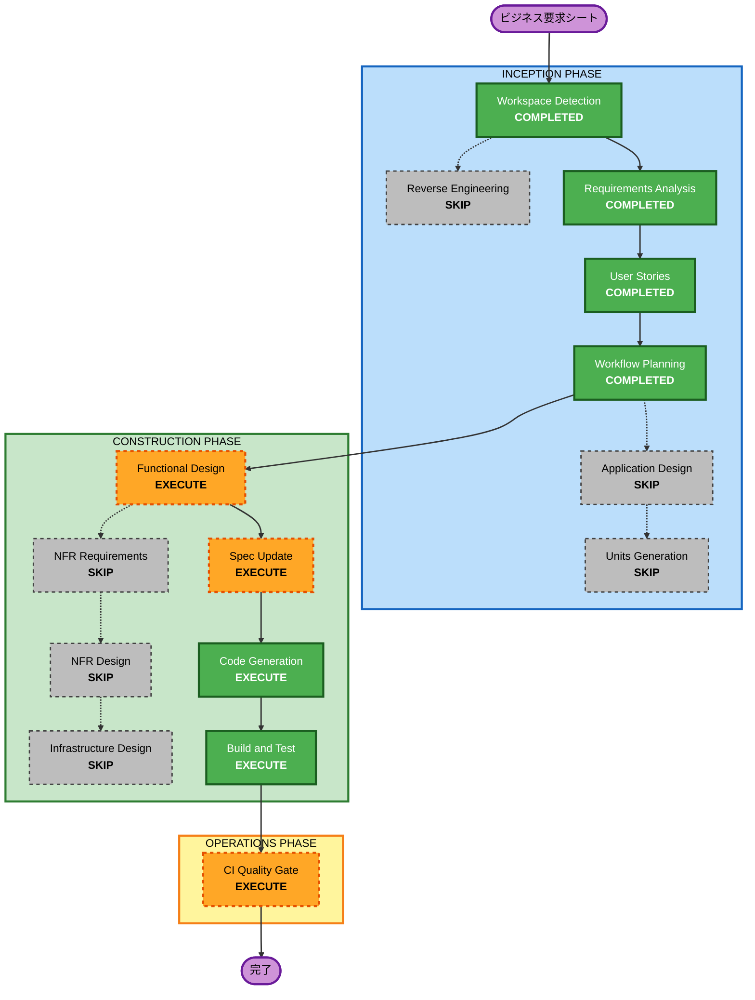

# Execution Plan — 予約の下書き保存

**対象**: `docs-next/docs/spec/enhancements/intermediate/reservation-draft.md`
**ユニット**: `reservation-draft`（単一）
**Issue**: #30
**ブランチ**: `feature/CHS-UTSUMI-KENTA/30-reservation-draft`
**作成日時**: 2026-10-02T11:02:40+00:00

**入力**:

- 要件定義: [`requirements.md`](../../requirements/reservation-draft/requirements.md)（FR-01〜FR-07、NFR-01〜NFR-04）
- 確認質問と回答: [`requirement-verification-questions.md`](../../requirements/reservation-draft/requirement-verification-questions.md)
- ユーザーストーリー: [`stories.md`](../../user-stories/reservation-draft/stories.md)（US-01〜US-07、受入基準34件）
- ペルソナ: [`personas.md`](../../user-stories/reservation-draft/personas.md)（P-01〜P-03）
- 既存システムの分析: `../../reverse-engineering/`（2026-09-16 生成・再利用）

---

## 1. 分析サマリー

### 変更の種別

| 項目 | 判定 |
|---|---|
| 変更の種別 | 既存コンポーネント内の機能追加。アーキテクチャ変換ではない |
| 主な変更 | 予約のステータス遷移に `DRAFT` の経路を追加し、承認ステップ生成と権限判定に条件分岐を足す |
| 新規コンポーネント | なし |
| 影響するモジュール | `backend`、`frontend`、`docs-next`（仕様書） |

### 変更の影響範囲

| 観点 | 影響 | 内容 |
|---|---|---|
| 利用者への影響 | あり | 3画面に新しい操作が加わる（下書き保存ボタン・ドラフトタブ・正式申請ボタン） |
| 構造的な変更 | なし | 4レイヤー構成を維持し、新しいクラスやパッケージを作らない |
| データモデルの変更 | なし | `DRAFT` は V001 の CHECK 制約に定義済み。Flyway マイグレーションは追加しない |
| API の変更 | あり | `POST /api/reservations` に `draft`、`PUT /api/reservations/{id}` に `status` を追加。いずれも省略可能で後方互換 |
| 非機能要件への影響 | なし | 性能・セキュリティ・拡張性の新規要件なし |

### コンポーネントの関係

```
変更の中心
  ReservationService          -- 作成時の DRAFT 分岐、更新時のステータスガード拡張、
                                 遷移判定、DRAFT の読み取り権限

直接の依存
  ReservationController       -- 変更なし（Service へ委譲する構造を維持）
  CreateReservationRequest    -- draft フィールド追加
  UpdateReservationRequest    -- status フィールド追加
  Reservation（エンティティ）  -- 状態遷移メソッドの追加

呼び出し先
  ApprovalService             -- createInitialStep の呼び出し条件が変わる（実装は変更なし）
  ResourceRepository          -- 変更なし

フロントエンド
  lib/schemas/reservation.ts  -- Zod スキーマに draft / status を追加
  server/actions/reservations.ts -- Server Action の引数を拡張
  reservations/new/           -- 下書き保存ボタン
  reservations/page.tsx       -- ドラフトタブ
  reservations/[id]/page.tsx  -- 編集・正式申請の導線
  reservations/[id]/edit/     -- DRAFT を編集対象に含める

テスト
  ReservationServiceTest      -- 遷移ケースの追加
  ReservationControllerTest   -- 権限ケースの追加
  frontend/tests/unit/        -- 分岐の追加
```

### リスク評価

| 項目 | 判定 | 根拠 |
|---|---|---|
| リスク水準 | Medium | 予約の作成と更新はアプリケーションの中核であり、既存の分岐に手を入れる。ただし追加するフィールドはいずれも省略可能で、省略時の振る舞いを変えない |
| 切り戻しの容易さ | Easy | 単一のコミット単位で切り戻せる。スキーマ変更を伴わないため、データの巻き戻しも不要 |
| テストの複雑さ | Moderate | 受入基準34件のうち24件がバックエンドのテストで検証でき、ステータスと `requires_approval` の組み合わせが中心 |

### 最大の注意点

`ReservationService.create` と `update` は既存のすべての予約操作が通る経路である。
`draft` と `status` を省略したときに従来と1バイトも変わらない振る舞いになることを、既存テストの全通過で確認する（NFR-03）。

---

## 2. ステージの実行判定

### INCEPTION フェーズ

| ステージ | 判定 | 根拠 |
|---|---|---|
| Workspace Detection | COMPLETED | 2026-10-02 完了 |
| Reverse Engineering | SKIP | `inception/reverse-engineering/` に2026-09-16 生成の成果物9件が存在し、以降コードベースに構造的変更がない。予約ドメインの現状は Requirements Analysis で実コードを読んで確認済み |
| Requirements Analysis | COMPLETED | 2026-10-02 完了。深度 Standard |
| User Stories | COMPLETED | 2026-10-02 完了。ペルソナ3件・ストーリー7件・受入基準34件 |
| Workflow Planning | COMPLETED | 本ドキュメント |
| Application Design | **SKIP** | 新規のコンポーネント・サービス・メソッド群を作らない。変更はすべて既存の `ReservationService` と既存 DTO の境界内に収まる |
| Units Generation | **SKIP** | 単一の縦切りユニット `reservation-draft` に収まる。バックエンドとフロントエンドをまたぐが、分割すると中途半端な状態でマージされうるため、1ユニットとして扱う |

### CONSTRUCTION フェーズ

| ステージ | 判定 | 根拠 |
|---|---|---|
| Functional Design | **EXECUTE** | ステータス遷移の可否判定、承認ステップ生成のスキップ条件、重複予約チェックの実行タイミング、`DRAFT` の読み取り権限という4つの業務ルールが相互に絡む。要求シートの「AI 活用ポイント」が相談事項として挙げる論点もここで扱う |
| NFR Requirements | **SKIP** | 新規の性能・セキュリティ・拡張性の要件がない。拡張ルール3件（Security Baseline・Resiliency Baseline・Property-Based Testing）はいずれも opt-out |
| NFR Design | **SKIP** | 前提となる NFR Requirements をスキップするため |
| Infrastructure Design | **SKIP** | `DRAFT` が `V001__create_initial_schema.sql:55` の CHECK 制約に定義済みで、Flyway マイグレーションを追加しない。インフラ構成要素の変更もない |
| Spec Update（`/update-spec`・BookFlow 翻案） | **EXECUTE** | Spec-first の原則により Code Generation より前に実施する。`api-spec.md`・`screen-spec.md`・`requirements.md` を更新する |
| Code Generation | **EXECUTE**（必須） | Part 1 で変更対象ファイルと手順を列挙し、Part 2 で実装する |
| Build and Test | **EXECUTE**（必須） | backend と frontend のテスト、lint、format、3モジュールのビルドを実行する |

### OPERATIONS フェーズ

| ステージ | 判定 | 根拠 |
|---|---|---|
| CI Quality Gate（BookFlow 翻案） | **EXECUTE** | PR 作成後に `CI Backend` / `CI Frontend` / `build` の3ジョブが pass することを確認する。base ブランチは `learner/CHS-UTSUMI-KENTA/main`（CI のトリガー条件が `branches: [main, 'learner/*/main']` のため） |

---

## 3. ワークフローの可視化



### テキストによる表現

```
INCEPTION
  1. Workspace Detection      COMPLETED
  2. Reverse Engineering      SKIP
  3. Requirements Analysis    COMPLETED
  4. User Stories             COMPLETED
  5. Workflow Planning        COMPLETED
  6. Application Design       SKIP
  7. Units Generation         SKIP

CONSTRUCTION（ユニット: reservation-draft）
  8. Functional Design        EXECUTE
  9. NFR Requirements         SKIP
 10. NFR Design               SKIP
 11. Infrastructure Design    SKIP
 12. Spec Update              EXECUTE
 13. Code Generation          EXECUTE
 14. Build and Test           EXECUTE

OPERATIONS
 15. CI Quality Gate          EXECUTE
```

---

## 4. 実装の順序

単一ユニットだが、モジュール間に依存の向きがあるため順序を定める。

| 順 | 対象 | 根拠 |
|---|---|---|
| 1 | 仕様書（`docs-next/docs/spec/`） | Spec-first。実装の判断基準を先に確定させる |
| 2 | backend の DTO とエンティティ | フロントエンドが参照する API の契約を先に固める |
| 3 | backend の `ReservationService` | 業務ルールの中心。ここが決まらないとテストが書けない |
| 4 | backend のテスト | 受入基準のうちバックエンドで検証する24件 |
| 5 | frontend の Zod スキーマと Server Action | 画面が参照する層を先に用意する |
| 6 | frontend の画面4つ | 一覧・新規作成・詳細・編集 |
| 7 | frontend のテスト | 受入基準のうちフロントエンドで検証する分 |

並行して進められる箇所はない。2と3は契約と実装の関係にあり、5は3が確定してから書く。

---

## 5. 見積もり

| 項目 | 値 |
|---|---|
| ステージ総数 | 15 |
| 完了済み | 4（Workspace Detection、Requirements Analysis、User Stories、Workflow Planning） |
| これから実行 | 5（Functional Design、Spec Update、Code Generation、Build and Test、CI Quality Gate） |
| スキップ | 6（Reverse Engineering、Application Design、Units Generation、NFR Requirements、NFR Design、Infrastructure Design） |
| 要求シートの想定工数 | 半日から1日 |

変更対象ファイルの列挙は Code Generation の Part 1 で行う。
現時点で件数を示すと、確認していない見込みが約束として扱われるため、ここでは出さない。

---

## 6. 成功基準

### 主目的

予約を `DRAFT` として保存し、再編集し、正式申請できるようにする。
その過程で下書きが承認フローに流れず、申請者本人と ADMIN 以外から見えないことを保証する。

### 主要成果物

- `docs-next/docs/spec/` の3ファイル更新（`api-spec.md`・`screen-spec.md`・`requirements.md`）
- backend の実装とテスト
- frontend の実装とテスト
- AI-DLC の設計成果物（`Docs/spec/aidlc-docs/`）

### 品質ゲート

1. 要求シートの受入条件6項目をすべて満たす
2. ユーザーストーリーの受入基準34件のうち、自動テストで検証する分がすべて通る
3. 既存のテストがすべて通る（NFR-03 の非回帰）
4. `pnpm lint`・`pnpm format:check`・`./gradlew spotlessApply`・`./gradlew checkstyleMain` が通る
5. backend・frontend・docs-next の3ビルドが成功する
6. PR で `CI Backend` / `CI Frontend` / `build` の3ジョブが pass する

### 受入条件からの意図的な逸脱

正式申請後のステータスを `requires_approval` の値に応じて決める（`true` なら `PENDING`、`false` なら `APPROVED`）。
受入条件の字句「`PENDING` に変更」から離れる。理由は要件定義 §7 を参照。
この逸脱は `api-spec.md` と PR 本文に明記する。
