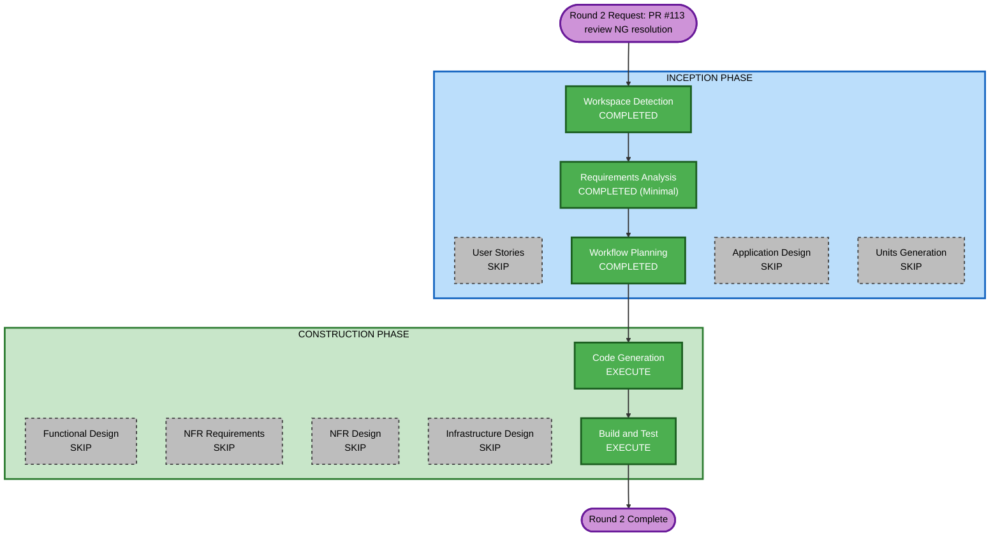

# Round 2 実行計画

## Detailed Analysis Summary

### Change Impact Assessment

- **User-facing changes**: No（テスト追加のみ、UI・API挙動は無変更）
- **Structural changes**: No（新規コンポーネント・新規ファイル構成の変更なし。新規テストファイル2つを追加するのみ）
- **Data model changes**: No
- **API changes**: No
- **NFR impact**: No

### Component Relationships

- **Primary Component**: `frontend/src/lib/api-client.ts`（`getRaw`）、`frontend/src/app/api/reports/reservations/csv/route.ts`
- **Supporting Components**: `frontend/tests/unit/msw/handlers.ts`（変更なし。テスト単位の`server.use`のみ使用）、`frontend/tests/unit/server/actions/*.test.ts`（セッションモックの規約を踏襲）

### Risk Assessment

- **Risk Level**: Low（テスト追加のみ、プロダクションコードは無変更）
- **Rollback Complexity**: Easy（テストファイルの削除のみで復元可能）
- **Testing Complexity**: Simple

## Workflow Visualization

## Phases to Execute

### INCEPTION PHASE

- [x] Workspace Detection (COMPLETED) — 既存ユニットcsv-exportの継続作業のため再検出不要
- [x] Requirements Analysis (COMPLETED, Minimal) — `round2-test-gap-requirements.md`
- [x] User Stories — SKIP（既存挙動の検証のみ。新規ユーザー体験・ペルソナなし）
- [x] Workflow Planning (COMPLETED) — 本ファイル
- [ ] Application Design — SKIP
  - **Rationale**: 新規コンポーネント・新規サービス層なし
- [ ] Units Generation — SKIP
  - **Rationale**: 既存ユニット `csv-export` の範囲内。新規データモデル・新規APIなし

### CONSTRUCTION PHASE

- [ ] Functional Design — SKIP
  - **Rationale**: 新規ビジネスロジックの設計は不要（既存実装の挙動を固定するテストのみ）
- [ ] NFR Requirements — SKIP
  - **Rationale**: 性能・セキュリティ等の新規非機能要件なし
- [ ] NFR Design — SKIP
  - **Rationale**: NFR Requirements未実行のため連動SKIP
- [ ] Infrastructure Design — SKIP
  - **Rationale**: インフラ変更なし
- [ ] Code Generation — EXECUTE (ALWAYS)
  - **Rationale**: `api-client.ts`（`getRaw`）用テストファイル・`route.ts` 用テストファイルの新規作成
- [ ] Build and Test — EXECUTE (ALWAYS)
  - **Rationale**: `pnpm test`（新規テスト含む全体）・`pnpm lint`・`pnpm format:check` で検証

## 対象ファイル（Code Generationで新規作成予定）

- `frontend/tests/unit/lib/api-client.test.ts`（新規）
- `frontend/tests/unit/app/api/reports/reservations/csv/route.test.ts`（新規）

## Success Criteria

- **Primary Goal**: PR #113 観点2 NGで指摘された2つのテストギャップを解消する
- **Key Deliverables**: 上記2テストファイルの新規追加。`getRaw`を消す/`route.ts`を壊すと新規テストが失敗することを確認（レビューコメントの「判断の根拠」を裏返す）
- **Quality Gates**: `pnpm test` 全件成功、`pnpm lint`・`pnpm format:check` 成功
