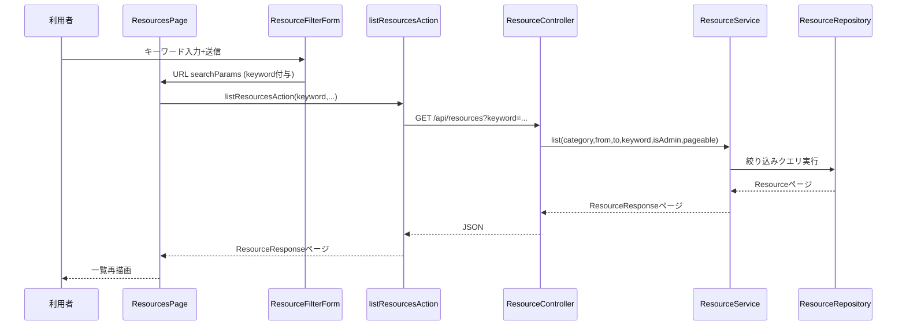

# System Architecture

> **深度メモ**: システム全体構成図・レイヤー設計方針は [`Docs/ARCHITECTURE.md`](../../../../ARCHITECTURE.md) に既存。ここでは重複せず、今回変更対象のレイヤー・コンポーネントだけを述べる。

## System Overview

BookFlow は Next.js（フロントエンド兼 BFF）と Spring Boot（バックエンド）の 2 層構成で、フロントエンドの Server Actions が BFF として Spring Boot の REST API を呼び出す。詳細は [`Docs/ARCHITECTURE.md`](../../../../ARCHITECTURE.md) を参照。

## 本エンハンスで変更するコンポーネント

| コンポーネント | レイヤー | 変更内容 |
|---|---|---|
| `ResourceController` | presentation（backend） | `GET /api/resources` に `keyword` クエリパラメータ追加 |
| `ResourceService` | application（backend） | キーワード条件を絞り込みロジックに組み込む |
| `ResourceRepository` | domain（backend） | キーワード検索クエリの追加（設計判断は Workflow Planning／Code Generation で確定） |
| `listResourcesAction` | Server Actions（frontend BFF） | `keyword` パラメータの受け渡し追加 |
| `ResourceFilterForm` | UI コンポーネント（frontend） | キーワード入力フィールド追加 |
| `ResourcesPage` | ページ（frontend） | `searchParams.keyword` の受け渡し追加 |

## Data Flow（今回変更される経路のみ）

## Integration Points

- 変更なし（外部 API・DB 以外の連携先はこのエンハンスでは増えない）
