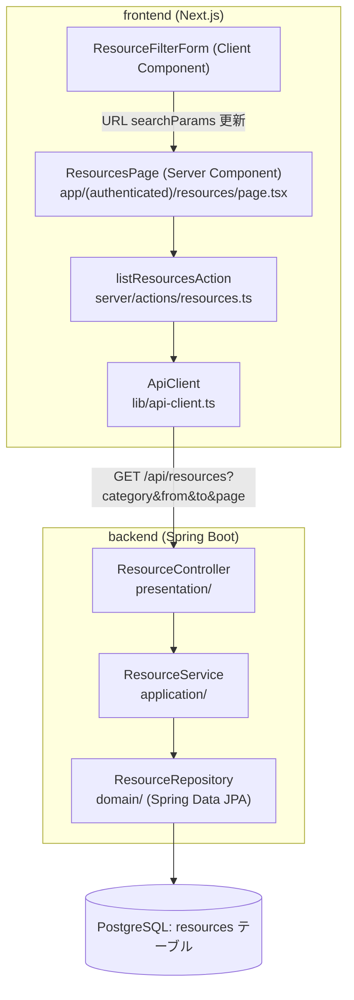
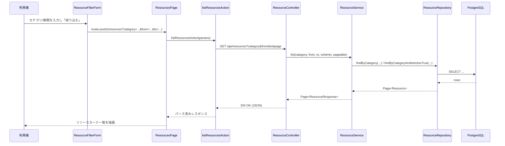

# System Architecture

> 全体アーキテクチャは既存の [`docs-next/docs/reference/architecture.md`](../../../../../docs-next/docs/reference/architecture.md)（AWS 標準アーキテクチャ）を出典とする。ここでは今回のタスクに関わるコンポーネント間の関係のみ記載する。

## System Overview

BookFlow はモノレポ構成。フロントエンドは Next.js 15（App Router）が UI と BFF（Server Actions）を兼ね、バックエンドは Spring Boot 4.0 が REST API を提供する。DB は PostgreSQL（JPA + Flyway）。

## Architecture Diagram

```mermaid
flowchart TD
    subgraph FE["frontend (Next.js)"]
        Page["ResourcesPage (Server Component)\napp/(authenticated)/resources/page.tsx"]
        Form["ResourceFilterForm (Client Component)"]
        Action["listResourcesAction\nserver/actions/resources.ts"]
        Client["ApiClient\nlib/api-client.ts"]
    end

    subgraph BE["backend (Spring Boot)"]
        Controller["ResourceController\npresentation/"]
        Service["ResourceService\napplication/"]
        Repo["ResourceRepository\ndomain/ (Spring Data JPA)"]
    end

    DB[("PostgreSQL: resources テーブル")]

    Form -->|URL searchParams 更新| Page
    Page --> Action
    Action --> Client
    Client -->|GET /api/resources?category&from&to&page| Controller
    Controller --> Service
    Service --> Repo
    Repo --> DB
```

## Component Descriptions

### `ResourceFilterForm.tsx`
- **Purpose**: カテゴリ・期間フィルタの入力フォーム（Client Component）。
- **Responsibilities**: フォーム送信時に URL クエリパラメータを組み立てて `router.push`。
- **Dependencies**: `next/navigation`（`useRouter`, `useSearchParams`）、shadcn/ui コンポーネント。
- **Type**: UI コンポーネント。

### `ResourcesPage`（`app/(authenticated)/resources/page.tsx`）
- **Purpose**: リソース一覧画面のサーバーコンポーネント。
- **Responsibilities**: `searchParams` を読み取り `listResourcesAction` を呼び出す。
- **Dependencies**: `listResourcesAction`, `getProfileAction`, `ResourceFilterForm`, `PaginationNav`。
- **Type**: ページ（Server Component）。

### `listResourcesAction`（`server/actions/resources.ts`）
- **Purpose**: BFF 層。バックエンド API への GET リクエストを組み立てる。
- **Responsibilities**: クエリパラメータの組み立て（`category`/`from`/`to`/`page`/`size`）、レスポンスの Zod バリデーション。
- **Dependencies**: `createApiClient`, `ResourceResponseSchema`。
- **Type**: Server Action（BFF）。

### `ResourceController`（`presentation/ResourceController.java`）
- **Purpose**: `GET /api/resources` を含むリソース関連エンドポイントの受け口。
- **Responsibilities**: リクエストパラメータの受け取り、`from`/`to` 同時指定チェック、ロール判定（ADMIN か否か）を `ResourceService` に渡す。
- **Dependencies**: `ResourceService`。
- **Type**: Controller（presentation 層）。

### `ResourceService`（`application/ResourceService.java`）
- **Purpose**: リソース一覧のユースケースロジック。
- **Responsibilities**: カテゴリ・期間フィルタの適用ロジック分岐（`listPaginated` / `listWithAvailabilityFilter`）、ロール別の可視性制御。
- **Dependencies**: `ResourceRepository`, `ReservationRepository`。
- **Type**: Service（application 層）。

### `ResourceRepository`（`domain/ResourceRepository.java`）
- **Purpose**: `resources` テーブルへのクエリを提供する Spring Data JPA リポジトリ。
- **Responsibilities**: `findByCategory` 系メソッド（ページネーション有無・ADMIN 可視性の組み合わせ）を提供。
- **Dependencies**: JPA（`Resource` エンティティ）。
- **Type**: Repository（domain 層）。

## Data Flow

```mermaid
sequenceDiagram
    participant U as 利用者
    participant Form as ResourceFilterForm
    participant Page as ResourcesPage
    participant Action as listResourcesAction
    participant API as ResourceController
    participant Svc as ResourceService
    participant Repo as ResourceRepository
    participant DB as PostgreSQL

    U->>Form: カテゴリ/期間を入力し「絞り込む」
    Form->>Page: router.push(/resources?category=...&from=...&to=...)
    Page->>Action: listResourcesAction(params)
    Action->>API: GET /api/resources?category&from&to&page
    API->>Svc: list(category, from, to, isAdmin, pageable)
    Svc->>Repo: findByCategory(...) / findByCategoryAndIsActiveTrue(...)
    Repo->>DB: SELECT ...
    DB-->>Repo: rows
    Repo-->>Svc: Page<Resource>
    Svc-->>API: Page<ResourceResponse>
    API-->>Action: 200 OK (JSON)
    Action-->>Page: パース済みレスポンス
    Page-->>U: リソースカード一覧を描画
```

## Integration Points

- **External APIs**: なし（今回のタスク範囲）。
- **Databases**: PostgreSQL の `resources` テーブル（`name` VARCHAR(100)、`description` TEXT）。
- **Third-party Services**: なし。

## Infrastructure Components

本タスクはローカル開発環境（`docker compose -f .devcontainer/docker-compose.yml`）内で完結し、AWS インフラの変更は伴わない。詳細は既存の `architecture.md` を参照。
