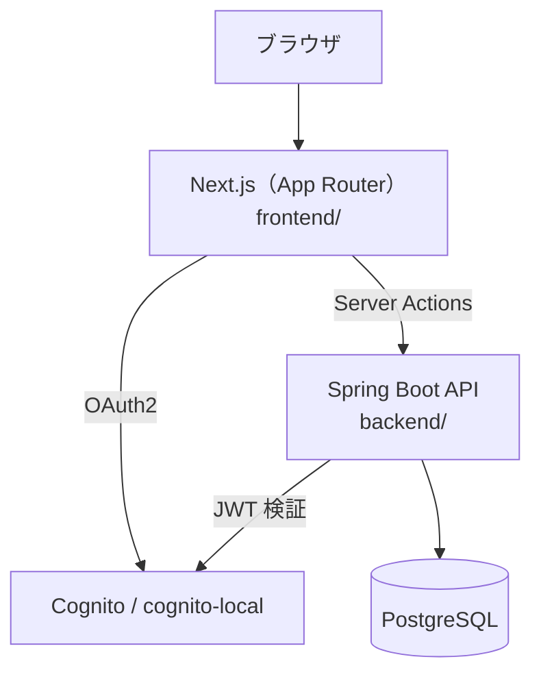
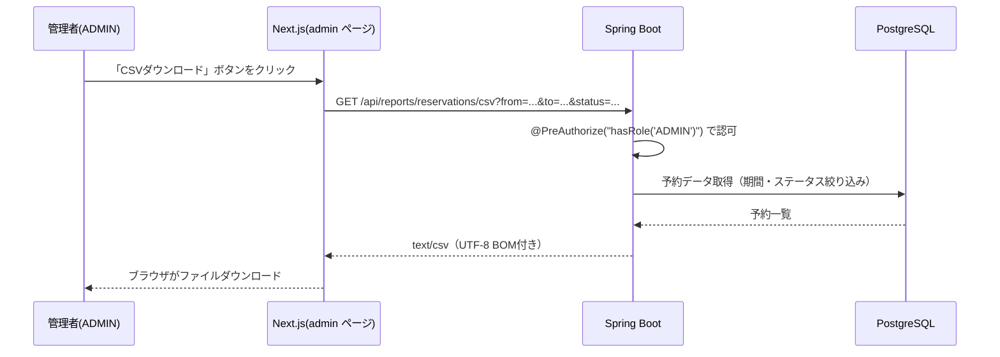

# System Architecture

> 深さ：浅め。全体アーキテクチャは [`docs-next/docs/reference/architecture.md`](../../../../../docs-next/docs/reference/architecture.md) が真実の源であり、ここでは要約とCSV帳票出力タスクに関わる部分の深掘りのみ行う。

## System Overview

Next.js（フロントエンド + BFF）と Spring Boot（バックエンド API）の2層構成。認証は Amazon Cognito（ローカルは cognito-local）、DB は PostgreSQL（Flyway 管理）。ローカル開発は Docker Compose（`.devcontainer/docker-compose.yml`）で完結する。

## Architecture Diagram

```mermaid
flowchart TB
    Browser["ブラウザ"] --> NextJS["Next.js（App Router）<br/>frontend/"]
    NextJS -->|Server Actions| SpringBoot["Spring Boot API<br/>backend/"]
    NextJS -->|OAuth2| Cognito["Cognito / cognito-local"]
    SpringBoot -->|JWT 検証| Cognito
    SpringBoot --> PostgreSQL[("PostgreSQL")]
```

## Component Descriptions

### frontend/（Next.js 15 / React 19 / TypeScript）

- **Purpose**: UI 描画・BFF（バックエンド呼び出しの集約、認証トークン管理）
- **Responsibilities**: 画面・フォーム・Server Actions（`src/server/actions/`）
- **Dependencies**: バックエンド API（`api-client.ts` 経由）、Cognito（Better Auth）
- **Type**: Application

### backend/（Spring Boot 4.0 / Java 25）

- **Purpose**: 予約・リソース・承認・ユーザーの REST API
- **Responsibilities**: ドメインルール集約、JWT 検証・認可（Spring Security + OAuth2 Resource Server）
- **Dependencies**: PostgreSQL、Cognito（JWT 発行元）
- **Type**: Application

4層構成（`domain` / `application` / `presentation` / `infrastructure`）を厳守する規約（CLAUDE.md）。詳細な層別ファイル一覧は [code-structure.md](./code-structure.md) を参照。

## Data Flow（CSV 帳票出力の想定フロー）

```mermaid
sequenceDiagram
    participant Admin as 管理者(ADMIN)
    participant FE as Next.js(admin ページ)
    participant BE as Spring Boot
    participant DB as PostgreSQL

    Admin->>FE: 「CSVダウンロード」ボタンをクリック
    FE->>BE: GET /api/reports/reservations/csv?from=...&to=...&status=...
    BE->>BE: @PreAuthorize("hasRole('ADMIN')") で認可
    BE->>DB: 予約データ取得（期間・ステータス絞り込み）
    DB-->>BE: 予約一覧
    BE-->>FE: text/csv（UTF-8 BOM付き）
    FE-->>Admin: ブラウザがファイルダウンロード
```

## Integration Points

- **External APIs**: なし（本タスクは内部の新規エンドポイント追加のみ）
- **Databases**: PostgreSQL（`reservations` テーブルほか、[er-diagram.md](../../../../../docs-next/docs/spec/er-diagram.md) 参照）
- **Third-party Services**: Amazon Cognito（認証）

## Infrastructure Components

- 本タスクの範囲では新規インフラ変更なし。全体構成は [`docs-next/docs/reference/architecture.md`](../../../../../docs-next/docs/reference/architecture.md) を参照。
