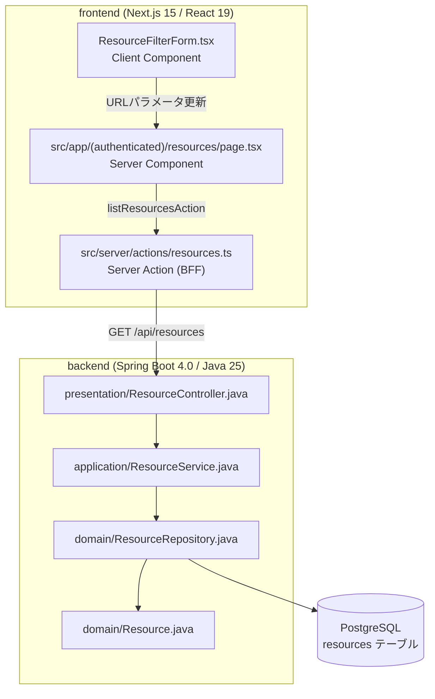
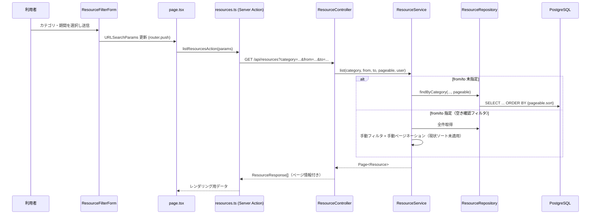

# System Architecture

## System Overview

BookFlow は Next.js（フロントエンド + BFF）と Spring Boot（バックエンドAPI）を分離した二層構成のモノレポである。認証は Amazon Cognito を Better Auth 経由で利用し、フロントエンドは Server Actions を介してバックエンド API を呼び出す BFF パターンを取る。既存アーキテクチャの全体像は `Docs/ARCHITECTURE.md` を正とし、本書はその要約と issue #22 に関係する範囲の詳細を記載する。

## Architecture Diagram

```mermaid
flowchart TB
    subgraph FE["frontend (Next.js 15 / React 19)"]
        Page["src/app/(authenticated)/resources/page.tsx<br/>Server Component"]
        Form["ResourceFilterForm.tsx<br/>Client Component"]
        Action["src/server/actions/resources.ts<br/>Server Action (BFF)"]
    end

    subgraph BE["backend (Spring Boot 4.0 / Java 25)"]
        Controller["presentation/ResourceController.java"]
        Service["application/ResourceService.java"]
        Repo["domain/ResourceRepository.java"]
        Entity["domain/Resource.java"]
    end

    DB[("PostgreSQL<br/>resources テーブル")]

    Form -->|URLパラメータ更新| Page
    Page -->|listResourcesAction| Action
    Action -->|GET /api/resources| Controller
    Controller --> Service
    Service --> Repo
    Repo --> Entity
    Repo --> DB
```

## Component Descriptions

### frontend: `resources/page.tsx`

- **Purpose**: リソース一覧のサーバーコンポーネント。`searchParams`（`category`/`from`/`to`/`page`）を受け取り一覧を描画する
- **Responsibilities**: `listResourcesAction` の呼び出し、`ResourceFilterForm` へのデフォルト値受け渡し、ページネーション導線
- **Dependencies**: `src/server/actions/resources.ts`
- **Type**: Application（Next.js App Router）

### frontend: `ResourceFilterForm.tsx`

- **Purpose**: カテゴリ・期間の絞り込みフォーム（クライアントコンポーネント）
- **Responsibilities**: フォーム送信時に `URLSearchParams` を組み立て `router.push` で一覧画面へ反映する
- **Dependencies**: `next/navigation`、shadcn/ui コンポーネント（`Select`/`Input`/`Button`）
- **Type**: Application

### frontend: `src/server/actions/resources.ts`

- **Purpose**: BFF層。バックエンド API 呼び出しをカプセル化する Server Action 群
- **Responsibilities**: `ListResourcesParams` の組み立て、`client.getPaginated` によるバックエンド呼び出し、レスポンスの Zod スキーマ検証
- **Dependencies**: バックエンド `GET /api/resources`
- **Type**: Application（BFF）

### backend: `ResourceController`

- **Purpose**: リソース関連 REST エンドポイントの公開
- **Responsibilities**: リクエストパラメータのバインド（`Pageable` は Spring Data の標準リゾルバに委譲）、`ResourceService` への委譲、権限制御（`POST`/`PUT`/`PATCH` は ADMIN 限定）
- **Dependencies**: `ResourceService`
- **Type**: Application（presentation層）

### backend: `ResourceService`

- **Purpose**: リソース一覧取得のユースケース実装
- **Responsibilities**: `category`/`isActive` によるフィルタ経路（`listPaginated`）と、`from`/`to` 指定時の空き確認フィルタ経路（`listWithAvailabilityFilter`、手動ページネーション）の2系統を持つ
- **Dependencies**: `ResourceRepository`、`ReservationRepository`（重複判定）
- **Type**: Application（application層）

### backend: `ResourceRepository`

- **Purpose**: `Resource` エンティティの永続化アクセス
- **Responsibilities**: `Pageable` を受け取るクエリメソッド（`findByCategory`等）と全件取得系メソッドの提供。**`Sort` を単体で受け取るメソッドは現状なし**
- **Dependencies**: Spring Data JPA
- **Type**: Application（domain層）

## Data Flow

```mermaid
sequenceDiagram
    participant U as 利用者
    participant Form as ResourceFilterForm
    participant Page as page.tsx
    participant Action as resources.ts (Server Action)
    participant Ctrl as ResourceController
    participant Svc as ResourceService
    participant Repo as ResourceRepository
    participant DB as PostgreSQL

    U->>Form: カテゴリ・期間を選択し送信
    Form->>Page: URLSearchParams 更新 (router.push)
    Page->>Action: listResourcesAction(params)
    Action->>Ctrl: GET /api/resources?category=...&from=...&to=...
    Ctrl->>Svc: list(category, from, to, pageable, user)
    alt from/to 未指定
        Svc->>Repo: findByCategory(..., pageable)
        Repo->>DB: SELECT ... ORDER BY (pageable.sort)
    else from/to 指定（空き確認フィルタ）
        Svc->>Repo: 全件取得
        Svc->>Svc: 手動フィルタ + 手動ページネーション（現状ソート未適用）
    end
    Svc-->>Ctrl: Page<Resource>
    Ctrl-->>Action: ResourceResponse[]（ページ情報付き）
    Action-->>Page: レンダリング用データ
```

## Integration Points

- **External APIs**: なし（リソース機能はバックエンド内で完結）
- **Databases**: PostgreSQL（`resources` テーブル、`db/migration/V001__create_initial_schema.sql`）
- **Third-party Services**: Amazon Cognito（認証、`currentUser` の権限判定に使用）

## Infrastructure Components

- 本タスクの影響範囲外（インフラ変更なし）。`Docs/ARCHITECTURE.md` を参照
