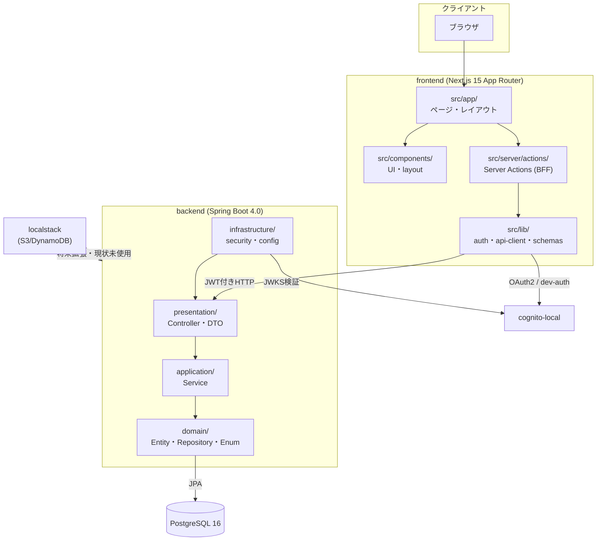
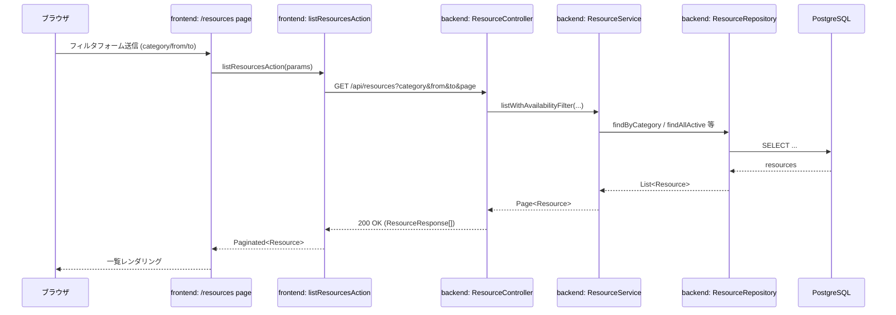
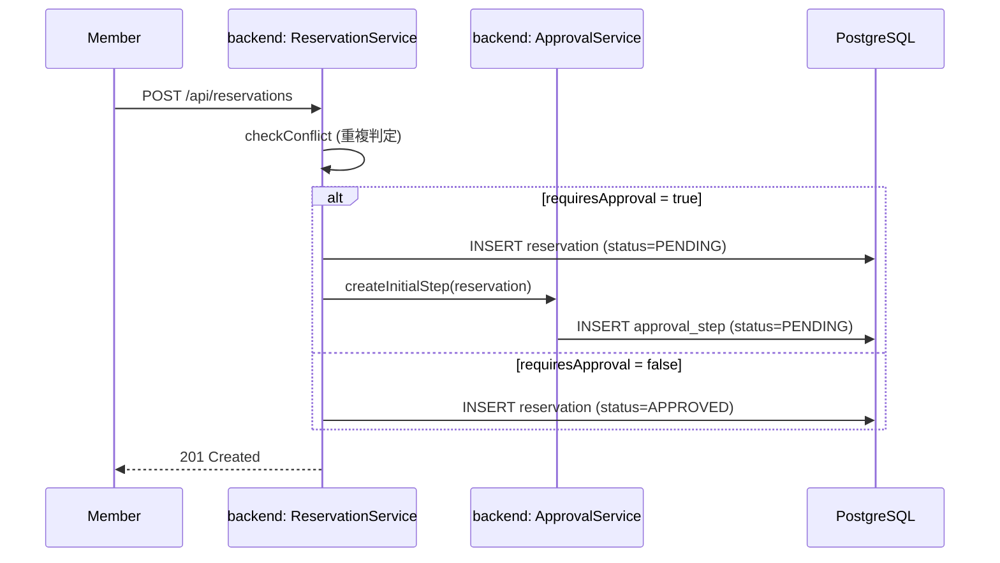

# System Architecture

> AI-DLC Reverse Engineering 成果物。既存の `docs-next/docs/reference/architecture.md`（AWS 標準アーキテクチャ・受注案件デフォルト構成）は将来の本番構成を示すもので、本書はローカル開発環境で実際に動いているコード構成を対象とする点で役割が異なる。

## System Overview

BookFlow はモノレポ構成の2層アプリケーションである。`frontend/`（Next.js 15、BFF 層込み）と `backend/`（Spring Boot 4.0、REST API）が独立したパッケージ管理・ビルドシステムを持ち、`docker-compose`（`.devcontainer/docker-compose.yml`）上の PostgreSQL・cognito-local・localstack と連携してローカル開発環境を構成する。ドキュメントサイト（`docs-next/`）はアプリケーションとは独立した第3のパッケージである。

## Architecture Diagram

```mermaid
flowchart TB
    subgraph Client["クライアント"]
        Browser["ブラウザ"]
    end

    subgraph FE["frontend (Next.js 15 App Router)"]
        Pages["src/app/<br/>ページ・レイアウト"]
        Components["src/components/<br/>UI・layout"]
        Actions["src/server/actions/<br/>Server Actions (BFF)"]
        Lib["src/lib/<br/>auth・api-client・schemas"]
    end

    subgraph BE["backend (Spring Boot 4.0)"]
        Presentation["presentation/<br/>Controller・DTO"]
        Application["application/<br/>Service"]
        Domain["domain/<br/>Entity・Repository・Enum"]
        Infrastructure["infrastructure/<br/>security・config"]
    end

    Postgres[("PostgreSQL 16")]
    CognitoLocal["cognito-local"]
    Localstack["localstack<br/>(S3/DynamoDB)"]

    Browser --> Pages
    Pages --> Components
    Pages --> Actions
    Actions --> Lib
    Lib -->|"JWT付きHTTP"| Presentation
    Lib -->|"OAuth2 / dev-auth"| CognitoLocal

    Presentation --> Application
    Application --> Domain
    Infrastructure --> Presentation
    Domain -->|"JPA"| Postgres
    Infrastructure -->|"JWKS検証"| CognitoLocal

    Localstack -.->|"将来拡張・現状未使用"| BE
```

## Component Descriptions

### frontend/src/app（ページ・レイアウト）

- **Purpose**: 画面ルーティングとページ単位のデータ取得・組み立て。
- **Responsibilities**: Server Components を優先し、認証・ロールガード、Server Actions の呼び出し、UI 組み立てを行う。
- **Dependencies**: `src/components/`、`src/server/actions/`、`src/lib/`。
- **Type**: Application。

### frontend/src/server/actions（BFF層）

- **Purpose**: バックエンド REST API 呼び出しの一元窓口。
- **Responsibilities**: `createApiClient` 経由でバックエンドを呼び出し、レスポンスを Zod で検証する。ドメイン別（auth / dev-auth / reservations / resources / approvals / users）にファイル分割。
- **Dependencies**: `src/lib/api-client.ts`、`src/lib/types/`、`src/lib/schemas/`。
- **Type**: Application（BFF）。

### backend/presentation（Controller・DTO）

- **Purpose**: REST API のエンドポイント定義とリクエスト/レスポンスの入出力境界。
- **Responsibilities**: 6つの `@RestController`（Auth/User/Department/Resource/Reservation/Approval）と、Bean Validation 付き入力 DTO・`from(entity)` 静的ファクトリ付き出力 DTO。
- **Dependencies**: `application/`（Service 呼び出し）。
- **Type**: Application。

### backend/application（Service）

- **Purpose**: ユースケースロジックの実装。
- **Responsibilities**: 5つの Service（Reservation/Resource/Approval/User/Department）が業務ルール（重複判定・承認要否分岐・所有権チェック等）を担う。
- **Dependencies**: `domain/`（Repository・Entity）に加え、`presentation/dto/` にも直接依存する（後述「アーキテクチャ上の注記」参照）。
- **Type**: Application。

### backend/domain（Entity・Repository・Enum）

- **Purpose**: 永続化対象のデータモデルと業務状態遷移。
- **Responsibilities**: 5エンティティ（User/Department/Resource/Reservation/ApprovalStep）がファクトリメソッド（`create`）と状態遷移メソッド（`update`/`cancel`/`approve`/`reject` 等）を持ち、setter を持たない。Repository（Spring Data JPA）は同パッケージに配置される。
- **Dependencies**: なし（最下層）。
- **Type**: Application（永続化を含む。一般的な「domain=ビジネスロジックのみ」という想定より広い責務を持つ）。

### backend/infrastructure（config・security）

- **Purpose**: Spring Bean 設定と認証・認可の横断的関心事。
- **Responsibilities**: `SecurityConfig`（OAuth2 Resource Server・JWT検証）、`@CurrentUser` 引数解決、`RegisteredUserInterceptor`（未登録ユーザー遮断）、OpenAPI 設定。
- **Dependencies**: `domain/UserRepository`（JWT sub からユーザー解決のため）。
- **Type**: Application（永続化実装は含まない。一般的な「infrastructure=永続化実装」という想定より狭い責務を持つ）。

### アーキテクチャ上の注記（命名と実態の乖離）

パッケージ名は4層アーキテクチャ（domain / application / presentation / infrastructure）の体裁を取るが、実際の依存方向は一方向（`presentation → application → domain`）になっていない。

- `application/*Service.java` は軒並み `presentation.dto.*` を直接 import し、DTO を生成・返却している（例: `ApprovalService` → `ApprovalStepResponse`）。実態は `presentation ⇄ application → domain` に近い相互依存である。
- `infrastructure` には永続化実装が存在しない。JPA エンティティ・Repository インターフェースはすべて `domain` に配置されている。

これは CLAUDE.md が定める「4レイヤーアーキテクチャを厳守」という規約と、実装の現状に差があることを意味する。今回のエンハンス課題（`GET /api/resources` へのキーワード検索追加）は既存の `ResourceService`/`ResourceRepository` の延長で完結するため、この乖離自体の是正は本課題のスコープ外とする。

## Data Flow

### リソース一覧の検索・空き確認フロー（既存）

```mermaid
sequenceDiagram
    participant U as ブラウザ
    participant P as frontend: /resources page
    participant A as frontend: listResourcesAction
    participant C as backend: ResourceController
    participant S as backend: ResourceService
    participant R as backend: ResourceRepository
    participant DB as PostgreSQL

    U->>P: フィルタフォーム送信 (category/from/to)
    P->>A: listResourcesAction(params)
    A->>C: GET /api/resources?category&from&to&page
    C->>S: listWithAvailabilityFilter(...)
    S->>R: findByCategory / findAllActive 等
    R->>DB: SELECT ...
    DB-->>R: resources
    R-->>S: List<Resource>
    S-->>C: Page<Resource>
    C-->>A: 200 OK (ResourceResponse[])
    A-->>P: Paginated<Resource>
    P-->>U: 一覧レンダリング
```

### 予約申請〜承認フロー（既存）

```mermaid
sequenceDiagram
    participant M as Member
    participant RS as backend: ReservationService
    participant AS as backend: ApprovalService
    participant DB as PostgreSQL

    M->>RS: POST /api/reservations
    RS->>RS: checkConflict (重複判定)
    alt requiresApproval = true
        RS->>DB: INSERT reservation (status=PENDING)
        RS->>AS: createInitialStep(reservation)
        AS->>DB: INSERT approval_step (status=PENDING)
    else requiresApproval = false
        RS->>DB: INSERT reservation (status=APPROVED)
    end
    RS-->>M: 201 Created
```

## Integration Points

- **External APIs**: なし（サードパーティ外部 API 連携は現状未実装）。
- **Databases**: PostgreSQL 16（`bookflow` データベース、`backend` からのみ接続）。
- **Third-party Services**: Amazon Cognito（本番）／cognito-local（ローカル開発、JWT 発行・JWKS 提供）。localstack（S3/DynamoDB を提供するが、現状のアプリケーションコードからの利用箇所はなし）。

## Infrastructure Components

- **ローカル実行環境**: `.devcontainer/docker-compose.yml` が `frontend` / `postgres` / `localstack` / `cognito-local` / `docs` の5サービスを定義する DevContainer 構成。
- **デプロイモデル**: 本番相当のデプロイ構成は `docs-next/docs/reference/architecture.md`（AWS 標準アーキテクチャ）に定義されており、本リポジトリには IaC（CDK/Terraform 等）は含まれない。
- **ネットワーキング**: ローカル環境では Docker Compose のデフォルトネットワークのみ。VPC・サブネット・セキュリティグループの定義は本リポジトリのスコープ外（AWS 環境デプロイ時の責務）。
